# 点亮 LED

###### 目录

> - Arduino API
>     - Arduino UNO R3
>     - STM32F103C8T6 Bule Pill
>     - ESP32-DevKitC
> - MicroPython API
>     - ESP32-DevKitC
> - STM32Cube

# Arduino API

## Arduino UNO R3


```arduino
/*
  LED Blinking

  This code demonstrates how to make an LED blink on and off at a 1-second interval using the digitalWrite() and delay() functions.

  The circuit:
  - LED attached from pin 11 to ground

  Diagram:

      Arduino         LED
     ---------       -----
    |         |     |     |
    |     13  |-----|>|---+---- GND
    |         |     (Anode) (Cathode)
    |         |  
    |         |
  
  The LED's anode (longer leg) connects to pin 11, and the cathode (shorter leg) connects to ground (GND).

  created 2024
  by Liang
*/

void setup() {
  // Set pin 11 as an output pin, which will control the LED
  pinMode(13, OUTPUT);
}

void loop() {
  // Turn the LED on by setting pin 11 to HIGH
  digitalWrite(13, HIGH);

  // Wait for 1 second (1000 milliseconds) while the LED is on
  delay(1000);

  // Turn the LED off by setting pin 11 to LOW
  digitalWrite(13, LOW);

  // Wait for 1 second (1000 milliseconds) while the LED is off
  delay(1000);
}
```

## STM32F103C8T6 Bule Pill

```arduino
/*
  STM32F103C8T6 (Blue Pill) LED Blinking

  This code demonstrates how to make an LED blink on and off at a 1-second interval using the digitalWrite() and delay() functions.

  The circuit:
  - LED attached from PB0 to ground

  Diagram:

      STM32         LED
     ---------     -----
    |         |   |     |
    |    PB0  |---|>|---+---- GND
    |         |   (Anode) (Cathode)
    |         |  
    |         |
  
  The LED's anode (longer leg) connects to PB0, and the cathode (shorter leg) connects to ground (GND).

  created 2024
  by Liang
*/

void setup() {
  // Set PB0 as an output pin, which will control the LED
  pinMode(PB0, OUTPUT);
}

void loop() {
  // Turn the LED on by setting PB0 to HIGH
  digitalWrite(PB0, HIGH);

  // Wait for 1 second (1000 milliseconds) while the LED is on
  delay(1000);

  // Turn the LED off by setting PB0 to LOW
  digitalWrite(PB0, LOW);

  // Wait for 1 second (1000 milliseconds) while the LED is off
  delay(1000);
}
```

## ESP32-DevKitC

```arduino
/*
  ESP32 LED Blinking

  This code demonstrates how to make an LED blink on and off at a 1-second interval using the digitalWrite() and delay() functions.

  The circuit:
  - LED attached from GPIO 13 to ground

  Diagram:

      ESP32         LED
     ---------     -----
    |         |   |     |
    |   GPIO13|---|>|---+---- GND
    |         |   (Anode) (Cathode)
    |         |  
    |         |
  
  The LED's anode (longer leg) connects to GPIO 13, and the cathode (shorter leg) connects to ground (GND).

  created 2024
  by Liang
*/

void setup() {
  // Set GPIO 13 as an output pin, which will control the LED
  pinMode(13, OUTPUT);
}

void loop() {
  // Turn the LED on by setting GPIO 13 to HIGH
  digitalWrite(13, HIGH);

  // Wait for 1 second (1000 milliseconds) while the LED is on
  delay(1000);

  // Turn the LED off by setting GPIO 13 to LOW
  digitalWrite(13, LOW);

  // Wait for 1 second (1000 milliseconds) while the LED is off
  delay(1000);
}
```

# MicroPython API

## ESP32-DevKitC

```python
"""
LED Blinking

此代码演示了如何使用 `machine.Pin` 类和 `time.sleep()` 函数使连接到 GPIO2 引脚的 LED 每隔 1 秒闪烁一次。

电路连接：
- LED 连接到 GPIO2 和地线（GND）

电路图：
    ESP32          LED
   ---------      -----
  |         |    |     |
  |    2    |----|>|---+---- GND
  |         |    (Anode) (Cathode)
  |         |  
  |         |

LED 的阳极（较长的脚）连接到 GPIO2 引脚，阴极（较短的脚）连接到地线（GND）。

创建于 2024
作者：Liang
"""

from machine import Pin
import time

# 初始化 LED 引脚为输出模式
led = Pin(2, Pin.OUT)

def blink():
    """
    无限循环，使 LED 以 1 秒间隔闪烁。
    
    在每次循环中，LED 将被点亮 1 秒钟，然后熄灭 1 秒钟。
    """
    while True:
        # 打开 LED
        led.value(1)  # 设置引脚为高电平
        print("LED on")
        # 延时 1 秒
        time.sleep(1)
        
        # 关闭 LED
        led.value(0)  # 设置引脚为低电平
        print("LED off")
        # 再次延时 1 秒
        time.sleep(1)

# 调用 blink 函数开始执行
blink()
```

# STM32Cube

ST-Link 烧录下载设置

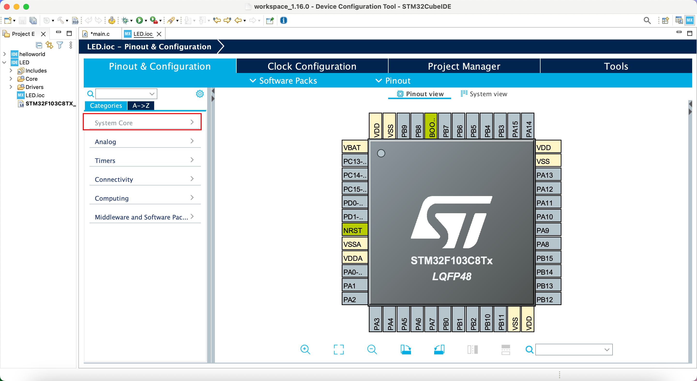

System Core cliked

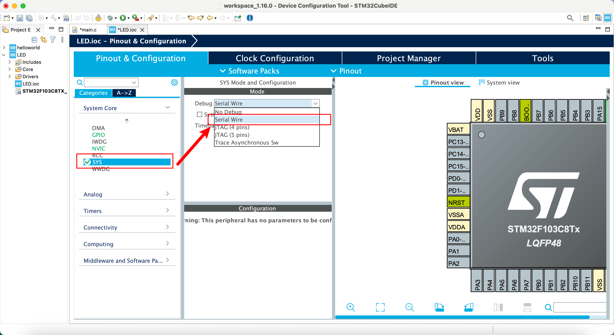

SYS-Debug-Serial Wire

STM32C8T6 核心板，板灯设置，PC13 GPIO

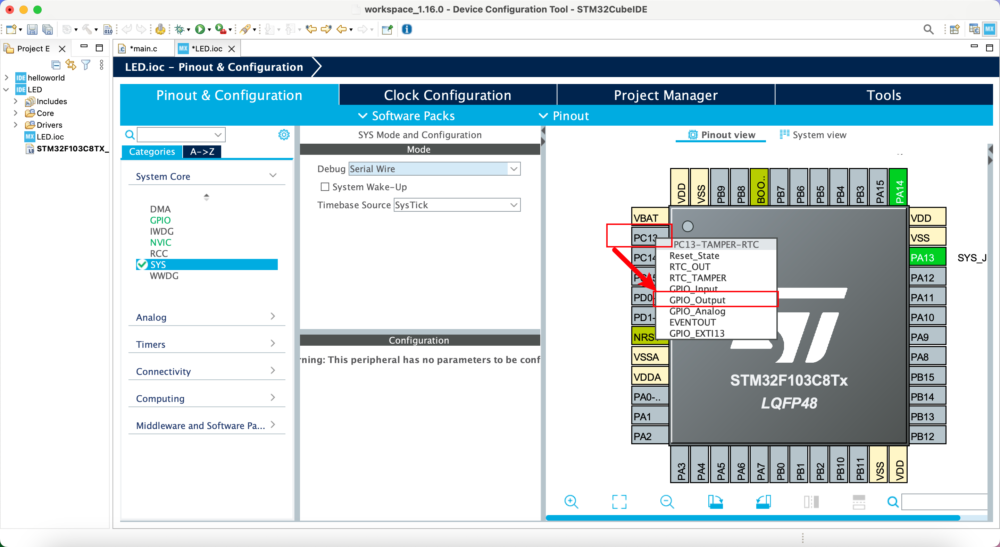

PC13-OUTPUT

生成代码

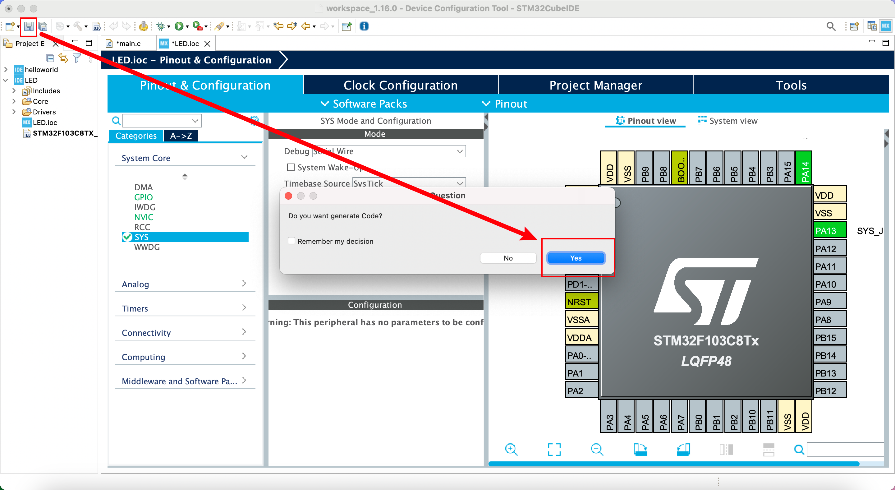

添加闪烁代码

```cpp
HAL_GPIO_WritePin(GPIOC, GPIO_PIN_13, 1);
HAL_Delay(200);
HAL_GPIO_WritePin(GPIOC, GPIO_PIN_13, 0);
HAL_Delay(200);
```

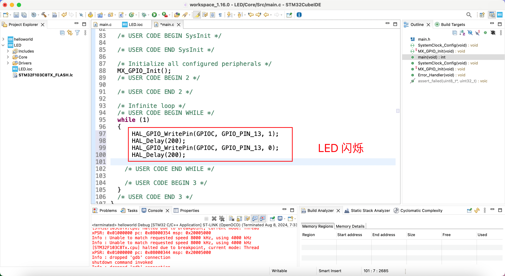

编译

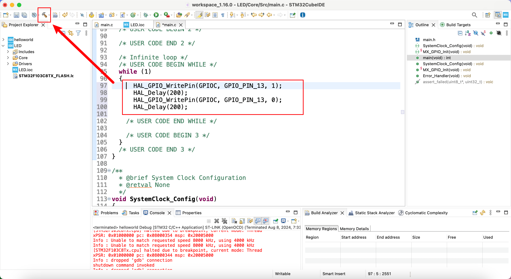

烧录下载设置

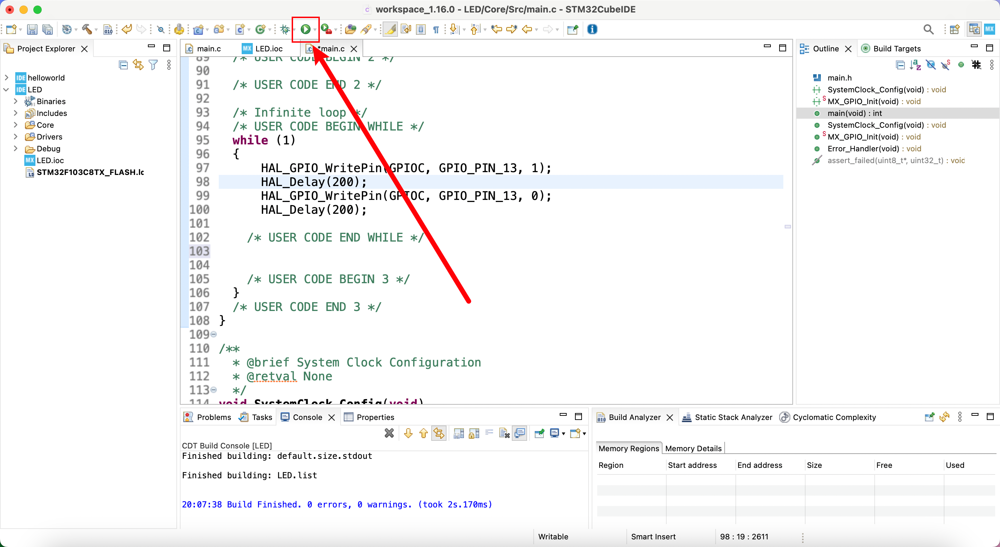

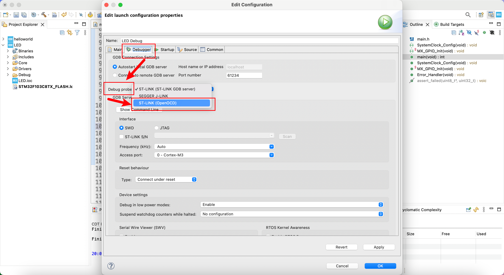

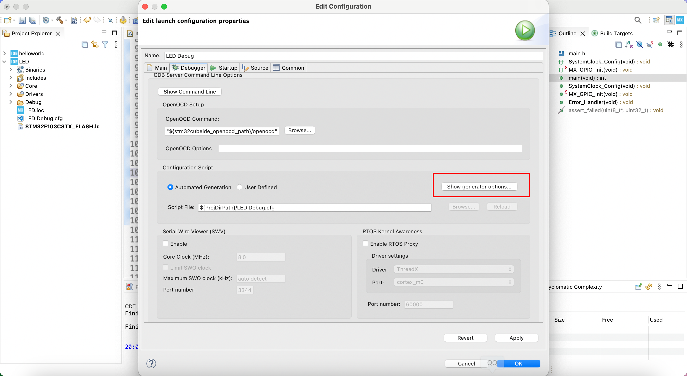

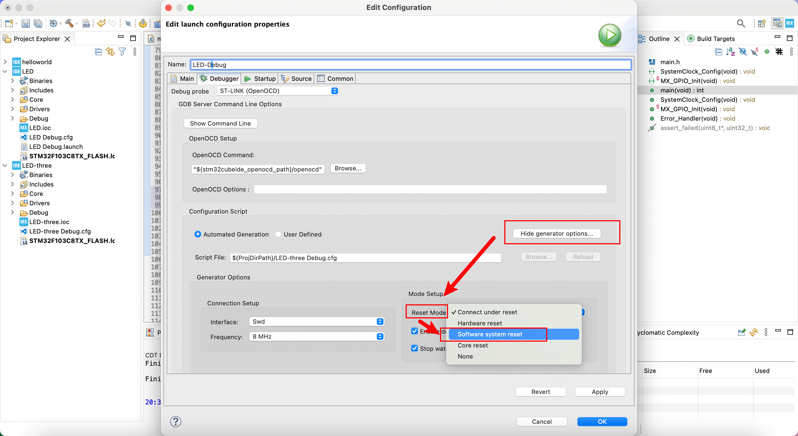

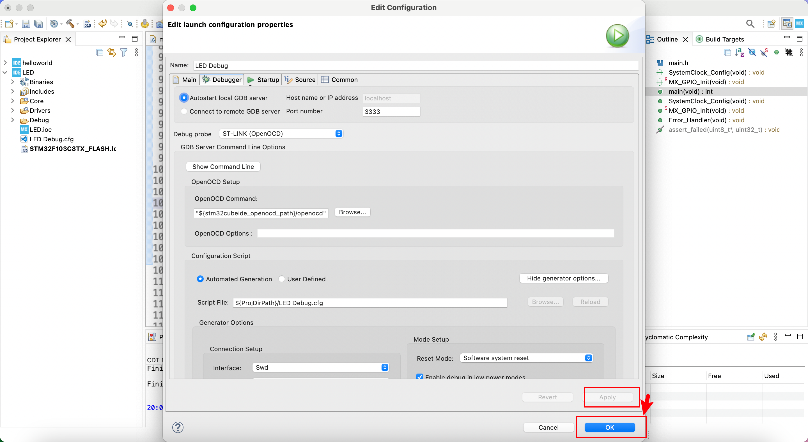

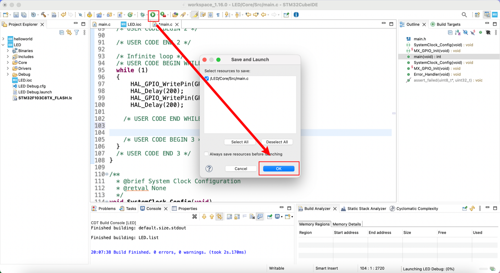
