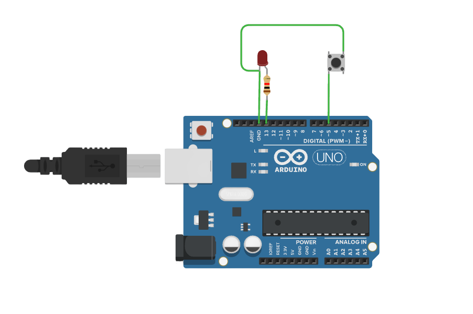

# 按钮控制 LED

###### 目录

> - Arduino API
>     - Arduino UNO R3
>     - STM32F103C8T6 Bule Pill
>     - ESP32-DevKitC
> - MicroPython API
>     - ESP32-DevKitC
> - STM32Cube（待补充）

# Arduino API

## Arduino UNO R3



### basic

```arduino
/*
  LED Push Button

  This example demonstrates the use of a pushbutton to turn on and off an LED using the digitalRead() function.
  
  The circuit:
  - LED attached from pin 11 to ground
  - Pushbutton attached to pin 5 with internal pull-up enabled (using INPUT_PULLUP)
  
  When the button is pressed, the LED will turn on; when released, the LED will turn off.

  Diagram:

      Arduino         LED                   Pushbutton
     ---------       -----                --------------
    |         |     |     |              |              |
    |     13  |-----|>|---+---- GND      |     5        |
    |         |     (Anode) (Cathode)    |    (Pin)     |
    |         |                          |              |
    |         |                          |---+    +-----|
    |         |                          |   |    |     |
    |     5   |--------------------------+   |    |     |
    |         |   (Internal Pull-up)      GND +    +  VCC

  The LED's anode (longer leg) connects to pin 11, and the cathode (shorter leg) connects to ground (GND).
  The pushbutton is connected to pin 5 and GND, with the internal pull-up resistor activated in the code.

  created 2024
  by Liang
*/

boolean pushButton;  // Variable to store the button state (pressed or not)

void setup() {
  // Set up pin modes for input and output

  pinMode(5, INPUT_PULLUP);  // Set pin 5 as input with internal pull-up resistor
  // The pull-up resistor ensures the pin is HIGH when the button is not pressed and LOW when pressed.

  pinMode(13, OUTPUT);  // Set pin 11 as output for controlling the LED
}

void loop() {
  // Main code to run repeatedly

  pushButton = digitalRead(5);  // Read the current state of the button (HIGH or LOW)

  if (pushButton == LOW) {  // If the button is pressed (LOW state)
    digitalWrite(13, HIGH);  // Turn on the LED (HIGH output on pin 11)
  } else {  // If the button is not pressed (HIGH state)
    digitalWrite(13, LOW);   // Turn off the LED (LOW output on pin 11)
  }
}
```

### debouncing

```arduino
/*
  LED Push Button with Debouncing

  This example demonstrates the use of a pushbutton to turn on and off an LED, with a debounce routine 
  to eliminate jitter caused by mechanical noise in the button.

  The circuit:
  - LED attached from pin 11 to ground
  - Pushbutton attached to pin 5 with internal pull-up enabled (using INPUT_PULLUP)

  When the button is pressed, the LED will turn on; when released, the LED will turn off.

  Diagram:

      Arduino         LED                   Pushbutton
     ---------       -----                --------------
    |         |     |     |              |              |
    |     11  |-----|>|---+---- GND      |     5        |
    |         |     (Anode) (Cathode)    |    (Pin)     |
    |         |                          |              |
    |         |                          |---+    +-----|
    |         |                          |   |    |     |
    |     5   |--------------------------+   |    |     |
    |         |   (Internal Pull-up)      GND +    +  VCC

  The LED's anode (longer leg) connects to pin 11, and the cathode (shorter leg) connects to ground (GND).
  The pushbutton is connected to pin 5 and GND, with the internal pull-up resistor activated in the code.

  created 2024
  by Liang
*/

boolean pushButtonState = HIGH;    // Variable to store the current button state
boolean lastButtonState = HIGH;    // Variable to store the last button state
unsigned long lastDebounceTime = 0; // Variable to store the last time the button state changed
unsigned long debounceDelay = 50;   // Debounce delay time (50ms)

void setup() {
  // Set up pin modes for input and output
  pinMode(5, INPUT_PULLUP);  // Set pin 5 as input with internal pull-up resistor
  pinMode(11, OUTPUT);       // Set pin 11 as output for controlling the LED
}

void loop() {
  // Read the current state of the button
  int reading = digitalRead(5);

  // If the button state has changed, reset the debounce timer
  if (reading != lastButtonState) {
    lastDebounceTime = millis();  // Reset the debounce timer
  }

  // If the button state has been stable for longer than the debounce delay, register the button state
  if ((millis() - lastDebounceTime) > debounceDelay) {
    // If the button state has changed (from HIGH to LOW or vice versa)
    if (reading != pushButtonState) {
      pushButtonState = reading;  // Update the current button state

      // Control the LED: if the button is pressed (LOW), turn on the LED, otherwise turn it off
      if (pushButtonState == LOW) {
        digitalWrite(11, HIGH);  // Turn on the LED
      } else {
        digitalWrite(11, LOW);   // Turn off the LED
      }
    }
  }

  // Save the current reading for the next iteration to detect state changes
  lastButtonState = reading;
}
```

## STM32F103C8T6 Bule Pill

```arduino
/*
  STM32F103C8T6 (Blue Pill) LED Push Button with Debouncing

  This example demonstrates the use of a pushbutton to turn on and off an LED, with a debounce routine 
  to eliminate jitter caused by mechanical noise in the button.

  The circuit:
  - LED attached from PB0 to ground
  - Pushbutton attached to PB5 with internal pull-up enabled (using INPUT_PULLUP)

  When the button is pressed, the LED will turn on; when released, the LED will turn off.

  Diagram:

      STM32          LED                   Pushbutton
     ---------      -----                --------------
    |         |    |     |              |              |
    |    PB0  |----|>|---+---- GND      |    PB5       |
    |         |    (Anode) (Cathode)    |    (Pin)     |
    |         |                         |              |
    |         |                         |---+    +-----|
    |         |                         |   |    |     |
    |    PB5  |-------------------------+   |    |     |
    |         |  (Internal Pull-up)      GND +    +  VCC

  The LED's anode (longer leg) connects to PB0, and the cathode (shorter leg) connects to ground (GND).
  The pushbutton is connected to PB5 and GND, with the internal pull-up resistor activated in the code.

  created 2024
  by Liang
*/

boolean pushButtonState = HIGH;    // Variable to store the current button state
boolean lastButtonState = HIGH;    // Variable to store the last button state
unsigned long lastDebounceTime = 0; // Variable to store the last time the button state changed
unsigned long debounceDelay = 50;   // Debounce delay time (50ms)

void setup() {
  // Set up pin modes for input and output
  pinMode(PB5, INPUT_PULLUP);  // Set PB5 as input with internal pull-up resistor
  pinMode(PB0, OUTPUT);        // Set PB0 as output for controlling the LED
}

void loop() {
  // Read the current state of the button
  int reading = digitalRead(PB5);

  // If the button state has changed, reset the debounce timer
  if (reading != lastButtonState) {
    lastDebounceTime = millis();  // Reset the debounce timer
  }

  // If the button state has been stable for longer than the debounce delay, register the button state
  if ((millis() - lastDebounceTime) > debounceDelay) {
    // If the button state has changed (from HIGH to LOW or vice versa)
    if (reading != pushButtonState) {
      pushButtonState = reading;  // Update the current button state

      // Control the LED: if the button is pressed (LOW), turn on the LED, otherwise turn it off
      if (pushButtonState == LOW) {
        digitalWrite(PB0, HIGH);  // Turn on the LED
      } else {
        digitalWrite(PB0, LOW);   // Turn off the LED
      }
    }
  }

  // Save the current reading for the next iteration to detect state changes
  lastButtonState = reading;
}
```

## ESP32-DevKitC

```arduino
/*
  ESP32 LED Push Button with Debouncing

  This example demonstrates the use of a pushbutton to turn on and off an LED, with a debounce routine 
  to eliminate jitter caused by mechanical noise in the button.

  The circuit:
  - LED attached from GPIO 13 to ground
  - Pushbutton attached to GPIO 5 with internal pull-up enabled (using INPUT_PULLUP)

  When the button is pressed, the LED will turn on; when released, the LED will turn off.

  Diagram:

      ESP32           LED                   Pushbutton
     ---------       -----                --------------
    |         |     |     |              |              |
    |   GPIO13|-----|>|---+---- GND      |    GPIO5     |
    |         |     (Anode) (Cathode)    |    (Pin)     |
    |         |                          |              |
    |         |                          |---+    +-----|
    |         |                          |   |    |     |
    |   GPIO5 |--------------------------+   |    |     |
    |         |   (Internal Pull-up)      GND +    +  VCC

  The LED's anode (longer leg) connects to GPIO 13, and the cathode (shorter leg) connects to ground (GND).
  The pushbutton is connected to GPIO 5 and GND, with the internal pull-up resistor activated in the code.

  created 2024
  by Liang
*/

boolean pushButtonState = HIGH;    // Variable to store the current button state
boolean lastButtonState = HIGH;    // Variable to store the last button state
unsigned long lastDebounceTime = 0; // Variable to store the last time the button state changed
unsigned long debounceDelay = 50;   // Debounce delay time (50ms)

void setup() {
  // Set up pin modes for input and output
  pinMode(5, INPUT_PULLUP);  // Set GPIO 5 as input with internal pull-up resistor for the button
  pinMode(13, OUTPUT);       // Set GPIO 13 as output for controlling the LED
}

void loop() {
  // Read the current state of the button
  int reading = digitalRead(5);

  // If the button state has changed, reset the debounce timer
  if (reading != lastButtonState) {
    lastDebounceTime = millis();  // Reset the debounce timer
  }

  // If the button state has been stable for longer than the debounce delay, register the button state
  if ((millis() - lastDebounceTime) > debounceDelay) {
    // If the button state has changed (from HIGH to LOW or vice versa)
    if (reading != pushButtonState) {
      pushButtonState = reading;  // Update the current button state

      // Control the LED: if the button is pressed (LOW), turn on the LED, otherwise turn it off
      if (pushButtonState == LOW) {
        digitalWrite(13, HIGH);  // Turn on the LED
      } else {
        digitalWrite(13, LOW);   // Turn off the LED
      }
    }
  }

  // Save the current reading for the next iteration to detect state changes
  lastButtonState = reading;
}
```

# MicroPython API

## ESP32-DevKitC

```python
"""
Button Controlled LED

此代码演示了如何使用按钮控制连接到 GPIO2 引脚的 LED 的开关状态。

电路连接：
- 按钮连接到 GPIO14 和地线（GND），并通过一个上拉电阻（例如 10kΩ）连接到 3.3V。
- LED 连接到 GPIO2 和地线（GND），并通过一个限流电阻（例如 330Ω）连接到 GND。

电路图：
    ESP32          Button           LED
   ---------      ---------       -----
  |         |    |     |        |     |
  |    2    |----|>|---+--------|>|---+---- GND
  |         |    (A)  (B)       (Anode) (Cathode)
  |         |                  (通过 330Ω 电阻)
  |    14   |----|<|---+---- 3.3V (通过 10kΩ 上拉电阻)
  |         |    (C)  (D)
  |         |  
  |         |  

创建于 2024
作者：Liang
"""

from machine import Pin
import time

# 初始化 LED 引脚为输出模式
led = Pin(2, Pin.OUT)

# 初始化按钮引脚为输入模式，并启用内部上拉电阻
button = Pin(14, Pin.IN, Pin.PULL_UP)

def main():
    """
    主函数，循环检测按钮状态并控制 LED。
    """
    while True:
        # 读取按钮的状态
        button_state = button.value()
        
        # 如果按钮被按下（低电平）
        if button_state == 0:
            # 翻转 LED 的状态
            led.value(not led.value())
            # 延时 200ms 以防止按钮抖动
            time.sleep_ms(200)
        else:
            # 如果按钮没有被按下，继续循环
            pass

# 调用主函数开始执行
main()
```
