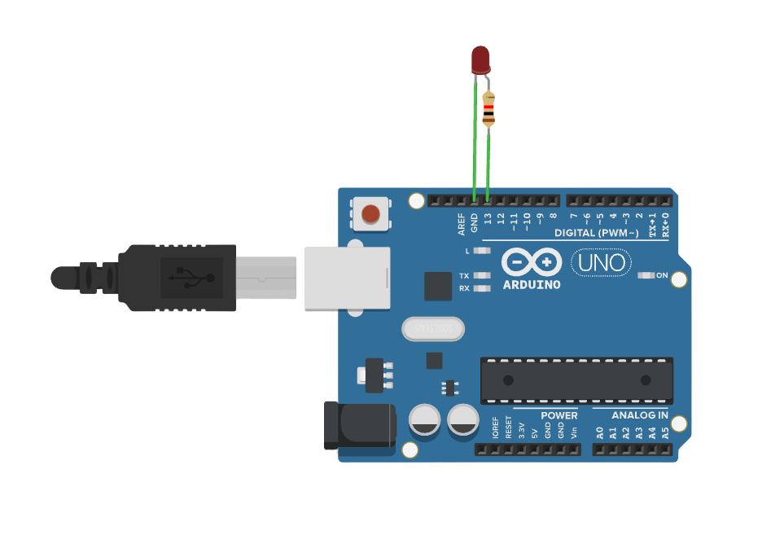

# PWM 实现呼吸灯

###### 目录

> - Arduino API
>     - Arduino UNO R3
>     - STM32F103C8T6 Bule Pill
>     - ESP32-DevKitC
> - MicroPython API
>     - ESP32-DevKitC
> - STM32Cube（待补充）

# Arduino API

## Arduino UNO R3



```arduino
/*
  LED Brightness Control

  This code gradually increases and decreases the brightness of an LED connected to pin 11 using PWM (Pulse Width Modulation).
  It also outputs the brightness values to the Serial Monitor for debugging or monitoring purposes.

  The circuit:
  - LED connected to pin 11 (PWM-capable pin) through a 220Ω resistor.
  - The cathode (shorter leg) of the LED connected to GND.
  - Serial monitor used for outputting brightness values.

  Diagram:
  
      Arduino         LED
     -----------     -----
    |           |   |     |
    |     13  --|---|>|---+---- GND
    | (PWM Pin) |   (Anode) (Cathode)
    |           |
    
  The anode (longer leg) of the LED is connected to pin 11 (PWM-capable) through a 220Ω resistor.
  The cathode (shorter leg) of the LED is connected to GND.

  created 2024
  by Liang
*/

void setup() {
  // Initialize pin 11 as an output pin to control the LED
  pinMode(13, OUTPUT);  
}

void loop() {
  // Start serial communication at a baud rate of 9600
  Serial.begin(9600);  

  // Gradually increase brightness from 0 to 255 (LED gets brighter)
  for (int brightness = 0; brightness <= 255; brightness++) {
    // Set the brightness of the LED using PWM on pin 11
    analogWrite(13, brightness);  

    // Output the current brightness value to the Serial Monitor
    Serial.println(brightness);   

    // Wait for 10 milliseconds before updating the brightness again
    delay(10);                    
  }

  // Gradually decrease brightness from 255 to 0 (LED gets dimmer)
  for (int brightness = 255; brightness >= 0; brightness--) {
    // Set the brightness of the LED using PWM on pin 11
    analogWrite(13, brightness);  

    // Output the current brightness value to the Serial Monitor
    Serial.println(brightness);   

    // Wait for 10 milliseconds before updating the brightness again
    delay(10);                    
  }
}
```

## STM32F103C8T6 Bule Pill

Only adapt pin, other same.

```arduino
/*
  STM32F103C8T6 (Blue Pill) LED Brightness Control

  This code gradually increases and decreases the brightness of an LED connected to PB1 using PWM (Pulse Width Modulation).
  It also outputs the brightness values to the Serial Monitor for debugging or monitoring purposes.

  The circuit:
  - LED connected to PB1 (PWM-capable pin) through a 220Ω resistor.
  - The cathode (shorter leg) of the LED connected to GND.
  - Serial monitor used for outputting brightness values.

  Diagram:

      STM32         LED
     -----------    -----
    |           |  |     |
    |     PB1 --|--|>|---+---- GND
    | (PWM Pin) |  (Anode) (Cathode)
    |           |

  The anode (longer leg) of the LED is connected to PB1 (PWM-capable) through a 220Ω resistor.
  The cathode (shorter leg) of the LED is connected to GND.

  created 2024
  by Liang
*/

void setup() {
  // Start serial communication at a baud rate of 9600
  Serial.begin(9600);

  // Set PB1 as an output for controlling the LED
  pinMode(PB1, OUTPUT);

  // Set up PWM on channel 1 for pin PB1, 5000 Hz frequency, and 8-bit resolution (values 0-255)
  analogWrite(PB1, 0); // Initialize PWM on PB1 with 0 brightness
}

void loop() {
  // Gradually increase brightness from 0 to 255 (LED gets brighter)
  for (int brightness = 0; brightness <= 255; brightness++) {
    // Set the brightness of the LED using PWM on PB1
    analogWrite(PB1, brightness);  

    // Output the current brightness value to the Serial Monitor
    Serial.println(brightness);   

    // Wait for 10 milliseconds before updating the brightness again
    delay(10);                    
  }

  // Gradually decrease brightness from 255 to 0 (LED gets dimmer)
  for (int brightness = 255; brightness >= 0; brightness--) {
    // Set the brightness of the LED using PWM on PB1
    analogWrite(PB1, brightness);  

    // Output the current brightness value to the Serial Monitor
    Serial.println(brightness);   

    // Wait for 10 milliseconds before updating the brightness again
    delay(10);                    
  }
}
```

## ESP32-DevKitC

### Arduino API

Only adapt the pin, other same.

### LEDC

```arduino
/*
  ESP32 LED Brightness Control

  This code gradually increases and decreases the brightness of an LED connected to GPIO 13 using PWM (Pulse Width Modulation).
  It also outputs the brightness values to the Serial Monitor for debugging or monitoring purposes.

  The circuit:
  - LED connected to GPIO 13 (PWM-capable pin) through a 220Ω resistor.
  - The cathode (shorter leg) of the LED connected to GND.
  - Serial monitor used for outputting brightness values.

  Diagram:

      ESP32         LED
     -----------    -----
    |           |  |     |
    |    GPIO13 |--|>|---+---- GND
    | (PWM Pin) |  (Anode) (Cathode)
    |           |

  The anode (longer leg) of the LED is connected to GPIO 13 (PWM-capable) through a 220Ω resistor.
  The cathode (shorter leg) of the LED is connected to GND.

  created 2024
  by Liang
*/

// Define the PWM channel, frequency, resolution, and pin
const int ledPin = 13;           // GPIO pin for LED
const int pwmChannel = 0;        // Use PWM channel 0
const int pwmFrequency = 5000;   // 5 kHz PWM frequency
const int pwmResolution = 8;     // 8-bit resolution, values from 0 to 255

void setup() {
  // Initialize serial communication for debugging
  Serial.begin(9600);

  // Configure PWM functionality on the specified pin
  ledcSetup(pwmChannel, pwmFrequency, pwmResolution);  // Set up PWM channel with frequency and resolution
  ledcAttachPin(ledPin, pwmChannel);  // Attach GPIO 13 to the PWM channel
}

void loop() {
  // Gradually increase brightness from 0 to 255 (LED gets brighter)
  for (int brightness = 0; brightness <= 255; brightness++) {
    // Set the brightness of the LED using PWM on the defined channel
    ledcWrite(pwmChannel, brightness);  

    // Output the current brightness value to the Serial Monitor
    Serial.println(brightness);   

    // Wait for 10 milliseconds before updating the brightness again
    delay(10);                    
  }

  // Gradually decrease brightness from 255 to 0 (LED gets dimmer)
  for (int brightness = 255; brightness >= 0; brightness--) {
    // Set the brightness of the LED using PWM on the defined channel
    ledcWrite(pwmChannel, brightness);  

    // Output the current brightness value to the Serial Monitor
    Serial.println(brightness);   

    // Wait for 10 milliseconds before updating the brightness again
    delay(10);                    
  }
}
```

# MicroPython API

## ESP32-DevKitC

```python
"""
LED Brightness Control with PWM

此代码演示了如何使用 `machine.PWM` 类来控制连接到 GPIO2 引脚的 LED 的亮度。

电路连接：
- LED 连接到 GPIO2 和地线（GND）
- 串联一个限流电阻（例如 330Ω）

电路图：
    ESP32          LED
   ---------      -----
  |         |    |     |
  |    2    |----|>|---+---- GND
  |         |    (Anode) (Cathode)
  |         |  
  |         |

LED 的阳极（较长的脚）连接到 GPIO2 引脚，阴极（较短的脚）通过限流电阻连接到地线（GND）。

创建于 2024
作者：Liang
"""

from machine import Pin, PWM
import time

# 初始化 LED 引脚
led_pin = Pin(2)

# 创建 PWM 对象
pwm = PWM(led_pin)

# 设置 PWM 频率（单位为 Hz），这里设置为 1000Hz
pwm.freq(1000)

# 循环改变占空比，从而改变 LED 的亮度
while True:
    # 逐渐增加亮度
    for duty in range(0, 1024):
        pwm.duty(duty)  # 设置占空比
        time.sleep_ms(1)  # 等待 1 毫秒

    # 逐渐减少亮度
    for duty in range(1023, -1, -1):
        pwm.duty(duty)  # 设置占空比
        time.sleep_ms(1)  # 等待 1 毫秒
```