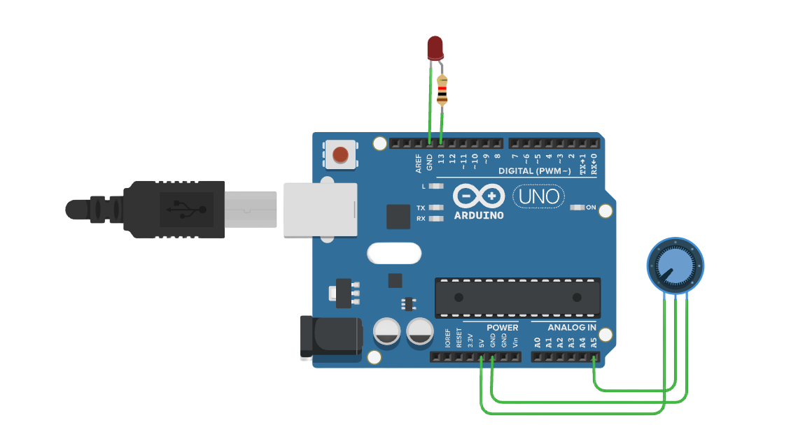

# ADC

###### 目录

> - Arduino API
>     - Arduino UNO R3
>     - STM32F103C8T6 Bule Pill
>     - ESP32-DevKitC
> - MicroPython API
>     - ESP32-DevKitC
> - STM32Cube（待补充）

# Arduino API

## Arduino UNO R3



```arduino
/*
  Analog Input to PWM LED Brightness Control

  This code reads the analog value from an analog input (e.g., a potentiometer) connected to pin A5 
  and converts it to a PWM signal that controls the brightness of an LED connected to pin 11.

  Circuit:
  - Analog input (e.g., potentiometer) connected to A5.
  - One side of the potentiometer connected to 5V, the other side connected to GND.
  - Middle pin of the potentiometer connected to A5 (analog input).
  - LED connected to pin 11 through a 220Ω resistor.
  
  Diagram:
  
       +5V ----[Potentiometer]---- GND
                     |
                     A5 (Analog input)
  
       Arduino         LED
     -----------      -----
    |           |    |     |
    |     13  --|----|>|---+---- GND
    | (PWM Pin) |    (Anode) (Cathode)
    |           |
    
  The analog input (A5) reads the voltage from the potentiometer and converts it into a brightness value for the LED using PWM.

  created 2024
  by Liang
*/

void setup() {
  // Initialize serial communication at 9600 baud to send data to the Serial Monitor
  Serial.begin(9600);
  
  // Set pin 11 as an output for controlling the brightness of the LED
  pinMode(13, OUTPUT);
}

void loop() {
  // Read the analog input value from the potentiometer connected to pin A5
  // The analogRead() function returns a value between 0 and 1023
  int analogInputVal = analogRead(A5);

  // Map the analog input value (0-1023) to a PWM value (0-255)
  // This allows us to control the brightness of the LED using analogWrite() on pin 11
  int brightness = map(analogInputVal, 0, 1023, 0, 255);

  // Print the raw analog input value to the Serial Monitor for debugging
  Serial.print("Analog Input Value: ");
  Serial.println(analogInputVal);

  // Print the mapped brightness value to the Serial Monitor for debugging
  Serial.print("LED Brightness Value: ");
  Serial.println(brightness);

  // Set the brightness of the LED by writing the mapped PWM value to pin 11
  analogWrite(13, brightness);
}
```

## STM32F103C8T6 Bule Pill

```arduino
/*
  STM32F103C8T6 (Blue Pill) ADC with PWM LED Control

  This code reads the analog value from a potentiometer or analog sensor connected to PA0 (A0) 
  and converts it to a PWM signal that controls the brightness of an LED connected to PB1 using PWM.

  Circuit:
  - Analog input (e.g., potentiometer) connected to PA0 (A0).
  - One side of the potentiometer connected to 3.3V, the other side connected to GND.
  - Middle pin of the potentiometer connected to PA0 (A0).
  - LED connected to PB1 through a 220Ω resistor.
  
  Diagram:
  
       +3.3V ----[Potentiometer]---- GND
                     |
                    PA0 (Analog input)
  
       STM32         LED
     -----------     -----
    |           |   |     |
    |   PB1  ---|---|>|---+---- GND
    | (PWM Pin) |   (Anode) (Cathode)
    |           |
    
  The analog input from PA0 (A0) is read, and its value is mapped to control the brightness of an LED using PWM on PB1.

  created 2024
  by Liang
*/

const int potPin = PA0;   // Potentiometer connected to PA0 (A0) for ADC
const int ledPin = PB1;   // LED connected to PB1 (PWM-capable pin)

void setup() {
  // Initialize serial communication for debugging
  Serial.begin(9600);

  // Configure the LED pin as an output
  pinMode(ledPin, OUTPUT);
}

void loop() {
  // Read the analog input from PA0 (12-bit resolution, values between 0 and 4095)
  int analogInputVal = analogRead(potPin);

  // Map the analog input (0-4095) to the PWM range (0-255)
  int brightness = map(analogInputVal, 0, 4095, 0, 255);

  // Print the raw analog input value to the Serial Monitor for debugging
  Serial.print("Analog Input Value: ");
  Serial.println(analogInputVal);

  // Print the mapped brightness value to the Serial Monitor for debugging
  Serial.print("LED Brightness Value: ");
  Serial.println(brightness);

  // Write the mapped brightness to the LED using PWM on PB1
  analogWrite(ledPin, brightness);  // analogWrite() works with PWM on STM32duino
}
```

## ESP32-DevKitC

```arduino
/*
  ESP32 ADC with PWM LED Control

  This code reads the analog value from a potentiometer or analog sensor connected to GPIO32 (ADC1_4) on the ESP32 and 
  converts it into a PWM signal that controls the brightness of an LED connected to GPIO15 using PWM.

  Circuit:
  - Analog input (e.g., potentiometer) connected to GPIO32 (ADC1_4).
  - One side of the potentiometer connected to 3.3V, the other side connected to GND.
  - Middle pin of the potentiometer connected to GPIO32.
  - LED connected to GPIO15 through a 220Ω resistor.
  
  Diagram:
  
       +3.3V ----[Potentiometer]---- GND
                     |
                    GPIO32 (ADC input)
  
       ESP32         LED
     -----------     -----
    |           |   |     |
    |    15  ---|---|>|---+---- GND
    | (PWM Pin) |   (Anode) (Cathode)
    |           |
    
  The analog input from GPIO32 is read, and its value is mapped to control the brightness of an LED using PWM on GPIO15.

  created 2024
  by Liang
*/

const int potPin = 32;   // Potentiometer connected to GPIO32 (ADC1_4)
const int ledPin = 15;   // LED connected to GPIO15 (PWM-capable pin)

void setup() {
  // Initialize serial communication for debugging
  Serial.begin(9600);

  // Configure the LED pin as an output
  pinMode(ledPin, OUTPUT);
}

void loop() {
  // Read the analog input from GPIO32 (12-bit resolution, values between 0 and 4095)
  int analogInputVal = analogRead(potPin);

  // Map the analog input (0-4095) to the PWM range (0-255)
  int brightness = map(analogInputVal, 0, 4095, 0, 255);

  // Print the raw analog input value to the Serial Monitor for debugging
  Serial.print("Analog Input Value: ");
  Serial.println(analogInputVal);

  // Print the mapped brightness value to the Serial Monitor for debugging
  Serial.print("LED Brightness Value: ");
  Serial.println(brightness);

  // Write the mapped brightness to the LED using PWM on GPIO15
  ledcWrite(0, brightness);  // PWM on channel 0 with brightness value
}
```

# MicroPython API

## ESP32-DevKitC

```python
"""
模拟输入控制PWM LED亮度

此代码从连接到引脚A5（在MicroPython中对应34号引脚，下面会进行引脚设置）的模拟输入（例如电位器）读取模拟值，
并将其转换为PWM信号，用于控制连接到引脚13的LED的亮度。

电路连接说明：
- 模拟输入（例如电位器）连接到A5（对应ESP32的34号引脚）。电位器一端接5V，另一端接地，中间引脚连接到A5作为模拟输入。
- LED通过一个220Ω电阻连接到引脚13。

示意图如下：

       +5V ----[Potentiometer]---- GND
                     |
                     A5 (Analog input，对应ESP32的34号引脚)

       ESP32         LED
     -----------      -----
    |           |    |     |
    |     13  --|----|>|---+---- GND
    | (PWM Pin) |    (Anode) (Cathode)
    |           |

模拟输入（A5对应的引脚）从电位器读取电压，并使用PWM将其转换为LED的亮度值。

创建于2024
作者：Liang
"""

from machine import Pin, ADC, PWM
import time

# 初始化模拟输入引脚对应的ADC对象，在ESP32中A5对应的引脚编号为34
adc = ADC(Pin(34))
# 设置模拟输入引脚的衰减，使得能够正确读取电位器的输入范围，这里设置为11dB衰减，适合0-3.3V输入范围
adc.atten(ADC.ATTN_11DB)

# 初始化PWM对象，用于控制LED亮度，引脚为13
pwm_led = PWM(Pin(13))
# 设置PWM的频率，这里设置为1000Hz，可根据实际情况调整
pwm_led.freq(1000)

while True:
    """
    主循环，不断读取模拟输入值并根据其设置LED的亮度。

    在循环中：
    1. 读取电位器连接引脚（A5对应的34号引脚）的模拟输入值。
    2. 将模拟输入值映射到合适的PWM占空比值范围，以控制LED亮度。
    3. 输出调试信息，展示模拟输入值和对应的亮度值。
    4. 根据计算出的亮度值设置LED的PWM占空比来改变亮度。
    5. 适当延时，避免过于频繁操作。
    """
    # 读取电位器连接引脚（A5对应的34号引脚）的模拟输入值
    # read()函数返回的值范围是0 - 4095（ESP32的ADC精度是12位）
    analog_input_value = adc.read()

    # 将模拟输入值（范围0 - 4095）映射到PWM占空比值（范围0 - 1023），以便控制LED亮度
    # 这里通过简单的线性映射来转换范围，与Arduino中map函数功能类似
    brightness_value = int(analog_input_value / 4095 * 1023)

    # 打印原始模拟输入值到终端用于调试（可以通过串口工具查看输出）
    print("Analog Input Value:", analog_input_value)

    # 打印映射后的亮度值到终端用于调试
    print("LED Brightness Value:", brightness_value)

    # 设置LED的亮度，通过写入映射后的PWM占空比值到引脚13
    pwm_led.duty(brightness_value)

    # 适当延时，避免过于频繁读取和更新，这里延时100毫秒，可以根据实际情况调整
    time.sleep(0.1)
    
```

