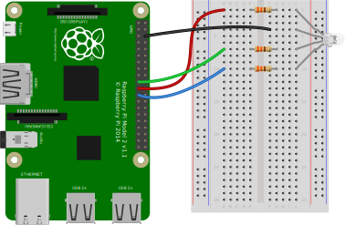

# RGB LED

###### 目录

> - Arduino API
>     - Arduino UNO R3
>     - STM32F103C8T6 Bule Pill
>     - ESP32-DevKitC
> - MicroPython API
>     - ESP32-DevKitC
> - STM32Cube（待补充）
> - Raspberry Pi

# Arduino API

## Arduino UNO R3

```arduino
/*
  RGB LED Control

  This code allows you to control the brightness of an RGB LED's red, green, and blue components using PWM.
  The RGB LED is connected to pins 9, 10, and 11 of the Arduino for red, green, and blue colors respectively.

  Circuit:
  - Red pin of RGB LED connected to pin 9 through a 220Ω resistor.
  - Green pin of RGB LED connected to pin 10 through a 220Ω resistor.
  - Blue pin of RGB LED connected to pin 11 through a 220Ω resistor.
  - Common cathode pin connected to GND.
    
  Diagram:

      Arduino       RGB LED
     ------------------------
    |   5V   | --> |  + (Cathode)   |
    |   GND  | --> |  GND (Common Cathode)  |
    |  Pin 9 | --> |  Red Anode     |
    |  Pin 10| --> |  Green Anode   |
    |  Pin 11| --> |  Blue Anode    |
     ------------------------------

  The common cathode pin of the RGB LED is connected to GND, and each color pin (red, green, and blue) is connected 
  to a corresponding PWM pin on the Arduino (pins 9, 10, 11) through a 220Ω current-limiting resistor.

  created 2024
  by Liang
*/

// Define pins for the RGB LED
const int redPin = 9;
const int greenPin = 10;
const int bluePin = 11;

void setup() {
  // Set RGB LED pins as output
  pinMode(redPin, OUTPUT);
  pinMode(greenPin, OUTPUT);
  pinMode(bluePin, OUTPUT);
}

void loop() {
  // Display different colors by adjusting RGB values

  // Set the LED to red
  setColor(255, 0, 0);  // Red full brightness
  delay(1000);          // Wait for 1 second

  // Set the LED to green
  setColor(0, 255, 0);  // Green full brightness
  delay(1000);          // Wait for 1 second

  // Set the LED to blue
  setColor(0, 0, 255);  // Blue full brightness
  delay(1000);          // Wait for 1 second

  // Set the LED to yellow
  setColor(255, 255, 0);  // Red + Green = Yellow
  delay(1000);            // Wait for 1 second

  // Set the LED to cyan
  setColor(0, 255, 255);  // Green + Blue = Cyan
  delay(1000);            // Wait for 1 second

  // Set the LED to magenta
  setColor(255, 0, 255);  // Red + Blue = Magenta
  delay(1000);            // Wait for 1 second

  // Set the LED to white
  setColor(255, 255, 255);  // Red + Green + Blue = White
  delay(1000);              // Wait for 1 second

  // Turn off the LED (black)
  setColor(0, 0, 0);  // No color
  delay(1000);        // Wait for 1 second
}

// Function to set the color of the RGB LED using PWM
void setColor(int red, int green, int blue) {
  analogWrite(redPin, red);    // Set the red brightness
  analogWrite(greenPin, green);  // Set the green brightness
  analogWrite(bluePin, blue);   // Set the blue brightness
}
```

## STM32F103C8T6 Bule Pill

```arduino
/*
  RGB LED Control for STM32F103C8T6 (Blue Pill)

  This code allows you to control the brightness of an RGB LED's red, green, and blue components using PWM.
  The RGB LED is connected to pins PA8, PA9, and PA10 of the STM32 for red, green, and blue colors respectively.

  Circuit:
  - Red pin of RGB LED connected to pin PA8 through a 220Ω resistor.
  - Green pin of RGB LED connected to pin PA9 through a 220Ω resistor.
  - Blue pin of RGB LED connected to pin PA10 through a 220Ω resistor.
  - Common cathode pin connected to GND.

  Diagram:

      STM32F103C8T6       RGB LED
     ------------------------------
    |   GND   | ------> | Cathode (Common) |
    |   PA8   | ------> | Red Anode        |
    |   PA9   | ------> | Green Anode      |
    |   PA10  | ------> | Blue Anode       |
     ------------------------------

  created 2024
  by Liang
*/

// Define pins for the RGB LED on STM32
const int redPin = PA8;  // Red pin connected to PA8
const int greenPin = PA9;  // Green pin connected to PA9
const int bluePin = PA10;  // Blue pin connected to PA10

void setup() {
  // Set RGB LED pins as output
  pinMode(redPin, OUTPUT);
  pinMode(greenPin, OUTPUT);
  pinMode(bluePin, OUTPUT);
}

void loop() {
  // Display different colors by adjusting RGB values

  // Set the LED to red
  setColor(255, 0, 0);  // Red full brightness
  delay(1000);          // Wait for 1 second

  // Set the LED to green
  setColor(0, 255, 0);  // Green full brightness
  delay(1000);          // Wait for 1 second

  // Set the LED to blue
  setColor(0, 0, 255);  // Blue full brightness
  delay(1000);          // Wait for 1 second

  // Set the LED to yellow
  setColor(255, 255, 0);  // Red + Green = Yellow
  delay(1000);            // Wait for 1 second

  // Set the LED to cyan
  setColor(0, 255, 255);  // Green + Blue = Cyan
  delay(1000);            // Wait for 1 second

  // Set the LED to magenta
  setColor(255, 0, 255);  // Red + Blue = Magenta
  delay(1000);            // Wait for 1 second

  // Set the LED to white
  setColor(255, 255, 255);  // Red + Green + Blue = White
  delay(1000);              // Wait for 1 second

  // Turn off the LED (black)
  setColor(0, 0, 0);  // No color
  delay(1000);        // Wait for 1 second
}

// Function to set the color of the RGB LED using PWM
void setColor(int red, int green, int blue) {
  analogWrite(redPin, red);    // Set the red brightness
  analogWrite(greenPin, green);  // Set the green brightness
  analogWrite(bluePin, blue);   // Set the blue brightness
}
```

## ESP32-DevKitC

```arduino
/*
  RGB LED Control for ESP32

  This code allows you to control the brightness of an RGB LED's red, green, and blue components using PWM.
  The RGB LED is connected to GPIO 16, 17, and 18 of the ESP32 for red, green, and blue colors respectively.

  Circuit:
  - Red pin of RGB LED connected to GPIO 16 through a 220Ω resistor.
  - Green pin of RGB LED connected to GPIO 17 through a 220Ω resistor.
  - Blue pin of RGB LED connected to GPIO 18 through a 220Ω resistor.
  - Common cathode pin connected to GND.

  Diagram:

      ESP32            RGB LED
     -------------------------------
    |   GND   | ------> | Cathode (Common) |
    |  GPIO16 | ------> | Red Anode        |
    |  GPIO17 | ------> | Green Anode      |
    |  GPIO18 | ------> | Blue Anode       |
     ------------------------------

  created 2024
  by Liang
*/

// Define pins for the RGB LED on ESP32
const int redPin = 16;   // Red pin connected to GPIO 16
const int greenPin = 17; // Green pin connected to GPIO 17
const int bluePin = 18;  // Blue pin connected to GPIO 18

void setup() {
  // Set RGB LED pins as output
  pinMode(redPin, OUTPUT);
  pinMode(greenPin, OUTPUT);
  pinMode(bluePin, OUTPUT);
}

void loop() {
  // Display different colors by adjusting RGB values

  // Set the LED to red
  setColor(255, 0, 0);  // Red full brightness
  delay(1000);          // Wait for 1 second

  // Set the LED to green
  setColor(0, 255, 0);  // Green full brightness
  delay(1000);          // Wait for 1 second

  // Set the LED to blue
  setColor(0, 0, 255);  // Blue full brightness
  delay(1000);          // Wait for 1 second

  // Set the LED to yellow
  setColor(255, 255, 0);  // Red + Green = Yellow
  delay(1000);            // Wait for 1 second

  // Set the LED to cyan
  setColor(0, 255, 255);  // Green + Blue = Cyan
  delay(1000);            // Wait for 1 second

  // Set the LED to magenta
  setColor(255, 0, 255);  // Red + Blue = Magenta
  delay(1000);            // Wait for 1 second

  // Set the LED to white
  setColor(255, 255, 255);  // Red + Green + Blue = White
  delay(1000);              // Wait for 1 second

  // Turn off the LED (black)
  setColor(0, 0, 0);  // No color
  delay(1000);        // Wait for 1 second
}

// Function to set the color of the RGB LED using PWM
void setColor(int red, int green, int blue) {
  analogWrite(redPin, red);    // Set the red brightness
  analogWrite(greenPin, green);  // Set the green brightness
  analogWrite(bluePin, blue);   // Set the blue brightness
}
```

# MicroPython API

## ESP32-DevKitC

# Raspberry Pi

## **Full color LED**

!https://gpiozero.readthedocs.io/en/stable/_images/rgb_led_bb.svg

Making colours with an [**`RGBLED`**](https://gpiozero.readthedocs.io/en/stable/api_output.html#gpiozero.RGBLED):

```python
**from** **gpiozero** **import** RGBLED
**from** **time** **import** sleep

led = RGBLED(red=9, green=10, blue=11)

led.red = 1  *# full red*sleep(1)
led.red = 0.5  *# half red*sleep(1)

led.color = (0, 1, 0)  *# full green*sleep(1)
led.color = (1, 0, 1)  *# magenta*sleep(1)
led.color = (1, 1, 0)  *# yellow*sleep(1)
led.color = (0, 1, 1)  *# cyan*sleep(1)
led.color = (1, 1, 1)  *# white*sleep(1)

led.color = (0, 0, 0)  *# off*sleep(1)

*# slowly increase intensity of blue***for** n **in** range(100):
    led.blue = n/100
    sleep(0.1)
```

# ESP-IDF API

## ESP32-DevKitC

`````python
"""
ESP32的RGB LED控制

此代码允许你使用PWM来控制RGB LED的红、绿、蓝各颜色分量的亮度。
RGB LED的红色引脚连接到ESP32的GPIO 16，绿色引脚连接到GPIO 17，蓝色引脚连接到GPIO 18，它们各自通过一个220Ω电阻连接。
公共阴极引脚连接到地线（GND）。

电路示意图如下：

      ESP32            RGB LED
     -------------------------------
    |   GND   | ------> | Cathode (Common) |
    |  GPIO16 | ------> | Red Anode        |
    |  GPIO17 | ------> | Green Anode      |
    |  GPIO18 | ------> | Blue Anode       |
     ------------------------------

创建于2024
作者：Liang
"""

from machine import Pin, PWM
import time

# 初始化红色引脚对应的PWM对象，引脚为16
pwm_red = PWM(Pin(16))
# 设置PWM频率，这里设置为1000Hz，可根据实际情况调整
pwm_red.freq(1000)

# 初始化绿色引脚对应的PWM对象，引脚为17
pwm_green = PWM(Pin(17))
pwm_green.freq(1000)

# 初始化蓝色引脚对应的PWM对象，引脚为18
pwm_blue = PWM(Pin(18))
pwm_blue.freq(1000)


def set_color(red, green, blue):
    """
    使用PWM设置RGB LED的颜色的函数。

    参数：
    - red：红色分量的亮度值，取值范围0 - 1023，对应不同亮度等级。
    - green：绿色分量的亮度值，取值范围0 - 1023，对应不同亮度等级。
    - blue：蓝色分量的亮度值，取值范围0 - 1023，对应不同亮度等级。

    此函数通过将传入的各颜色分量亮度值设置到对应的PWM引脚，从而改变RGB LED显示的颜色。
    """
    # 设置红色引脚的PWM占空比，以控制红色亮度
    pwm_red.duty(red)
    # 设置绿色引脚的PWM占空比，以控制绿色亮度
    pwm_green.duty(green)
    # 设置蓝色引脚的PWM占空比，以控制蓝色亮度
    pwm_blue.duty(blue)


while True:
    """
    主循环，用于循环展示不同颜色。

    在循环中，依次调用set_color函数来设置RGB LED显示不同的颜色，每种颜色显示1秒钟，
    展示的颜色包括红、绿、蓝、黄、青、品红、白以及关闭（黑色）。
    """
    # 设置LED为红色（红色全亮，绿色和蓝色关闭）
    set_color(1023, 0, 0)
    time.sleep(1)

    # 设置LED为绿色（绿色全亮，红色和蓝色关闭）
    set_color(0, 1023, 0)
    time.sleep(1)

    # 设置LED为蓝色（蓝色全亮，红色和绿色关闭）
    set_color(0, 0, 1023)
    time.sleep(1)

    # 设置LED为黄色（红色和绿色全亮，蓝色关闭）
    set_color(1023, 1023, 0)
    time.sleep(1)

    # 设置LED为青色（绿色和蓝色全亮，红色关闭）
    set_color(0, 1023, 1023)
    time.sleep(1)

    # 设置LED为品红色（红色和蓝色全亮，绿色关闭）
    set_color(1023, 0, 1023)
    time.sleep(1)

    # 设置LED为白色（红、绿、蓝全亮）
    set_color(1023, 1023, 1023)
    time.sleep(1)

    # 关闭LED（所有颜色分量亮度为0，显示黑色）
    set_color(0, 0, 0)
    time.sleep(1)
`````

# Raspberry Pi




`````python
from gpiozero import RGBLED
from time import sleep

led = RGBLED(red=9, green=10, blue=11)

led.red = 1  # full redsleep(1)
led.red = 0.5  # half redsleep(1)

led.color = (0, 1, 0)  # full greensleep(1)
led.color = (1, 0, 1)  # magentasleep(1)
led.color = (1, 1, 0)  # yellowsleep(1)
led.color = (0, 1, 1)  # cyansleep(1)
led.color = (1, 1, 1)  # whitesleep(1)

led.color = (0, 0, 0)  # offsleep(1)

# slowly increase intensity of bluefor n in range(100):
    led.blue = n/100
    sleep(0.1)
`````

