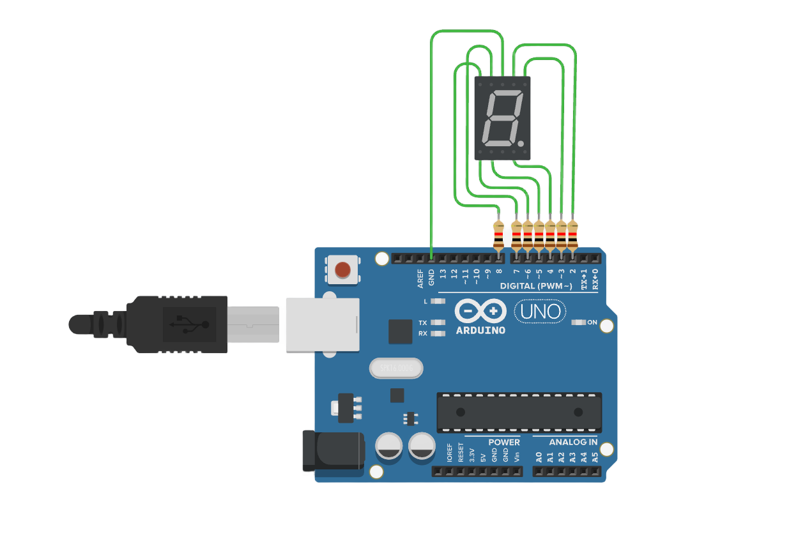

# 7 位数码管

###### 目录

> - Arduino API
>     - Arduino UNO R3
>     - STM32F103C8T6 Bule Pill
>     - ESP32-DevKitC
> - MicroPython API
>     - ESP32-DevKitC
> - STM32Cube（待补充）

# Arduino API

## Arduino UNO R3



```arduino
/*
  7-Segment Display Digit Control

  This code controls a 7-segment display connected to an Arduino.
  It loops through the digits 0 to 9 and displays each digit for 1 second using individual pins for each segment.

  Circuit:
  - A common cathode 7-segment display is connected to pins 2-8 of the Arduino.
  - Each segment (a-g) is controlled by a specific pin.
  - 220Ω resistors are placed in series with each segment to limit the current.

  Diagram:

         Arduino        7-Segment Display
        --------        -----------------
       |        |      |   a            |
       |     2  |------|   o---/\\/\\/----| (220Ω resistor to segment a)
       |     3  |------|   o---/\\/\\/----| (220Ω resistor to segment b)
       |     4  |------|   o---/\\/\\/----| (220Ω resistor to segment c)
       |     5  |------|   o---/\\/\\/----| (220Ω resistor to segment d)
       |     6  |------|   o---/\\/\\/----| (220Ω resistor to segment e)
       |     7  |------|   o---/\\/\\/----| (220Ω resistor to segment f)
       |     8  |------|   o---/\\/\\/----| (220Ω resistor to segment g)
       |        |      |                |
       |   GND  |------| GND (Common Cathode) |
       |        |      --------------------
       |        |
  
  created 2024
  by Liang
*/

// Define the pin mappings for each segment of the 7-segment display
const int segmentA = 2;
const int segmentB = 3;
const int segmentC = 4;
const int segmentD = 5;
const int segmentE = 6;
const int segmentF = 7;
const int segmentG = 8;

void setup() {
  // Initialize all segment pins as output so they can control the display
  pinMode(segmentA, OUTPUT);  // Set pin for segment A as output
  pinMode(segmentB, OUTPUT);  // Set pin for segment B as output
  pinMode(segmentC, OUTPUT);  // Set pin for segment C as output
  pinMode(segmentD, OUTPUT);  // Set pin for segment D as output
  pinMode(segmentE, OUTPUT);  // Set pin for segment E as output
  pinMode(segmentF, OUTPUT);  // Set pin for segment F as output
  pinMode(segmentG, OUTPUT);  // Set pin for segment G as output
}

// Function to turn off all segments (clearing the display before showing a new digit)
void clearDisplay() {
  digitalWrite(segmentA, LOW);  // Turn off segment A
  digitalWrite(segmentB, LOW);  // Turn off segment B
  digitalWrite(segmentC, LOW);  // Turn off segment C
  digitalWrite(segmentD, LOW);  // Turn off segment D
  digitalWrite(segmentE, LOW);  // Turn off segment E
  digitalWrite(segmentF, LOW);  // Turn off segment F
  digitalWrite(segmentG, LOW);  // Turn off segment G
}

// Function to display a specific digit on the 7-segment display
void displayDigit(int digit) {
  clearDisplay();  // Clear the display to avoid leftover segments from previous digit

  // Determine which segments to light up for the specified digit
  switch (digit) {
    case 0:
      // Display '0' by lighting up segments a, b, c, d, e, f
      digitalWrite(segmentA, HIGH);
      digitalWrite(segmentB, HIGH);
      digitalWrite(segmentC, HIGH);
      digitalWrite(segmentD, HIGH);
      digitalWrite(segmentE, HIGH);
      digitalWrite(segmentF, HIGH);
      digitalWrite(segmentG, LOW);  // Segment g off
      break;
    case 1:
      // Display '1' by lighting up segments b, c
      digitalWrite(segmentA, LOW);
      digitalWrite(segmentB, HIGH);
      digitalWrite(segmentC, HIGH);
      digitalWrite(segmentD, LOW);
      digitalWrite(segmentE, LOW);
      digitalWrite(segmentF, LOW);
      digitalWrite(segmentG, LOW);
      break;
    case 2:
      // Display '2' by lighting up segments a, b, d, e, g
      digitalWrite(segmentA, HIGH);
      digitalWrite(segmentB, HIGH);
      digitalWrite(segmentC, LOW);
      digitalWrite(segmentD, HIGH);
      digitalWrite(segmentE, HIGH);
      digitalWrite(segmentF, LOW);
      digitalWrite(segmentG, HIGH);
      break;
    case 3:
      // Display '3' by lighting up segments a, b, c, d, g
      digitalWrite(segmentA, HIGH);
      digitalWrite(segmentB, HIGH);
      digitalWrite(segmentC, HIGH);
      digitalWrite(segmentD, HIGH);
      digitalWrite(segmentE, LOW);
      digitalWrite(segmentF, LOW);
      digitalWrite(segmentG, HIGH);
      break;
    case 4:
      // Display '4' by lighting up segments b, c, f, g
      digitalWrite(segmentA, LOW);
      digitalWrite(segmentB, HIGH);
      digitalWrite(segmentC, HIGH);
      digitalWrite(segmentD, LOW);
      digitalWrite(segmentE, LOW);
      digitalWrite(segmentF, HIGH);
      digitalWrite(segmentG, HIGH);
      break;
    case 5:
      // Display '5' by lighting up segments a, c, d, f, g
      digitalWrite(segmentA, HIGH);
      digitalWrite(segmentB, LOW);
      digitalWrite(segmentC, HIGH);
      digitalWrite(segmentD, HIGH);
      digitalWrite(segmentE, LOW);
      digitalWrite(segmentF, HIGH);
      digitalWrite(segmentG, HIGH);
      break;
    case 6:
      // Display '6' by lighting up segments a, c, d, e, f, g
      digitalWrite(segmentA, HIGH);
      digitalWrite(segmentB, LOW);
      digitalWrite(segmentC, HIGH);
      digitalWrite(segmentD, HIGH);
      digitalWrite(segmentE, HIGH);
      digitalWrite(segmentF, HIGH);
      digitalWrite(segmentG, HIGH);
      break;
    case 7:
      // Display '7' by lighting up segments a, b, c
      digitalWrite(segmentA, HIGH);
      digitalWrite(segmentB, HIGH);
      digitalWrite(segmentC, HIGH);
      digitalWrite(segmentD, LOW);
      digitalWrite(segmentE, LOW);
      digitalWrite(segmentF, LOW);
      digitalWrite(segmentG, LOW);
      break;
    case 8:
      // Display '8' by lighting up all segments a, b, c, d, e, f, g
      digitalWrite(segmentA, HIGH);
      digitalWrite(segmentB, HIGH);
      digitalWrite(segmentC, HIGH);
      digitalWrite(segmentD, HIGH);
      digitalWrite(segmentE, HIGH);
      digitalWrite(segmentF, HIGH);
      digitalWrite(segmentG, HIGH);
      break;
    case 9:
      // Display '9' by lighting up segments a, b, c, d, f, g
      digitalWrite(segmentA, HIGH);
      digitalWrite(segmentB, HIGH);
      digitalWrite(segmentC, HIGH);
      digitalWrite(segmentD, HIGH);
      digitalWrite(segmentE, LOW);
      digitalWrite(segmentF, HIGH);
      digitalWrite(segmentG, HIGH);
      break;
  }
}

void loop() {
  // Loop through digits 0 to 9 and display each for 1 second

  for (int i = 0; i <= 9; i++) {
    displayDigit(i);  // Display the current digit
    delay(1000);      // Wait for 1 second before moving to the next digit
  }
}
```

## STM32F103C8T6 Bule Pill

Only adapt pin, other same.

```arduino
/*
  STM32F103C8T6 (Blue Pill) 7-Segment Display Digit Control

  This code controls a 7-segment display connected to an STM32.
  It loops through the digits 0 to 9 and displays each digit for 1 second using individual pins for each segment.

  Circuit:
  - A common cathode 7-segment display is connected to PA0-PA6 of the STM32.
  - Each segment (a-g) is controlled by a specific pin.
  - 220Ω resistors are placed in series with each segment to limit the current.

  Diagram:

         STM32         7-Segment Display
        --------       -----------------
       |        |     |   a            |
       |   PA0  |-----|   o---/\\/\\/----| (220Ω resistor to segment a)
       |   PA1  |-----|   o---/\\/\\/----| (220Ω resistor to segment b)
       |   PA2  |-----|   o---/\\/\\/----| (220Ω resistor to segment c)
       |   PA3  |-----|   o---/\\/\\/----| (220Ω resistor to segment d)
       |   PA4  |-----|   o---/\\/\\/----| (220Ω resistor to segment e)
       |   PA5  |-----|   o---/\\/\\/----| (220Ω resistor to segment f)
       |   PA6  |-----|   o---/\\/\\/----| (220Ω resistor to segment g)
       |   GND  |-----| GND (Common Cathode) |
       |        |     --------------------
  
  The LED segments are connected to PA0-PA6, and the common cathode is connected to GND.

  created 2024
  by Liang
*/

// Define the pin mappings for each segment of the 7-segment display
const int segmentA = PA0;
const int segmentB = PA1;
const int segmentC = PA2;
const int segmentD = PA3;
const int segmentE = PA4;
const int segmentF = PA5;
const int segmentG = PA6;

void setup() {
  // Initialize all segment pins as output to control the display
  pinMode(segmentA, OUTPUT);
  pinMode(segmentB, OUTPUT);
  pinMode(segmentC, OUTPUT);
  pinMode(segmentD, OUTPUT);
  pinMode(segmentE, OUTPUT);
  pinMode(segmentF, OUTPUT);
  pinMode(segmentG, OUTPUT);
}

// Function to turn off all segments (clearing the display before showing a new digit)
void clearDisplay() {
  digitalWrite(segmentA, LOW);
  digitalWrite(segmentB, LOW);
  digitalWrite(segmentC, LOW);
  digitalWrite(segmentD, LOW);
  digitalWrite(segmentE, LOW);
  digitalWrite(segmentF, LOW);
  digitalWrite(segmentG, LOW);
}

// Function to display a specific digit on the 7-segment display
void displayDigit(int digit) {
  clearDisplay();  // Clear the display to avoid leftover segments from previous digit

  // Determine which segments to light up for the specified digit
  switch (digit) {
    case 0:
      digitalWrite(segmentA, HIGH);
      digitalWrite(segmentB, HIGH);
      digitalWrite(segmentC, HIGH);
      digitalWrite(segmentD, HIGH);
      digitalWrite(segmentE, HIGH);
      digitalWrite(segmentF, HIGH);
      break;
    case 1:
      digitalWrite(segmentB, HIGH);
      digitalWrite(segmentC, HIGH);
      break;
    case 2:
      digitalWrite(segmentA, HIGH);
      digitalWrite(segmentB, HIGH);
      digitalWrite(segmentD, HIGH);
      digitalWrite(segmentE, HIGH);
      digitalWrite(segmentG, HIGH);
      break;
    case 3:
      digitalWrite(segmentA, HIGH);
      digitalWrite(segmentB, HIGH);
      digitalWrite(segmentC, HIGH);
      digitalWrite(segmentD, HIGH);
      digitalWrite(segmentG, HIGH);
      break;
    case 4:
      digitalWrite(segmentB, HIGH);
      digitalWrite(segmentC, HIGH);
      digitalWrite(segmentF, HIGH);
      digitalWrite(segmentG, HIGH);
      break;
    case 5:
      digitalWrite(segmentA, HIGH);
      digitalWrite(segmentC, HIGH);
      digitalWrite(segmentD, HIGH);
      digitalWrite(segmentF, HIGH);
      digitalWrite(segmentG, HIGH);
      break;
    case 6:
      digitalWrite(segmentA, HIGH);
      digitalWrite(segmentC, HIGH);
      digitalWrite(segmentD, HIGH);
      digitalWrite(segmentE, HIGH);
      digitalWrite(segmentF, HIGH);
      digitalWrite(segmentG, HIGH);
      break;
    case 7:
      digitalWrite(segmentA, HIGH);
      digitalWrite(segmentB, HIGH);
      digitalWrite(segmentC, HIGH);
      break;
    case 8:
      digitalWrite(segmentA, HIGH);
      digitalWrite(segmentB, HIGH);
      digitalWrite(segmentC, HIGH);
      digitalWrite(segmentD, HIGH);
      digitalWrite(segmentE, HIGH);
      digitalWrite(segmentF, HIGH);
      digitalWrite(segmentG, HIGH);
      break;
    case 9:
      digitalWrite(segmentA, HIGH);
      digitalWrite(segmentB, HIGH);
      digitalWrite(segmentC, HIGH);
      digitalWrite(segmentD, HIGH);
      digitalWrite(segmentF, HIGH);
      digitalWrite(segmentG, HIGH);
      break;
  }
}

void loop() {
  // Loop through digits 0 to 9 and display each for 1 second
  for (int i = 0; i <= 9; i++) {
    displayDigit(i);
    delay(1000);  // Wait for 1 second before moving to the next digit
  }
}
```

## ESP32-DevKit.

Only adapt pin, other same,

```arduino
/*
  ESP32 7-Segment Display Digit Control

  This code controls a 7-segment display connected to an ESP32.
  It loops through the digits 0 to 9 and displays each digit for 1 second using individual pins for each segment.

  Circuit:
  - A common cathode 7-segment display is connected to GPIO 12-18 of the ESP32.
  - Each segment (a-g) is controlled by a specific pin.
  - 220Ω resistors are placed in series with each segment to limit the current.

  Diagram:

         ESP32         7-Segment Display
        --------       -----------------
       |        |     |   a            |
       |  GPIO12|-----|   o---/\\/\\/----| (220Ω resistor to segment a)
       |  GPIO13|-----|   o---/\\/\\/----| (220Ω resistor to segment b)
       |  GPIO14|-----|   o---/\\/\\/----| (220Ω resistor to segment c)
       |  GPIO15|-----|   o---/\\/\\/----| (220Ω resistor to segment d)
       |  GPIO16|-----|   o---/\\/\\/----| (220Ω resistor to segment e)
       |  GPIO17|-----|   o---/\\/\\/----| (220Ω resistor to segment f)
       |  GPIO18|-----|   o---/\\/\\/----| (220Ω resistor to segment g)
       |   GND  |-----| GND (Common Cathode) |
       |        |     --------------------

  created 2024
  by Liang
*/

// Define the pin mappings for each segment of the 7-segment display
const int segmentA = 12;
const int segmentB = 13;
const int segmentC = 14;
const int segmentD = 15;
const int segmentE = 16;
const int segmentF = 17;
const int segmentG = 18;

void setup() {
  // Initialize all segment pins as output to control the display
  pinMode(segmentA, OUTPUT);
  pinMode(segmentB, OUTPUT);
  pinMode(segmentC, OUTPUT);
  pinMode(segmentD, OUTPUT);
  pinMode(segmentE, OUTPUT);
  pinMode(segmentF, OUTPUT);
  pinMode(segmentG, OUTPUT);
}

// Function to turn off all segments (clearing the display before showing a new digit)
void clearDisplay() {
  digitalWrite(segmentA, LOW);
  digitalWrite(segmentB, LOW);
  digitalWrite(segmentC, LOW);
  digitalWrite(segmentD, LOW);
  digitalWrite(segmentE, LOW);
  digitalWrite(segmentF, LOW);
  digitalWrite(segmentG, LOW);
}

// Function to display a specific digit on the 7-segment display
void displayDigit(int digit) {
  clearDisplay();  // Clear the display to avoid leftover segments from previous digit

  // Determine which segments to light up for the specified digit
  switch (digit) {
    case 0:
      digitalWrite(segmentA, HIGH);
      digitalWrite(segmentB, HIGH);
      digitalWrite(segmentC, HIGH);
      digitalWrite(segmentD, HIGH);
      digitalWrite(segmentE, HIGH);
      digitalWrite(segmentF, HIGH);
      break;
    case 1:
      digitalWrite(segmentB, HIGH);
      digitalWrite(segmentC, HIGH);
      break;
    case 2:
      digitalWrite(segmentA, HIGH);
      digitalWrite(segmentB, HIGH);
      digitalWrite(segmentD, HIGH);
      digitalWrite(segmentE, HIGH);
      digitalWrite(segmentG, HIGH);
      break;
    case 3:
      digitalWrite(segmentA, HIGH);
      digitalWrite(segmentB, HIGH);
      digitalWrite(segmentC, HIGH);
      digitalWrite(segmentD, HIGH);
      digitalWrite(segmentG, HIGH);
      break;
    case 4:
      digitalWrite(segmentB, HIGH);
      digitalWrite(segmentC, HIGH);
      digitalWrite(segmentF, HIGH);
      digitalWrite(segmentG, HIGH);
      break;
    case 5:
      digitalWrite(segmentA, HIGH);
      digitalWrite(segmentC, HIGH);
      digitalWrite(segmentD, HIGH);
      digitalWrite(segmentF, HIGH);
      digitalWrite(segmentG, HIGH);
      break;
    case 6:
      digitalWrite(segmentA, HIGH);
      digitalWrite(segmentC, HIGH);
      digitalWrite(segmentD, HIGH);
      digitalWrite(segmentE, HIGH);
      digitalWrite(segmentF, HIGH);
      digitalWrite(segmentG, HIGH);
      break;
    case 7:
      digitalWrite(segmentA, HIGH);
      digitalWrite(segmentB, HIGH);
      digitalWrite(segmentC, HIGH);
      break;
    case 8:
      digitalWrite(segmentA, HIGH);
      digitalWrite(segmentB, HIGH);
      digitalWrite(segmentC, HIGH);
      digitalWrite(segmentD, HIGH);
      digitalWrite(segmentE, HIGH);
      digitalWrite(segmentF, HIGH);
      digitalWrite(segmentG, HIGH);
      break;
    case 9:
      digitalWrite(segmentA, HIGH);
      digitalWrite(segmentB, HIGH);
      digitalWrite(segmentC, HIGH);
      digitalWrite(segmentD, HIGH);
      digitalWrite(segmentF, HIGH);
      digitalWrite(segmentG, HIGH);
      break;
  }
}

void loop() {
  // Loop through digits 0 to 9 and display each for 1 second
  for (int i = 0; i <= 9; i++) {
    displayDigit(i);
    delay(1000);  // Wait for 1 second before moving to the next digit
  }
}
```

# MicroPython API

## ESP32-DevKitC

```python
"""
ESP32 控制 7 位数码管

此代码演示了如何使用 MicroPython 将 ESP32 连接到 7 位数码管，并显示数字 0 到 9。

电路连接：
- 共阴极数码管
- a: GPIO 12
- b: GPIO 13
- c: GPIO 14
- d: GPIO 15
- e: GPIO 16
- f: GPIO 17
- g: GPIO 18
- GND: 公共阴极连接到 GND

电路图：
         ESP32         7-Segment Display
        --------       -----------------
       |        |     |   a            |
       |  GPIO12|-----|   o---/\\/\\/----| (220Ω resistor to segment a)
       |  GPIO13|-----|   o---/\\/\\/----| (220Ω resistor to segment b)
       |  GPIO14|-----|   o---/\\/\\/----| (220Ω resistor to segment c)
       |  GPIO15|-----|   o---/\\/\\/----| (220Ω resistor to segment d)
       |  GPIO16|-----|   o---/\\/\\/----| (220Ω resistor to segment e)
       |  GPIO17|-----|   o---/\\/\\/----| (220Ω resistor to segment f)
       |  GPIO18|-----|   o---/\\/\\/----| (220Ω resistor to segment g)
       |   GND  |-----| GND (Common Cathode) |
       |        |     --------------------

创建于 2024
作者：Liang
"""

import machine
import time

# 定义数码管的段引脚
segments = [
    machine.Pin(5, machine.Pin.OUT),  # a
    machine.Pin(18, machine.Pin.OUT), # b
    machine.Pin(19, machine.Pin.OUT), # c
    machine.Pin(21, machine.Pin.OUT), # d
    machine.Pin(22, machine.Pin.OUT), # e
    machine.Pin(23, machine.Pin.OUT), # f
    machine.Pin(25, machine.Pin.OUT), # g
    machine.Pin(26, machine.Pin.OUT)  # dp
]

# 定义数码管显示数字 0 到 9 的段码
digit_patterns = {
    0: (1, 1, 1, 1, 1, 1, 0, 0),  # 0
    1: (0, 1, 1, 0, 0, 0, 0, 0),  # 1
    2: (1, 1, 0, 1, 1, 0, 1, 0),  # 2
    3: (1, 1, 1, 1, 0, 0, 1, 0),  # 3
    4: (0, 1, 1, 0, 0, 1, 1, 0),  # 4
    5: (1, 0, 1, 1, 0, 1, 1, 0),  # 5
    6: (1, 0, 1, 1, 1, 1, 1, 0),  # 6
    7: (1, 1, 1, 0, 0, 0, 0, 0),  # 7
    8: (1, 1, 1, 1, 1, 1, 1, 0),  # 8
    9: (1, 1, 1, 1, 0, 1, 1, 0)   # 9
}

def display_digit(digit):
    """
    显示指定的数字。
    
    参数:
        digit (int): 要显示的数字（0-9）。
    """
    if 0 <= digit <= 9:
        pattern = digit_patterns[digit]
        for i in range(len(segments)):
            segments[i].value(pattern[i])
    else:
        print("无效的数字")

def main():
    """
    主函数，循环显示 0 到 9。
    """
    while True:
        for digit in range(10):
            display_digit(digit)
            time.sleep(1)

if __name__ == "__main__":
    main()
```

