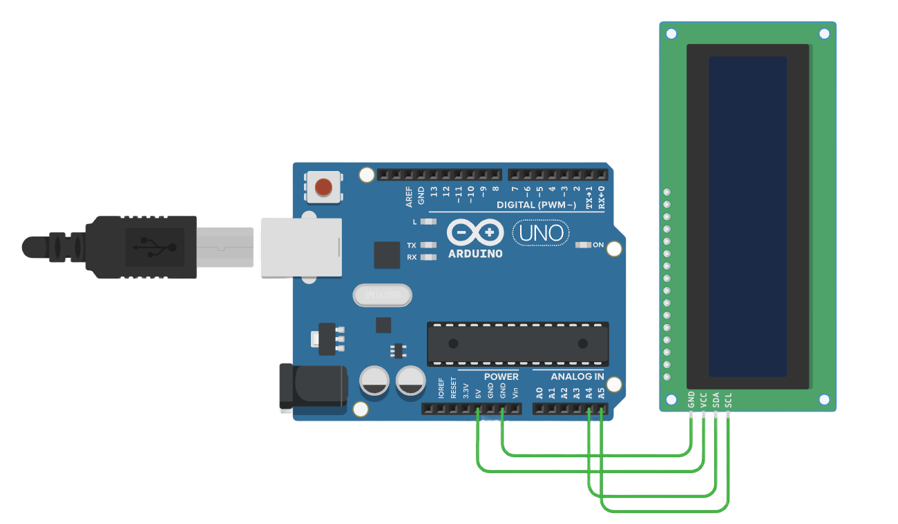

# LCD

###### 目录

> - Arduino API
>     - Arduino UNO R3
>     - STM32F103C8T6 Bule Pill
>     - ESP32-DevKitC
> - MicroPython API
>     - ESP32-DevKitC
> - STM32Cube（待补充）

# Arduino API

## Arduino UNO R3



```arduino
/*
  LCD I2C Example - 16x2 Display

  This example demonstrates how to control a 16x2 LCD using the I2C protocol with Arduino.
  It prints "Hello world!" on the first row and "LCD Tutorial" on the second row.

  Circuit:
  - An I2C LCD display is connected to the Arduino.

  Diagram:
  
      Arduino       I2C LCD
     ------------------------
    |  5V   | --> |   VCC    |
    |  GND  | --> |   GND    |
    |  A4   | --> |   SDA    |
    |  A5   | --> |   SCL    |
     ------------------------

  created 2024
  by Liang
*/

#include <LiquidCrystal_I2C.h>  // Include the LiquidCrystal_I2C library for controlling the LCD

// Initialize the LCD with address 0x20, 16 columns, and 2 rows
// The first parameter is the I2C address (0x20 in this case)
// The second and third parameters specify that it is a 16x2 LCD
LiquidCrystal_I2C lcd(0x20, 16, 2);

void setup()
{
  lcd.init();           // Initialize the LCD, setting it up for use
  lcd.clear();          // Clear the LCD screen to ensure it's empty
  lcd.backlight();      // Turn on the LCD backlight

  // Print a message on the first row of the LCD
  lcd.setCursor(2, 0);  // Set the cursor to column 2 of row 0 (first row)
  lcd.print("Hello world!");  // Print "Hello world!" on the first row
  
  // Print a message on the second row of the LCD
  lcd.setCursor(2, 1);  // Move the cursor to column 2 of row 1 (second row)
  lcd.print("LCD Tutorial");  // Print "LCD Tutorial" on the second row
}

void loop()
{
  // No operation needed in loop for this simple example
  // The messages on the LCD will remain static
}
```

## STM32F103C8T6 Bule Pill

```arduino
/*
  LCD I2C Example - 16x2 Display for STM32F103C8T6 (Blue Pill)

  This example demonstrates how to control a 16x2 LCD using the I2C protocol with STM32F103C8T6.
  It prints "Hello world!" on the first row and "LCD Tutorial" on the second row.

  Circuit:
  - An I2C LCD display is connected to the STM32F103C8T6.

  Diagram:
  
      STM32F103C8T6      I2C LCD
     ------------------------------
    |  5V   | ------> |   VCC    |
    |  GND  | ------> |   GND    |
    |  PB7  | ------> |   SDA    |
    |  PB6  | ------> |   SCL    |
     -----------------------------

  created 2024
  by Liang
*/

#include <Wire.h>               // Include Wire library for I2C
#include <LiquidCrystal_I2C.h>   // Include the LiquidCrystal_I2C library for controlling the LCD

// Initialize the LCD with the I2C address (0x20), 16 columns, and 2 rows
LiquidCrystal_I2C lcd(0x20, 16, 2);

void setup() {
  lcd.init();           // Initialize the LCD
  lcd.clear();          // Clear the LCD screen
  lcd.backlight();      // Turn on the LCD backlight

  // Print a message on the first row of the LCD
  lcd.setCursor(2, 0);  // Set cursor to column 2 of row 0 (first row)
  lcd.print("Hello world!");  // Print "Hello world!" on the first row

  // Print a message on the second row of the LCD
  lcd.setCursor(2, 1);  // Move cursor to column 2 of row 1 (second row)
  lcd.print("LCD Tutorial");  // Print "LCD Tutorial" on the second row
}

void loop() {
  // No operation needed in loop for this example
}
```

## ESP32-DevKitC

```arduino
/*
  LCD I2C Example - 16x2 Display for ESP32

  This example demonstrates how to control a 16x2 LCD using the I2C protocol with ESP32.
  It prints "Hello world!" on the first row and "LCD Tutorial" on the second row.

  Circuit:
  - An I2C LCD display is connected to the ESP32.

  Diagram:
  
      ESP32           I2C LCD
     --------------------------
    |  3.3V/5V | ---> |   VCC    |
    |   GND    | ---> |   GND    |
    |  GPIO 21 | ---> |   SDA    |
    |  GPIO 22 | ---> |   SCL    |
     ----------------------------

  created 2024
  by Liang
*/

#include <Wire.h>               // Include the Wire library for I2C
#include <LiquidCrystal_I2C.h>   // Include the LiquidCrystal_I2C library for controlling the LCD

// Initialize the LCD with the I2C address (0x20), 16 columns, and 2 rows
LiquidCrystal_I2C lcd(0x20, 16, 2);

void setup() {
  lcd.init();           // Initialize the LCD
  lcd.clear();          // Clear the LCD screen
  lcd.backlight();      // Turn on the LCD backlight

  // Print a message on the first row of the LCD
  lcd.setCursor(2, 0);  // Set cursor to column 2 of row 0 (first row)
  lcd.print("Hello world!");  // Print "Hello world!" on the first row

  // Print a message on the second row of the LCD
  lcd.setCursor(2, 1);  // Move cursor to column 2 of row 1 (second row)
  lcd.print("LCD Tutorial");  // Print "LCD Tutorial" on the second row
}

void loop() {
  // No operation needed in loop for this example
}
```

# MicroPython API

## ESP32-DevKitC

```python
"""
LCD I2C示例 - 16x2显示屏

此示例展示了如何使用ESP32-DevKitC并基于MicroPython框架通过I2C协议控制一个16x2的LCD显示屏。
它会在LCD的第一行显示“Hello world!”，在第二行显示“LCD Tutorial”。

电路连接情况：
- 一个I2C接口的LCD显示屏连接到ESP32-DevKitC开发板。

连接示意图如下：

      ESP32-DevKitC       I2C LCD
     ------------------------
    |  3.3V  | --> |   VCC    |
    |  GND   | --> |   GND    |
    |  21    | --> |   SDA    |
    |  22    | --> |   SCL    |
     ------------------------

注：在ESP32-DevKitC中，通常使用引脚21作为SDA（数据信号线），引脚22作为SCL（时钟信号线）来进行I2C通信，这里的引脚与Arduino有所不同。

创建于2024
作者：Liang
"""

from machine import Pin, I2C
import time
from lcd_api import LcdApi
from i2c_lcd import I2cLcd

# I2C对象初始化，指定SDA引脚为21，SCL引脚为22，波特率为100000（这是I2C常用的标准波特率）
i2c = I2C(scl=Pin(22), sda=Pin(21), freq=100000)

# 扫描I2C总线上的设备，获取设备地址列表，一般情况下，我们期望找到的LCD设备地址在这里获取到
devices = i2c.scan()
if len(devices) == 0:
    print("没有发现I2C设备，请检查硬件连接")
else:
    print("发现I2C设备地址:", devices)
    # 假设LCD的I2C地址为0x27（不同的LCD模块地址可能不同，需要根据实际情况修改，此处示例假设为0x27）
    lcd_address = 0x27
    # 初始化LCD对象，传入I2C对象、设备地址、行数和列数信息，这里是16列2行的LCD
    lcd = I2cLcd(i2c, lcd_address, 2, 16)

    def setup_lcd():
        """
        初始化LCD显示相关设置的函数。

        此函数用于清空LCD屏幕、打开背光，并在相应位置显示指定的文本内容。
        """
        lcd.clear()  # 清空LCD屏幕，确保初始状态下屏幕上没有残留内容
        lcd.backlight_on()  # 打开LCD的背光，使屏幕能够正常显示内容

        # 设置光标位置到第一行第2列（行列计数从0开始）
        lcd.move_to(2, 0)
        lcd.putstr("Hello world!")  # 在第一行显示"Hello world!"

        # 设置光标位置到第二行第2列
        lcd.move_to(2, 1)
        lcd.putstr("LCD Tutorial")  # 在第二行显示"LCD Tutorial"

    setup_lcd()

    while True:
        """
        主循环，由于这个示例只是简单显示固定文本，所以循环内暂时无需额外操作。
        如果后续需要更新显示内容等，可以在这个循环内添加相应逻辑代码。
        """
        time.sleep(1)  # 适当延时，避免程序空转占用过多资源，这里每秒延时一次，可根据实际情况调整
```

