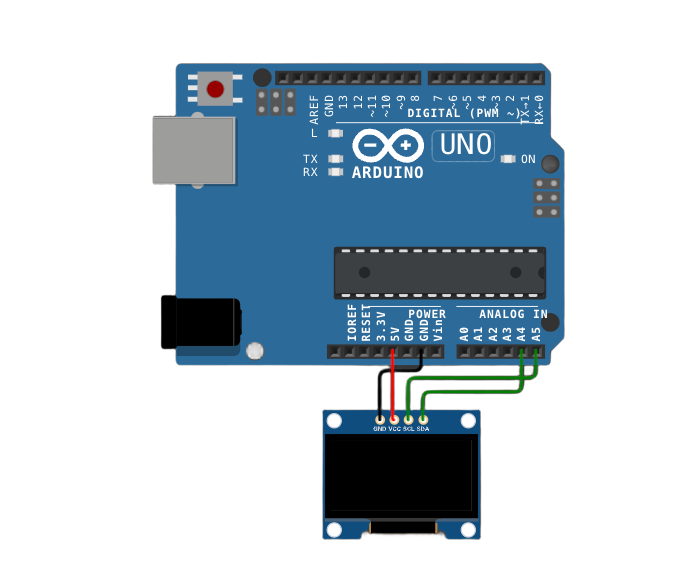
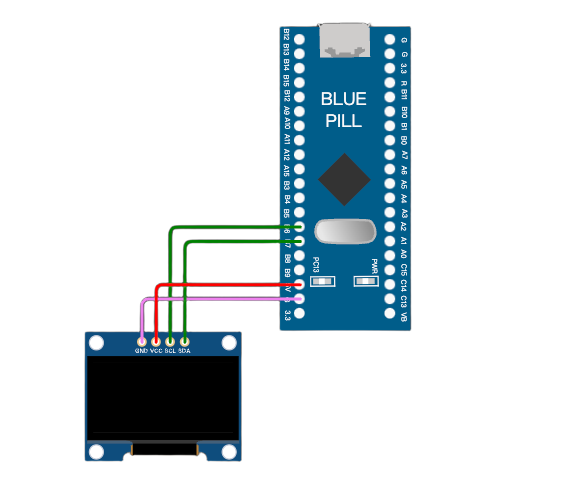
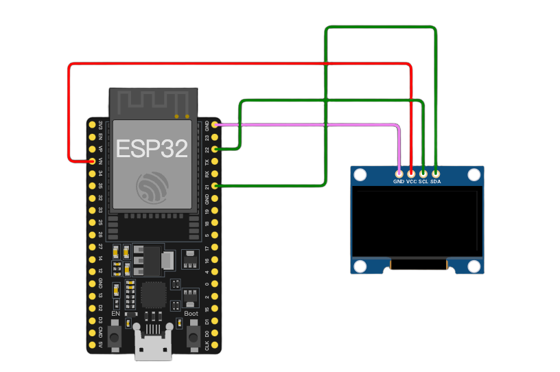

# OLED

###### 目录

> - Arduino API
>     - Arduino UNO R3
>     - STM32F103C8T6 Bule Pill
>     - ESP32-DevKitC
> - MicroPython API
>     - ESP32-DevKitC
> - STM32Cube（待补充）

# Arduino API

## Arduino UNO R3

[在线仿真](https://wokwi.com/projects/415313618305020929)：https://wokwi.com/projects/415313618305020929



```arduino
/*
  OLED Display Control with Arduino UNO R3

  This code demonstrates how to control a 4-pin OLED display using an Arduino UNO R3 board.
  It initializes the OLED display and shows a static text "Hello, World!" on it.

  Connections:
  - The SSD1306 OLED display is connected to the Arduino UNO R3 as follows:
    - The VCC pin of the OLED is connected to the +5V pin on the Arduino UNO R3 (used for providing power to the display).
    - The GND pin of the OLED is connected to the GND pin on the Arduino UNO R3 (for grounding the display).
    - The SCL pin of the OLED is connected to pin A5 on the Arduino UNO R3 (which serves as the Serial Clock Line for I2C communication).
    - The SDA pin of the OLED is connected to pin A4 on the Arduino UNO R3 (which serves as the Serial Data Line for I2C communication).

  Diagram:
  
       SSD1306 OLED         Arduino Uno
     ----------------------    ---------
    |          |            |         |
    |   VCC ----|------------|   +5V    |
    |   GND ----|------------|   GND    |
    |   SCL ----|------------|   A5     |
    |   SDA ----|------------|   A4     |
    |          |            |         |
     ----------------------    ---------

  The code first initializes the OLED display and then repeatedly clears the display and shows the text in the loop.

  created 2024
  by Liang
*/

#include <Wire.h>
#include <Adafruit_GFX.h>
#include <Adafruit_SSD1306.h>

// Define the width of the OLED display in pixels. In this case, it's set to 128 pixels.
const int SCREEN_WIDTH = 128; 
// Define the height of the OLED display in pixels. Here, it's set to 64 pixels.
const int SCREEN_HEIGHT = 64; 

// Declaration for an SSD1306 display connected to I2C (using the SDA and SCL pins).
// The constructor takes the screen width, screen height, a pointer to the Wire object (for I2C communication), and an address offset (-1 in this case).
Adafruit_SSD1306 display(SCREEN_WIDTH, SCREEN_HEIGHT, &Wire, -1);

void setup() {
    // Initialize the serial communication with a baud rate of 9600.
    // This is mainly used for debugging purposes, like printing error messages or status information.
    Serial.begin(9600);

    // Try to initialize the SSD1306 OLED display.
    // The first parameter SSD1306_SWITCHCAPVCC indicates the type of power supply configuration for the display.
    // The second parameter is the I2C address of the display. Here, 0x3C is used for this particular 128x64 OLED display.
    // If the initialization fails, it prints an error message to the serial monitor and enters an infinite loop.
    if(!display.begin(SSD1306_SWITCHCAPVCC, 0x3C)) { 
        Serial.println(F("SSD1306 allocation failed"));
        while(true);
    }
}

void loop() {
    // Clear the entire display. This erases any previous content on the OLED screen.
    display.clearDisplay();

    // Set the text size to 1. This determines the relative size of the text that will be displayed on the OLED.
    display.setTextSize(1);
    // Set the text color to WHITE. This defines the color of the text that will be shown on the display.
    display.setTextColor(WHITE);
    // Set the cursor position to column 0 and row 10 on the display.
    // The coordinates start from the top-left corner of the screen (0, 0).
    display.setCursor(0, 10);

    // Display a static text "Hello, World!" on the OLED display.
    // The text will be shown at the position specified by the cursor.
    display.println("Hello, World!");
    // Update the display to show the new content (in this case, the text).
    display.display();
}
```

## STM32F103C8T6 Bule Pill



```arduino
/*
  OLED Display Control with STM32F103C8T6 Blue Pill

  This code demonstrates how to control a 4-pin SSD1306 OLED display using an STM32F103C8T6 Blue Pill board with the Arduino framework.
  It initializes the OLED display and shows a static text "Hello, World!" on it.

  Connections:
  - The SSD1306 OLED display is connected to the STM32F103C8T6 Blue Pill as follows:
    - The VCC pin of the OLED is connected to the 3.3V pin on the STM32F103C8T6 Blue Pill (used for providing power to the display). Note that STM32F103C8T6 operates with 3.3V logic level.
    - The GND pin of the OLED is connected to the GND pin on the STM32F103C8T6 Blue Pill (for grounding the display).
    - The SCL pin of the OLED is connected to pin PB6 on the STM32F103C8T6 Blue Pill (which serves as the Serial Clock Line for I2C communication). In the Arduino framework for STM32, this pin is often mapped as PB6 for I2C clock.
    - The SDA pin of the OLED is connected to pin PB7 on the STM32F103C8T6 Blue Pill (which serves as the Serial Data Line for I2C communication). Similarly, PB7 is commonly used for I2C data in this context.

  Diagram:
  
       SSD1306 OLED         STM32F103C8T6 Blue Pill
     ----------------------    --------------------
    |          |            |                    |
    |   VCC ----|------------|   3.3V             |
    |   GND ----|------------|   GND               |
    |   SCL ----|------------|   PB6 (SCL)         |
    |   SDA ----|------------|   PB7 (SDA)         |
    |          |            |                    |
     ----------------------    --------------------

  The code first initializes the OLED display and then repeatedly clears the display and shows the text in the loop.

  created 2024
  by Liang
*/

#include <Wire.h>
#include <Adafruit_GFX.h>
#include <Adafruit_SSD1306.h>

// Define the width of the OLED display in pixels. In this case, it's set to 128 pixels.
const int SCREEN_WIDTH = 128; 
// Define the height of the OLED display in pixels. Here, it's set to 64 pixels.
const int SCREEN_HEIGHT = 64; 

// Declaration for an SSD1306 display connected to I2C (using the SDA and SCL pins).
// The constructor takes the screen width, screen height, a pointer to the Wire object (for I2C communication), and an address offset (-1 in this case).
Adafruit_SSD1306 display(SCREEN_WIDTH, SCREEN_HEIGHT, &Wire, -1);

void setup() {
    // Initialize the serial communication with a baud rate of 9600.
    // This is mainly used for debugging purposes, like printing error messages or status information.
    Serial.begin(9600);

    // Configure the I2C pins (PB6 as SCL and PB7 as SDA) for I2C communication.
    // This is specific to the STM32F103C8T6 Blue Pill when using the Arduino framework.
    Wire.begin(PB7, PB6);

    // Try to initialize the SSD1306 OLED display.
    // The first parameter SSD1306_SWITCHCAPVCC indicates the type of power supply configuration for the display.
    // The second parameter is the I2C address of the display. Here, 0x3C is used for this particular 128x64 OLED display.
    // If the initialization fails, it prints an error message to the serial monitor and enters an infinite loop.
    if(!display.begin(SSD1306_SWITCHCAPVCC, 0x3C)) { 
        Serial.println(F("SSD1306 allocation failed"));
        while(true);
    }
}

void loop() {
    // Clear the entire display. This erases any previous content on the OLED screen.
    display.clearDisplay();

    // Set the text size to 1. This determines the relative size of the text that will be displayed on the OLED.
    display.setTextSize(1);
    // Set the text color to WHITE. This defines the color of the text that will be shown on the display.
    display.setTextColor(WHITE);
    // Set the cursor position to column 0 and row 10 on the display.
    // The coordinates start from the top-left corner of the screen (0, 0).
    display.setCursor(0, 10);

    // Display a static text "Hello, World!" on the OLED display.
    // The text will be shown at the position specified by the cursor.
    display.println("Hello, World!");
    // Update the display to show the new content (in this case, the text).
    display.display();
}
```

## ESP32-DevKitC

[在线仿真](https://wokwi.com/projects/415313117318408193)：https://wokwi.com/projects/415313117318408193



```arduino
/*
  OLED Display Control with ESP32-DevKitC

  This code demonstrates how to control a 4-pin SSD1306 OLED display using an ESP32-DevKitC board with the Arduino framework.
  It initializes the OLED display and shows a static text "Hello, World!" on it.

  Connections:
  - The SSD1306 OLED display is connected to the ESP32-DevKitC as follows:
    - The VCC pin of the OLED is connected to the 3.3V pin on the ESP32-DevKitC (used for providing power to the display). Note that ESP32 works with 3.3V logic level unlike Arduino UNO R3 which uses 5V for some pins.
    - The GND pin of the OLED is connected to the GND pin on the ESP32-DevKitC (for grounding the display).
    - The SCL pin of the OLED is connected to pin 22 on the ESP32-DevKitC (which serves as the Serial Clock Line for I2C communication).
    - The SDA pin of the OLED is connected to pin 21 on the ESP32-DevKitC (which serves as the Serial Data Line for I2C communication).

  Diagram:
  
       SSD1306 OLED         ESP32-DevKitC
     ----------------------    -------------
    |          |            |             |
    |   VCC ----|------------|   3.3V      |
    |   GND ----|------------|   GND        |
    |   SCL ----|------------|   22         |
    |   SDA ----|------------|   21         |
    |          |            |             |
     ----------------------    -------------

  The code first initializes the OLED display and then repeatedly clears the display and shows the text in the loop.

  created 2024
  by Liang
*/

#include <Wire.h>
#include <Adafruit_GFX.h>
#include <Adafruit_SSD1306.h>

// Define the width of the OLED display in pixels. In this case, it's set to 128 pixels.
const int SCREEN_WIDTH = 128; 
// Define the height of the OLED display in pixels. Here, it's set to 64 pixels.
const int SCREEN_HEIGHT = 64; 

// Declaration for an SSD1306 display connected to I2C (using the SDA and SCL pins).
// The constructor takes the screen width, screen height, a pointer to the Wire object (for I2C communication), and an address offset (-1 in this case).
Adafruit_SSD1306 display(SCREEN_WIDTH, SCREEN_HEIGHT, &Wire, -1);

void setup() {
    // Initialize the serial communication with a baud rate of 9600.
    // This is mainly used for debugging purposes, like printing error messages or status information.
    Serial.begin(9600);

    // Try to initialize the SSD1306 OLED display.
    // The first parameter SSD1306_SWITCHCAPVCC indicates the type of power supply configuration for the display.
    // The second parameter is the I2C address of the display. Here, 0x3C is used for this particular 128x64 OLED display.
    // If the initialization fails, it prints an error message to the serial monitor and enters an infinite loop.
    if(!display.begin(SSD1306_SWITCHCAPVCC, 0x3C)) { 
        Serial.println(F("SSD1306 allocation failed"));
        while(true);
    }
}

void loop() {
    // Clear the entire display. This erases any previous content on the OLED screen.
    display.clearDisplay();

    // Set the text size to 1. This determines the relative size of the text that will be displayed on the OLED.
    display.setTextSize(1);
    // Set the text color to WHITE. This defines the color of the text that will be shown on the display.
    display.setTextColor(WHITE);
    // Set the cursor position to column 0 and row 10 on the display.
    // The coordinates start from the top-left corner of the screen (0, 0).
    display.setCursor(0, 10);

    // Display a static text "Hello, World!" on the OLED display.
    // The text will be shown at the position specified by the cursor.
    display.println("Hello, World!");
    // Update the display to show the new content (in this case, the text).
    display.display();
}
```

# MicroPython API

## ESP32-DevKitC

[在线仿真](https://wokwi.com/projects/415314101672423425)：https://wokwi.com/projects/415314101672423425

```python
"""
使用ESP32-DevKitC控制OLED显示屏

此代码展示了如何通过ESP32-DevKitC开发板利用MicroPython框架控制一个4针的OLED显示屏。
代码会对OLED显示屏进行初始化，并在显示屏上显示静态文本“Hello, World!”。

电路连接情况：
- SSD1306 OLED显示屏与ESP32-DevKitC连接如下：
    - OLED的VCC引脚连接到ESP32-DevKitC的3.3V引脚（用于给显示屏供电，注意ESP32的引脚工作电压一般是3.3V）。
    - OLED的GND引脚连接到ESP32-DevKitC的GND引脚（实现显示屏接地）。
    - OLED的SCL引脚连接到ESP32-DevKitC的22号引脚（此引脚作为I2C通信的串行时钟线）。
    - OLED的SDA引脚连接到ESP32-DevKitC的21号引脚（此引脚作为I2C通信的串行数据线）。

连接示意图如下：

       SSD1306 OLED         ESP32-DevKitC
     ----------------------    -------------
    |          |            |             |
    |   VCC ----|------------|   3.3V      |
    |   GND ----|------------|   GND        |
    |   SCL ----|------------|   22         |
    |   SDA ----|------------|   21         |
    |          |            |             |
     ----------------------    -------------

代码首先初始化OLED显示屏，然后在循环中反复清空显示屏并显示文本内容。

创建于2024
作者：Liang
"""

from machine import Pin, I2C
import ssd1306
import time

# OLED显示屏宽度，单位为像素，这里设置为128像素
SCREEN_WIDTH = 128
# OLED显示屏高度，单位为像素，这里设置为64像素
SCREEN_HEIGHT = 64
# OLED显示屏的I2C地址，常见的128x64的SSD1306 OLED屏地址一般为0x3C
OLED_ADDR = 0x3C

# 初始化I2C对象，指定SDA引脚为21，SCL引脚为22，波特率为100000（I2C常用的标准波特率）
i2c = I2C(scl=Pin(22), sda=Pin(21), freq=100000)
# 初始化OLED显示屏对象，传入I2C对象、显示屏宽度、显示屏高度以及OLED的I2C地址
oled = ssd1306.SSD1306_I2C(SCREEN_WIDTH, SCREEN_HEIGHT, i2c, OLED_ADDR)

def setup_oled():
    """
    初始化OLED显示屏的函数。

    此函数用于尝试初始化OLED显示屏，如果初始化失败，会打印错误信息。
    """
    try:
        oled.init_display()
    except:
        print("OLED显示屏初始化失败，请检查硬件连接及相关配置")

def show_text():
    """
    在OLED显示屏上显示文本的函数。

    此函数先清空显示屏内容，然后设置文本相关属性（大小、颜色、位置等），最后在指定位置显示文本“Hello, World!”。
    """
    oled.fill(0)  # 清空显示屏，将所有像素点设置为熄灭状态（值为0）
    oled.text('Hello, World!', 0, 10, 1)  # 在坐标(0, 10)位置显示文本，最后参数1表示白色（点亮像素）
    oled.show()  # 更新显示屏内容，使设置的文本显示出来

if __name__ == "__main__":
    setup_oled()
    while True:
        show_text()
        time.sleep(1)  # 适当延时，避免过于频繁地更新显示内容，这里设置为每1秒更新一次，可根据实际需求调整
```