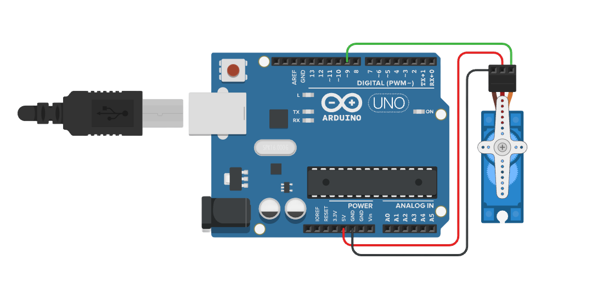
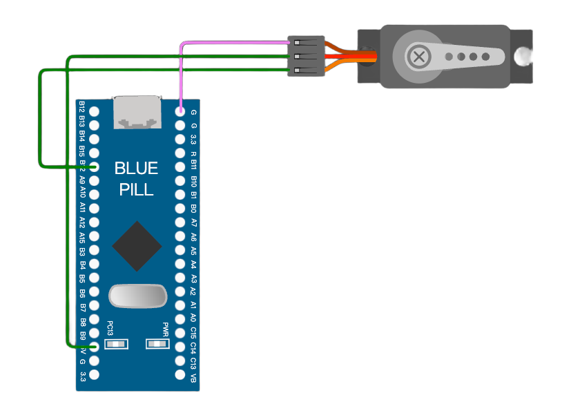
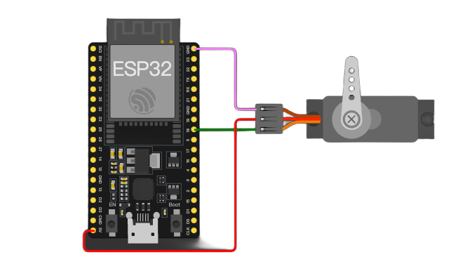

# Servo

###### 目录

> - Arduino API
>     - Arduino UNO R3
>     - STM32F103C8T6 Bule Pill
>     - ESP32-DevKitC
> - MicroPython API
>     - ESP32-DevKitC
> - STM32Cube（待补充）

# Arduino API

## Arduino UNO R3

[在线仿真](https://www.tinkercad.com/things/cNApLEY4SPl-servo)：https://www.tinkercad.com/things/cNApLEY4SPl-servo



```arduino
/*
  Serial Control of Servo Motor

  This code allows you to control a servo motor using serial communication.
  You can send an angle (0-180) via the serial monitor to set the position of the servo motor.
  
  Circuit:
  - Servo motor signal wire connected to pin 9
  - Servo power connected to 5V and ground (or external power if needed)
  - Serial communication at 9600 baud rate

  Diagram:

      Arduino          Servo Motor
     ---------        -------------
    |         |       |           |
    |     9   |-------| Signal     |
    |         |       |           |
    |    5V   |-------| VCC        |
    |   GND   |-------| GND        |
    |         |       |           |
  
  The servo's signal wire is connected to pin 9, the VCC wire is connected to 5V, and the ground wire is connected to GND.
  If the servo requires more power than the Arduino can provide, use an external power source.

  created 2024
  by Liang
*/

Servo myServo;  // Create a servo object to represent and control a servo motor

const int servoPin = 9;  // Define the pin where the servo signal wire is connected

void setup() {
  // Attach the servo object to the defined PWM pin (pin 9)
  myServo.attach(servoPin);

  // Start serial communication at 9600 baud rate to send and receive data via the serial monitor
  Serial.begin(9600);

  // Print an initial message to the serial monitor, instructing the user how to control the servo
  Serial.println("Enter a value between 0 and 180 to set the servo angle:");
}

void loop() {
  // Check if there is any incoming data available in the serial input buffer
  if (Serial.available() > 0) {
    // Read the incoming serial data and convert it into an integer (angle)
    int angle = Serial.parseInt();

    // Ensure the angle is within the valid range (0 to 180 degrees)
    if (angle >= 0 && angle <= 180) {
      // Move the servo to the specified angle
      myServo.write(angle);

      // Provide feedback to the user via the serial monitor, confirming the servo angle
      Serial.print("Servo angle set to: ");
      Serial.println(angle);
    } else {
      // If the angle is out of range, print an error message to the serial monitor
      Serial.println("Invalid angle. Please enter a value between 0 and 180.");
    }
  }
}
```

## STM32F103C8T6 Bule Pill



```arduino
/*
  Serial Control of Servo Motor for STM32F103C8T6 (Blue Pill)

  This code allows you to control a servo motor using serial communication.
  You can send an angle (0-180) via the serial monitor to set the position of the servo motor.
  
  Circuit:
  - Servo motor signal wire connected to pin PA8
  - Servo power connected to 5V and ground (or external power if needed)
  - Serial communication at 9600 baud rate

  Diagram:

      STM32F103C8T6     Servo Motor
     ---------------   -------------
    |               |  |           |
    |     PA8       |--| Signal     |
    |               |  |           |
    |     5V        |--| VCC        |
    |    GND        |--| GND        |
    |               |  |           |
  
  The servo's signal wire is connected to pin PA8, the VCC wire is connected to 5V, and the ground wire is connected to GND.
  If the servo requires more power than the STM32 can provide, use an external power source.

  created 2024
  by Liang
*/

#include <Servo.h>  // Include the Servo library to control the servo motor

Servo myServo;  // Create a servo object to represent and control a servo motor

const int servoPin = PA8;  // Define the pin where the servo signal wire is connected (PA8 for STM32)

void setup() {
  // Attach the servo object to the defined PWM pin (PA8)
  myServo.attach(servoPin);

  // Start serial communication at 9600 baud rate to send and receive data via the serial monitor
  Serial.begin(9600);

  // Print an initial message to the serial monitor, instructing the user how to control the servo
  Serial.println("Enter a value between 0 and 180 to set the servo angle:");
}

void loop() {
  // Check if there is any incoming data available in the serial input buffer
  if (Serial.available() > 0) {
    // Read the incoming serial data and convert it into an integer (angle)
    int angle = Serial.parseInt();

    // Ensure the angle is within the valid range (0 to 180 degrees)
    if (angle >= 0 && angle <= 180) {
      // Move the servo to the specified angle
      myServo.write(angle);

      // Provide feedback to the user via the serial monitor, confirming the servo angle
      Serial.print("Servo angle set to: ");
      Serial.println(angle);
    } else {
      // If the angle is out of range, print an error message to the serial monitor
      Serial.println("Invalid angle. Please enter a value between 0 and 180.");
    }
  }
}
```

## ESP32-DevKitC

[在线仿真](https://wokwi.com/projects/415315518168764417)：https://wokwi.com/projects/415315518168764417



```arduino
/*
  Serial Control of Servo Motor using ESP32-DevKitC and ESPServo Library

  This code allows you to control a servo motor using serial communication with the ESP32-DevKitC board.
  You can send an angle (ranging from 0 to 180) via the serial monitor to set the position of the servo motor.

  Circuit:
  - The servo motor's signal wire is connected to pin 18 of the ESP32-DevKitC. (The pin can be adjusted based on your specific hardware setup. Here, pin 18 is used as an example.)
  - The servo's power can be connected to 5V (if the power requirements are within the capacity of the ESP32's power supply) or an external power source if more power is needed. The ground wire is connected to the GND pin of the ESP32-DevKitC.
  - Serial communication is set at a baud rate of 9600.

  Diagram:

      ESP32-DevKitC          Servo Motor
     --------------        -------------
    |              |       |           |
    |     18       |-------| Signal     |
    |              |       |           |
    |    5V (or external power) | VCC        |
    |   GND        |-------| GND        |
    |              |       |           |

  The servo's signal wire is connected to pin 18, the power supply is connected as described above, and the ground wire is connected to GND. If the servo demands more power than what the ESP32 can supply, an external power source should be used.

  created 2024
  by Liang
*/

#include <ESP32Servo.h>  // Include the ESPServo library for controlling servo motors with ESP32

const int servoPin = 18;  // Define the pin where the servo motor's signal wire is connected. Here, we use pin 18.

Servo servo;  // Create a Servo object to represent and control the servo motor

void setup() {
    // Attach the servo object to the specified pin (pin 18 in this case).
    // The additional parameters 500 and 2400 are the minimum and maximum pulse widths (in microseconds) respectively.
    // These values might need to be adjusted depending on the specific servo motor you are using.
    servo.attach(servoPin, 500, 2400);

    // Initialize the serial communication with a baud rate of 9600. This enables sending and receiving data through the serial monitor.
    Serial.begin(9600);

    Serial.println("Enter a value between 0 and 180 to set the servo angle:");
}

void loop() {
    // Check if there is any incoming data available in the serial input buffer.
    if (Serial.available() > 0) {
        // Read the incoming serial data and convert it into an integer representing the angle.
        int angle = Serial.parseInt();

        // Ensure the angle is within the valid range (from 0 to 180 degrees).
        if (angle >= 0 && angle <= 180) {
            // Move the servo to the specified angle.
            servo.write(angle);

            // Provide feedback to the user via the serial monitor, confirming the servo angle that has been set.
            Serial.print("Servo angle set to: ");
            Serial.println(angle);
        }
        else {
            // If the angle is out of range, print an error message to the serial monitor.
            Serial.println("Invalid angle. Please enter a value between 0 and 180.");
        }
    }
}
```

# MicroPython API

## ESP32-DevKitC

[在线仿真](https://wokwi.com/projects/415316361593108481)：https://wokwi.com/projects/415316361593108481

```python
"""
使用ESP32-DevKitC通过MicroPython利用PWM控制舵机

此代码借助ESP32-DevKitC开发板以及MicroPython框架，运用PWM（脉冲宽度调制）的方式来控制舵机的角度。
你既可以通过串口向开发板发送0到180之间的角度值，以此控制舵机转动到指定角度，也可以运行代码中的示例循环，让舵机在0度和180度之间来回转动。

电路连接情况：
- 舵机的信号线连接到ESP32-DevKitC的2号引脚（该引脚可根据实际硬件情况进行调整，这里以2号引脚为例）。
- 舵机的电源可以连接到开发板的5V引脚（如果舵机功率需求在ESP32供电能力范围内），若舵机需要更大功率，则需使用外部电源，舵机的地线连接到ESP32-DevKitC的GND引脚。

连接示意图如下：

      ESP32-DevKitC          Servo Motor
     --------------        -------------
    |              |       |           |
    |     2        |-------| Signal     |
    |              |       |           |
    |    5V (or external power) | VCC        |
    |   GND        |-------| GND        |
    |              |       |           |

创建于2024
作者：Liang
"""

from machine import Pin, PWM
import time

# 定义舵机信号线所连接的引脚，这里使用2号引脚，你可按需更改
servo_pin = Pin(2, Pin.OUT)
# 初始化PWM对象，设置频率为50Hz（舵机通常使用50Hz的PWM信号来控制角度）
pwm = PWM(servo_pin, freq=50)

def set_servo_angle(angle):
    """
    根据传入的角度值来设置舵机角度的函数。

    参数：
    - angle：要设置的舵机角度，取值范围是0到180度，超出此范围的角度值将被视为无效。

    此函数依据舵机的PWM控制原理，将角度值转换为对应的PWM占空比值，进而控制舵机转动到指定角度。
    """
    # 判断角度值是否在有效范围内（0到180度）
    if 0 <= angle <= 180:
        # 将角度转换为对应的PWM占空比，不同的舵机可能会有细微差异，这里是常见的转换计算方式
        duty = int(((angle / 180) * 2 + 0.5) / 20 * 1023)
        pwm.duty(duty)
    else:
        print("无效角度，请输入0到180之间的值")

if __name__ == "__main__":
    # 以下是一个简单的示例，让舵机在0度和180度之间循环转动，每隔1秒切换一次角度
    while True:
        set_servo_angle(180)
        time.sleep(1)
        set_servo_angle(0)
        time.sleep(1)

    # 若要通过串口控制舵机角度，可取消以下注释，并按照注释提示添加相应代码逻辑

    # 导入串口通信相关模块（这里假设使用UART进行串口通信，你也可以根据实际情况调整）
    # from machine import UART
    # 初始化串口通信，波特率设置为9600，用于接收和发送数据（这里示例使用UART 1，可按需更改）
    # uart = UART(1, 9600)
    # while True:
    #     # 判断串口是否有数据可读，如果可读字节数大于0则表示有数据
    #     if uart.any() > 0:
    #         # 读取串口接收到的数据，以字符串形式返回
    #         data = uart.readline().decode('utf-8').strip()
    #         try:
    #             # 将接收到的字符串数据转换为整数类型的角度值
    #             angle = int(data)
    #             # 调用函数设置舵机角度
    #             set_servo_angle(angle)
    #             print("舵机角度已设置为：", angle)
    #         except ValueError:
    #             print("接收到无效数据，请输入整数角度值（0到180之间）")
    #     # 适当延时，避免过于频繁地检查串口数据，这里延时0.1秒，可根据实际情况调整
    #     time.sleep(0.1)
```