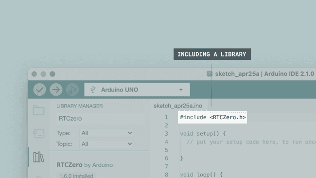

# Arduino IDE

# Arduino IDE

框架: Arduino
平台: Arduino

- 官网：https://docs.arduino.cc/software/ide/
- [**Arduino IDE 2**](https://www.arduino.cc/en/software) installed.

# Overview


- **Verify / Upload** - compile and upload your code to your Arduino Board.
- **Select Board & Port** - detected Arduino boards automatically show up here, along with the port number.
- **Sketchbook** - here you will find all of your sketches locally stored on your computer. Additionally, you can sync with the [**Arduino Cloud**](https://cloud.arduino.cc/), and also obtain your sketches from the online environment.
- **Boards Manager** - browse through Arduino & third party packages that can be installed. For example, using a MKR WiFi 1010 board requires the  `Arduino SAMD Boards` package installed.
- **Library Manager** - browse through thousands of Arduino libraries, made by Arduino & its community.
- **Debugger** - test and debug programs in real time.
- **Search** - search for keywords in your code.
- **Open Serial Monitor** - opens the Serial Monitor tool, as a new tab in the console.

# **Installing a Board Package in the IDE 2**

The board manager is a tool that is used to install different board packages on your local computer. So what is a **board package**, and why is it necessary that I install one?

What a board package does is to act as a layer between all of this microcontroller-specific jargon, and you - the maker. The board package translates it into the Arduino API you are already familiar with so that you can program any of the microcontrollers in the Arduino ecosystem in the same way.

For example, an Arduino UNO has an **ATmega328P**, which uses the **AVR package**, while an Arduino Nano 33 IoT has a **SAMD21** microcontroller, where we need to use the **SAMD package**. However, regardless of what microcontroller is on the board we are using, `digitalWrite(LED_BUILTIN, HIGH)` will turn on the built-in LED, and `analogRead(A0)` will read the analog pin 0 and check for a voltage.

In conclusion, to use a specific board, we need to install a specific board package.

## Installing a Board Package

Installing a board package is quick and easy, but let's take a look at what we need to do.

**1.** Open the Arduino IDE 2.

**2.** With the editor open, let's take a look at the left column. Here, we can see a couple of icons. Let's click the on the **Arduino board** icon


**3.** A list will now appear of all available packages. Now let's say we are using an **Nano 33 BLE** board, and we want to install the board package. Simply enter the name in the search field, and the right package (Mbed OS Nano) will appear, where the Nano 33 BLE features in the description. Click on the **"INSTALL"** button.


**4.** This will begin an installation process, which usually only take a few moments.


**5.** When it is finished, we can take a look at the core in the boards manager column, where it should say **"INSTALLED"**, as well as noting which version you have installed on your machine.


Congratulations! You have now successfully downloaded and installed a board package on your machine, and you can start using your Arduino board!

## What Board Package Should I Install?

Do you have an Arduino board in your hands, but are not sure what board package you need to install? When you plug a board in to your computer, and you don't have the appropriate board package installed, the IDE should automatically prompt you to install it. But, in case you need it anyways, you can find a list of boards and the board packages they belong to below:

### **AVR**

The **AVR boards package** is based on the **Arduino AVR Core**, and includes the following boards:

- [**UNO R3**](https://docs.arduino.cc/hardware/uno-rev3)
- [**UNO R3 SMD**](https://docs.arduino.cc/hardware/uno-rev3-smd)
- [**UNO Mini Limited Edition**](https://docs.arduino.cc/hardware/uno-mini-limited-edition)
- [**Leonardo**](https://docs.arduino.cc/hardware/leonardo)
- [**Micro**](https://docs.arduino.cc/hardware/micro)
- [**Nano**](https://docs.arduino.cc/hardware/nano)
- [**Mega 2560**](https://docs.arduino.cc/hardware/mega-2560)

The **AVR board package** comes pre-installed when you download the Arduino IDE, so if you have one of these boards - Great! You're already done and won't need to install it yourself. You can, however, still find it in the board manager if you want to change what version of the board package you have installed. For detailed instructions on how to do this, [**follow the steps above**](https://docs.arduino.cc/software/ide-v2/tutorials/ide-v2-board-manager/#installing-a-board-package).

For source code and reporting issues, please visit the official GitHub repository:

- [**ArduinoCore-avr**](https://github.com/arduino/ArduinoCore-avr)

## ESP32

## STM32

# **Installing libraries**

A large part of the Arduino programming experience is the **use of libraries.** There are thousands of libraries that can be found online, and the best documented ones can be found and installed directly through the editor.

In this tutorial, we will go through how to install a library using the library manager in the Arduino IDE 2. We will also show how to access examples from a library that you have installed.

## Why Use Libraries?

Libraries are incredibly useful when creating a project of any type. They make our development experience much smoother, and there almost an infinite amount out there. They are used to interface with many different sensors, RTCs, Wi-Fi modules, RGB matrices and of course with other components on your board.

Arduino has many official libraries, but the real heroes are the Arduino community, who develop, maintain and improve their libraries on a regular basis.

## Installing a Library

Installing a library is quick and easy, but let's take a look at what we need to do.

**1.** Open the Arduino IDE 2.

**2.** With the editor open, let's take a look at the left column. Here, we can see a couple of icons. Let's click the on the **"library"** icon.


The library manager.

**3.** A list will now appear of all available libraries, where we can also search for the library we want to use. In this example, we are going to install the **RTCZero** library. Click on the **"INSTALL"** button to install the library.


Navigating the library manager.

**4.** This process should not take too long, but allow up to a minute to install it.


Installing a library.

**5.** When it is finished, we can take a look at the library in the library manager column, where it should say **"INSTALLED"**.


Library installed successfully.

Congratulations! You have now successfully downloaded and installed a library on your machine.

## Including a Library

To use a library, you first need to include the library at the top of the sketch.



Including a library in a sketch.

Almost all libraries come with already made examples that you can use. These are accessible through **File > Examples > {Library} > {Example}**. In this example, we are choosing the **RTCZero > SimpleRTC**.


Choosing an example sketch from a library.

You can also access library examples directly in the library manager, by clicking the three dots next to the installed library, like this:


Library examples

The chosen example will now open up in a new window, and you can start using it however you want to.


# **Serial Monitor**


Now, we need to create a sketch that includes some configurations needed, so that our board can communicate with our computer. Mainly, we need to set a **baud rate**, which is done by writing `Serial.begin(9600);`. Here, the `9600` represents the baud rate, which is the maximum bits per seconds that can be transferred. The sketch that we need to use can be found in the snippet below:

```arduino
void setup() {
Serial.begin(9600);
}

void loop() {
Serial.println("Hello world!");
delay(1000); 
}
```

This will print `"Hello world!"`, every one second to the Serial Monitor. Let's select the board we want to use, and upload the sketch to the board.


When it has finished uploading, click on the Serial Monitor button, located at the top right corner of the IDE. This will launch the Serial Monitor in the bottom of the IDE, replacing the console section.


The text `"Hello world!"` is now printed every one second. Congratulations, you have now successfully sent a message from your Arduino, to your computer.

# **Serial Plotter**


The Serial Plotter tool is great for visualizing data using graphs, and to monitor for example peaks in voltage.

You can monitor several variables simultaneously, with options to enable only certain types.

To use the Serial Plotter, we will need to create a sketch and upload it to our board. This sketch needs to include at least one **numerical variable**, such as an `int` or `float` .

### **Sketch (Without Potentiometer)**

- `int random_variable` - variable that stores a randomized value between 0-1000.
- `int static_variable = 500` - variable that has an unchanged value of 500.

```arduino
int random_variable;
int static_variable = 500;

void setup() {
  Serial.begin(9600);
}

void loop() {
  random_variable = random(0, 1000);

  Serial.print("Variable_1:");
  Serial.print(random_variable);
  Serial.print(",");
  Serial.print("Variable_2:");
  Serial.println(static_variable);
}
```

Once the sketch is uploaded, we can test out the Serial Plotter.

***Make sure the sketch has finished uploading before opening the Serial Plotter. You will see the text "upload complete" in the terminal output.***

Click the button in the the top right of the IDE window to open the **Serial Plotter**.


You can also enable/disable the variables by checking the box next to the variable name.


# **Debugging**


The debugger tool is used to test and **debug** programs, hence the name. It can be used to navigate through a program's execution in a controlled manner.
