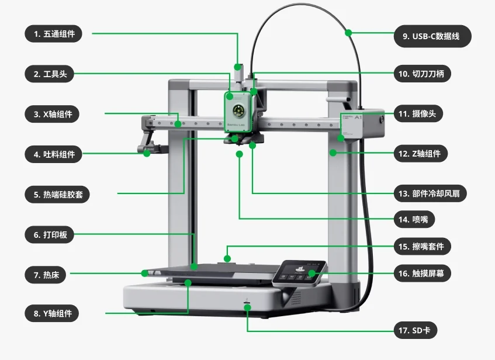
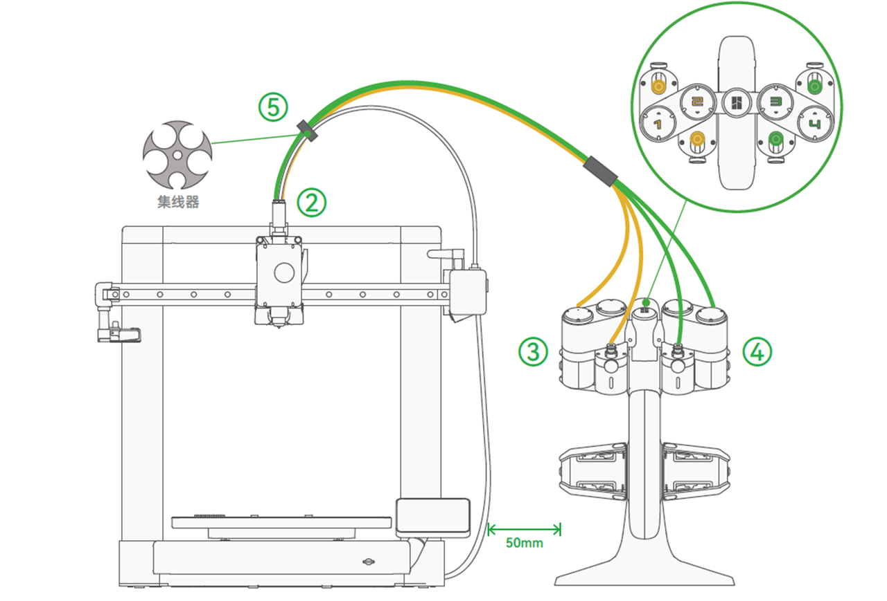
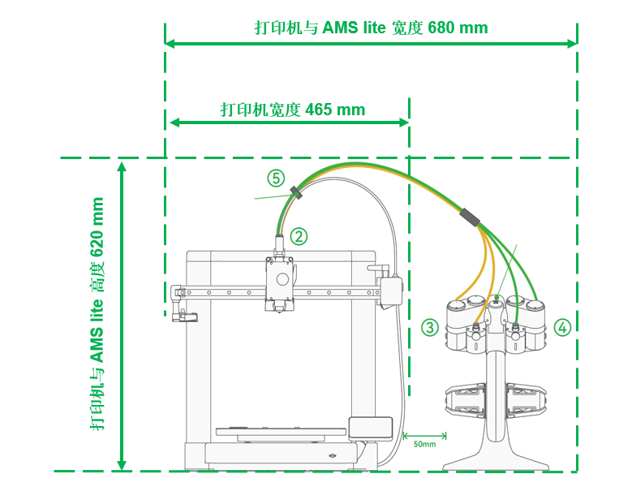
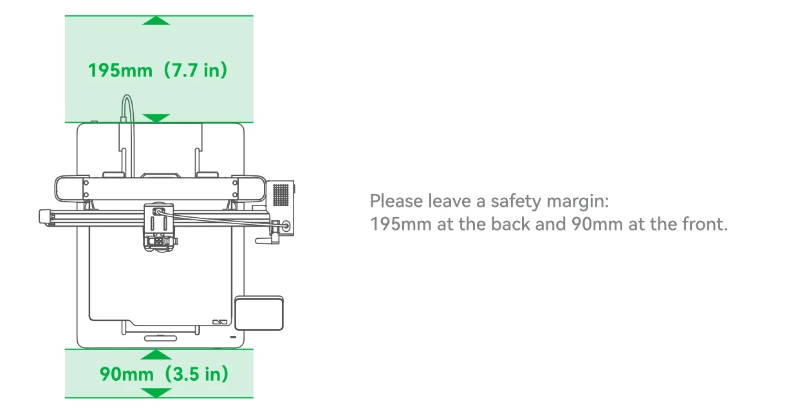

# Bambu 3D 打印机

##### 相关

> - 官网：
> - 官方文档：https://wiki.bambulab.com/zh/a1

###### 目录

> - A1 规格
> - A1 维护保养
> - 更换零件
> - A1 使用

## Bambu A1 3D打印机基本规格与特点

Bambu A1 是一款采用笛卡尔坐标运动系统的3D打印机。

- 最大打印体积为 256 x 256 x 256 mm³
- 其最高喷嘴温度可达 300℃
- 热床温度上限为 100℃

### **运动系统**

- X 轴：配备高精度线轨和横梁，打印头可在水平方向精准移动
- Y 轴：采用高精度水平导轨，支持打印平台前后精准移动
- Z 轴：使用双光轴-直线轴承导向系统，通过同步带实现精准稳定的垂直运动

### **打印材料支持**

- 低温材料：**PLA** 类、**PETG** 类、**TPU** 类及相关支撑材料（Support for PLA，PVA，HIPS 等）等低温料
- 特殊材料：可打印含碳纤维、玻璃纤维材料，PETG-CF/GF、PLA-CF/GF、PLA 夜光（PLA Glow-in-the-dark）但需更换硬化钢喷嘴
- 高温材料：虽然技术上支持ABS、ASA、PC、PA、PA-CF/GF 等，但因开放式设计不建议打印大尺寸或高要求的模型

注意：因为 A1 为开放式机型，虽然热床温度上限为 100 ℃，但腔温低，易造成高温耗材的层间强度因过度冷却而变得很低，也易造成大尺寸模型有更高的翘曲风险、更大的翘曲幅度，所以不推荐在 A1 上用 ABS、ASA、PC、PA、PA-CF/GF、PET-CF/GF、PPA-CF/GF 等常规高温耗材来打印要对层间强度要求较高的、大尺寸和（或）高填充密度的模型，但可以在 A1 上用这些高温耗材打印一般的小尺寸、低填充率的模型，打印效果与耗材干湿状态、模型本身特点、打印参数、环境温度等有关。

另外，由于 ABS、ASA 在打印过程会释放出有害的、带刺激性气味的气体，因此对空气过滤和通风有较高的要求，而 A1 打印机属于不带空气封闭、净化功能的开放式打印机，因此我们建议您不使用 A1 打印机来打印 ABS、ASA，或在通风条件较好的、与人有一定距离的环境内打印。

### **打印平台**

标配纹理 PEI 打印板，适用于 PLA、PETG 和 TPU 等材料，无需使用粘合剂。建议等待完全冷却后再取下打印件，并定期用温水和肥皂清洁以保持最佳粘附力。

### **使用注意事项**

- 必须使用micro SD卡才能开始打印，预装32GB卡，最大支持2TB
- 不兼容标准AMS，需使用AMS lite实现多色打印
- 设备状态可通过顶部白色 LED 指示灯监控：常亮表示正常，闪烁表示需要注意

### 摆放 A1 和 AMS lite

建议按照下图的方式摆放 A1 和 AMS lite，并保持两者之间留有 5 cm 左右的空隙。

### 对于A1 + AMS lite，在X、Y和Z轴方向上，整体的空间要求尺寸

### A1移动热床到打印机的前面和后面时，需要预留空间

如图所示，放置打印机时，请在 Y 方向上留出足够热床移动的安全空间，约195 mm + 90 mm+ 410 mm = 695 mm。

## 维护保养

https://wiki.bambulab.com/zh/a1-mini/maintenance/lubricate-y-axis-with-wd-40-multi-use-product

需要特别注意润滑剂的使用：X轴线轨和Y导轨使用润滑油，而丝杆和挤出轮则使用润滑脂。严禁在X轴线轨上使用润滑脂。

### A1 配件盒中的润滑油和润滑脂有什么区别？

- 润滑油的用途：用于X轴线轨、Y导轨和惰轮消异音之类的 。

- 润滑脂的用途：用于润滑丝杆和挤出轮。**请注意，严禁将润滑脂用于 X 轴线轨上。**

考虑到一些用户反馈润滑脂的黏稠性可能会引起灰尘和碎屑问题，**经过反复验证测试后，我们决定更换A1机型Y轴导轨的润滑剂。因此，对于A1型号的Y轴导轨，我们建议使用润滑油进行润滑。如果您之前已经使用了润滑脂，在以后的保养中，我们建议您改用润滑油进行润滑。**在进行润滑的过程中，您也可以先擦除导轨上的润滑脂，然后按照视频指南重新涂抹润滑油。

## 更换零件

- PEI 打印面板
- 喷嘴

## A1 使用

Bambu Lab 的打印机“认主”，只能给一个用户提供服务。

- 手机 APP：略
- 电脑 Bambu Studio：见 Bambu Studio 文章

