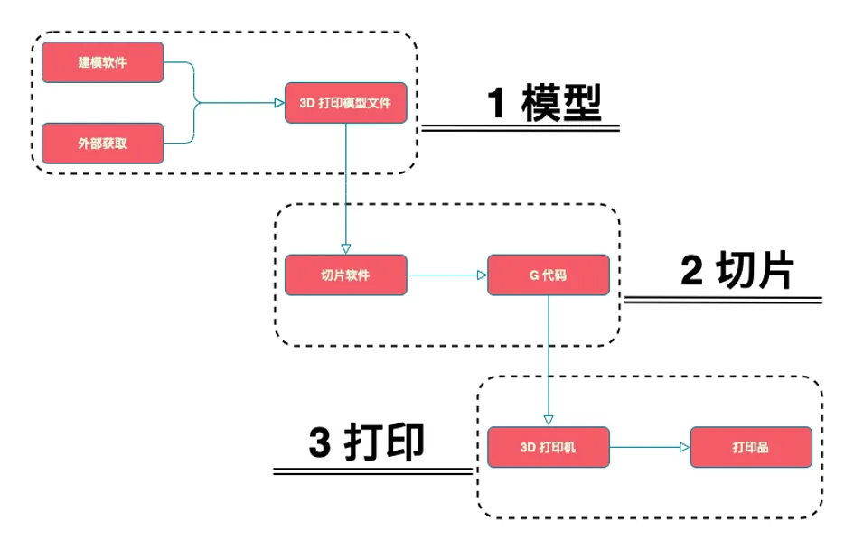
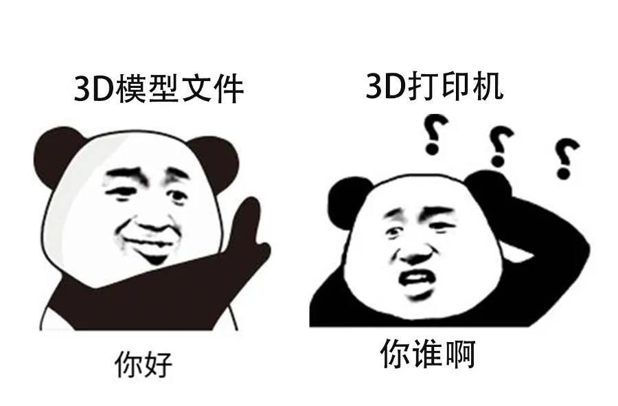
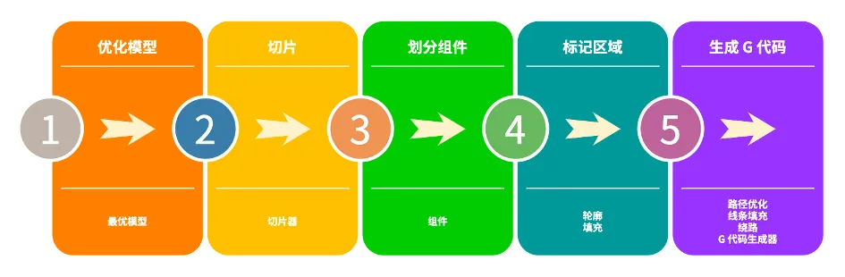
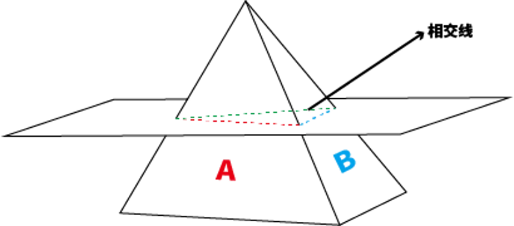
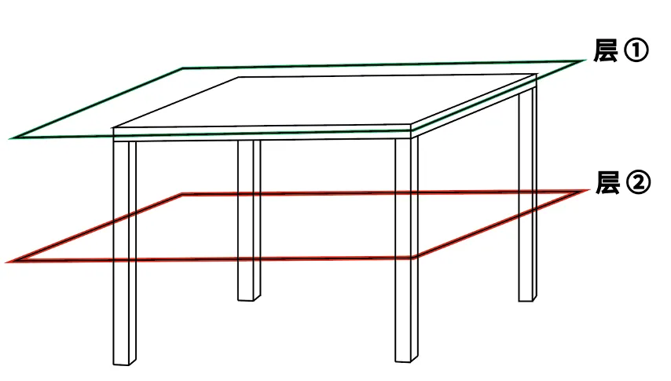
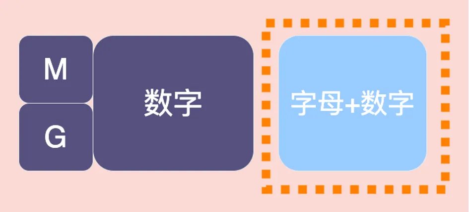
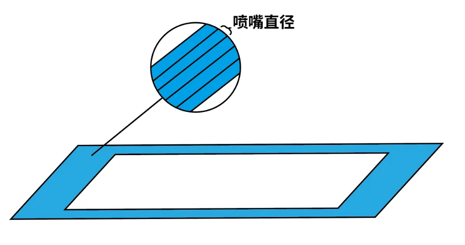
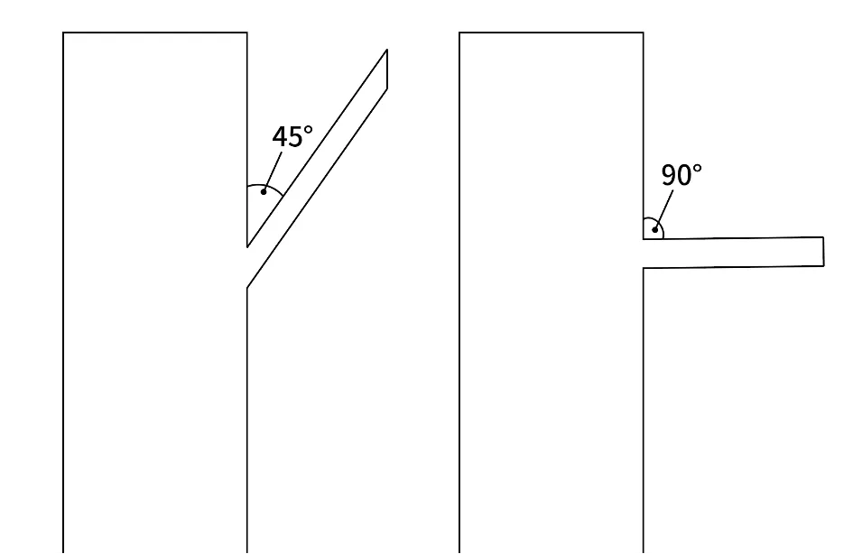

# 3D 打印切片、G-code 与 Cura 使用与基本原理

- 为什么需要切片、G-code
- 切片的工作原理
- G-code
- 切片参数
- 简单的 Cura 使用教程

## 为什么需要切片、G-code

在三维打印技术的整体操作流程中，有若干关键步骤是不可或缺的。






首先，获取三维打印模型文件是初始步骤。然而，要使三维打印机能够启动并执行打印任务，仅有三维模型文件是不足的。我们还需要将该模型文件导入至切片软件（Slicer/Slicing Software），进行切片处理，生成G代码（G-code），随后将此代码导入三维打印机。

切片，本质上来说是一个“翻译”的过程，即切片操作的实质是将几何信息转化为具体操作指令的过程。

三维打印模型文件通常是诸如STL等格式的三维图形文件，这些文件包含了由大量三角形面片构成的几何信息，通过这些信息的集合描述物体的外部轮廓形状。然而，三维打印机作为一种机械设备，其运行依赖的是具体的操作指令，而非几何描述信息。

因此，问题显现：三维打印机无法直接读取和理解三维模型文件中的几何数据，而这些文件本身也不存储详细的操作指令。如此一来，在三维打印模型与三维打印机之间，存在着信息供需难以匹配的鸿沟。

为了阐释这一转换过程，可以将其比作烹饪过程。仅凭一张菜品的图片（三维模型文件），即便是经验丰富的厨师（三维打印机）也几乎不可能完美再现图中菜品的味道。但若提供详细的菜谱（通过切片生成的G代码），其中描述了所有原材料、用量及烹饪顺序，并附加每个步骤所需的火候和手法等信息，厨师便可以准确还原菜品。

对于熟悉计算机数控技术的人来说，三维打印模型、切片软件与G代码之间的关系可以类比为计算机辅助设计（CAD，Computer-Aided Design）、计算机辅助制造（CAM，Computer-Aided Manufacturing）和计算机数控（CNC，Computer Numerical Control）之间的关系。这种类比有助于进一步理解三维打印过程中几何信息向操作指令转化的必要性与机制。

## 切片的工作原理

在深入探讨切片的重要性之后，我们将结合当前最常用的切片软件——Cura，对切片的工作原理展开分析，涉及切片引擎及其关键概念。



### 优化模型

根据先前对三维打印操作流程的介绍，为了对三维模型进行切片，首先需要将模型导入切片软件，使其能够读取模型文件中的几何信息。在载入模型后，Cura 引擎会基于“最优模型”（OptimizedModel）对模型进行优化。

此处的优化并非改变模型文件原有的几何信息，而是在读取信息时，分析并存储几何信息中的关联关系。

三维模型文件的几何信息通常是对由无数个三角形面片组成的模型的位置描述。因此，Cura 引擎的优化过程涉及分析、建立和存储这些三角形面片之间的关联关系，即所谓的点-面关系（vertex-face relation）。简单来说，就是确定哪些三角形是相邻的，这种关系可以被称为相邻关系。

例如，一个人若要记住一组数字如「8，10，12，20，25，30」，可以选择逐一记忆，也可以通过发现其内部关系，如前者是2的倍数，后者是5的倍数，以此优化记忆过程。

建立这些相邻关系的目的是为了实现模型优化，这是Cura能够快速切片和划分组件的关键前提。

### 进行切片

在此阶段，CuraEngine 的主要任务是将三维立体模型切割成若干二维平面层。

从3D打印机的机械结构来看，这一过程可被理解为用X轴和Y轴形成的二维平面，以一定的Z轴高度（层高），将三维模型逐层切割，使二维平面与构成三维模型的三角形面片相交，从而得到相应的相交线条。

切片的最终产物是二维平面上的二维图形。然而，初步相交的结果仅仅是一组线条，如何将这些线条组成封闭的二维图形？

此时，优化模型中建立的三角形面片相邻关系发挥了作用。如果两个三角形面片是相邻的，且均与同一个X-Y平面相交，那么它们分别与该平面相交时所产生的线条也一定是相邻的。通过迅速判定每层中的相邻线条关系，CuraEngine 可以将这些线条连接成封闭的二维图形。

此步骤完成后，三维立体模型已被切割成多层二维平面，每层均形成一个或多个封闭的二维图形。



### 划分组件

组件（LayerParts）是CuraEngine中的一个重要概念。切片过程中，每层二维平面上的封闭图形可能数量不一。这些不相交的二维封闭图形称为组件。

如以下实例所示，对于一个四腿桌，在切片后，第二层会有四个组件，而第一层只有一个组件。

该步骤中，CuraEngine 将不相交的二维封闭图形划定义为不同组件。在生成G代码时，以组件为单位编译指令，此举旨在尽可能减少多余信息，以提高打印效率。



### 标记区域

在划分组件后，此步骤的任务是规划喷嘴在组件中不同区域的打印模式，分为轮廓（Insets）和填充（Up/Down skin）。

对于同一组件，其外围线条区域会采用“轮廓”打印模式，而内部区域则采取“填充”打印模式。具体参数如轮廓厚度、填充密度和图案等，可以在Cura中单独设置。本步骤仅标记不同区域并规划打印模式，实际打印路径会在生成G代码时确定。

### 生成G代码

在此步骤中，CuraEngine 将收集并编译之前所有步骤中的几何和参数信息，生成G代码，以指导3D打印机的操作。

Cura官方文档中列出了生成G代码时的几个关键概念：

- **路径优化（PathOrderOptimizer）：**喷嘴在移动时会选择最近的组件进行打印，以减少移动距离。
- **线条填充（Infill）：**以线条方式进行填充打印。
- **绕路运动（Comb）：**为避免拉丝，喷嘴会尽量选择绕行路径。
- **G代码生成（GCodeExport）：**生成G代码包括两个步骤：先收集每层的路径信息，再编译生成G代码。

## G-code

G代码（G-code）是切片过程的产物，也是3D打印机执行打印任务时所依据的指令集。G代码作为一种独特的编程语言，类似于C语言和Python，具备较高的可读性。通过掌握其基本语法结构和常见字符的含义，可以大致理解不同指令的作用。以下将对G代码的结构进行简要分析。



#### 代码分类

G代码主要可以分为两大类：几何命令（G-code）和非几何命令（M-code）。其中，几何命令（Geometric code）主要包含指导3D打印模块移动的指令；而非几何命令（Miscellaneous code）用于设置如热床温度和风扇状态等非几何参数。G代码的命名方式也表明了其核心类别，例如G-code类型的指令是核心的几何命令，而M-code则是用于设置操作环境的辅助命令。

#### 指令结构

紧跟在字母G或M后的数字表示不同的指令类型。例如，G0指令控制打印模块快速移动，而G28指令则是控制打印模块返回初始点。

其他参数通常由一个或多个字母与数字的组合构成。字母通常表示操作对象，而数字则表示具体的参数变化。例如，指令G0 X5 Y20表示控制打印模块移动到X坐标为5、Y坐标为20的位置。然而，并不是每个G代码都必须包含具体的参数。例如，指令M84无需附加其他参数，即可指示禁用电机。更多关于字母代表的含义可参见维基百科上的详细解释。

#### 不同核心固件的兼容性

需要注意的是，不同核心固件的3D打印机在解析相同G代码指令时，可能会产生不同的理解和执行结果。为此，以下三种解决方案可以帮助缓解这一问题：

1. **使用3D打印机的专属切片软件**：某些切片软件如Snapmaker Luban是专为Snapmaker 3D打印机设计的，能够生成最适配该设备固件类型的G代码。
2. **在切片软件中选择打印机型号**：如果使用其他切片软件，可以在软件中选择对应的打印机型号。例如，在Cura中，可以从打印机型号列表中选择“Snapmaker”打印机。
3. **手动添加/新建打印机配置**：如果无法在切片软件中找到对应的打印机型号，可以手动添加一个新的打印机并选择正确的固件类型。例如，Snapmaker 3D打印机使用的是Marlin固件。

## 切片参数

在实际的3D打印过程中，即使准备的3D模型文件已经非常完美，也难免会遇到各种突发的小问题。但是，大多数情况下，这些问题可以通过在切片软件中调整相关参数来解决或改善。

#### 层高

层高是指在切片过程中，相邻两层之间的高度。层高越低，打印时间越长，但模型的细节还原度会更高。相反，层高越高，打印时间减短，但每层之间的细节会变得粗糙。了解这一参数的特性后，可以根据具体需求进行选择：对于细节较少或注重实用性的模型，可以适当增大层高以节约时间；对于细节精美或着重观赏性的模型，则应减小层高，以确保细节还原。

#### 外壁厚度

外壁厚度参数表示模型的外层厚度。外壁越厚，模型的外壳越坚固；反之，外壳则相对薄弱。这个参数与人们常说的"脸皮越厚，越不容易受伤害"有相似之处。即便打印出的模型不成功，也不必感到挫败，可以重新开始。**值得注意的是，壁厚值应设置为喷嘴直径的倍数，否则可能影响打印效果。**



#### 回抽

在打印模块空载移动时，喷嘴中已经熔化的材料可能会因重力影响而滴漏，形成不美观的拉丝。当设置了回抽参数后，喷嘴内的材料会在移动时被回抽一定距离，从而减轻滴漏现象。然而，设置不当的回抽参数可能导致材料供给不足或喷嘴堵塞问题。因此，需要根据实际情况调整回抽距离、回抽速度和抬升高度等相关参数，以避免拉丝并确保打印质量。

#### 填充密度

填充密度通常以百分比表示。若设置为100%，表示目标区域将被完全填充，但过高的填充密度可能导致模型变形。一般情况下，设置为15%-30%的填充密度即可满足多数打印需求，既经济实用又省时。如果需要增强模型强度，可以适当提高填充密度。

#### 支撑

当打印模型有悬垂部分时，需要添加支撑结构，以提供打印基底。3D打印机逐层打印，悬垂角度超过45°时，应当添加支撑，以确保打印顺利。切片软件Snapmaker Luban不仅提供支撑位置的设置，还支持支撑结构、密度及Z距离的调整，以改善打印质量。



#### 起始层粘附

起始层的粘附对3D打印至关重要。若起始层粘附不牢，可能导致移位、错层或翘边等问题。为此，Snapmaker Luban支持对起始层的独立参数设置，如打印速度、层高、走线宽度等。此外，可以通过热床附着结构的调整来提高起始层的粘附力。

综上所述，尽管没有绝对完美的参数设置，也没有十全十美的打印成品，但理解各参数的意义并根据不同需求灵活调整，可以获得最适合的打印结果，这也是创客精神和创造魅力的重要体现。

## 简单的 Cura 使用教程

### Cura 简介

**Ultimaker Cura是Ultimaker公司旗下3D打印机的模型切片软件。**提到Ultimaker Cura，相信大部分的中国用户对于这款3D打印使用的模型切片软件并不陌生。在3D打印刚刚进入到中国市场时，以及后期中国内地的各个3D打印机制造商如雨后春笋一样漫步崛起，他们都是使用的这款叫Ultimaker Cura的模型切片软件。

### 1. 下载安装和启动

首先，用户可以从Cura的官方网站下载最新版本的安装包，根据操作系统的不同（Windows、macOS、Linux）进行安装。

官网的Cura下载地址哦：http://www.ultimaker.cn/Ultimaker-cura-software/Download

### 2. 添加打印机

用户需要在Cura中配置使用的打印机。点击菜单栏的“Settings”（设置），选择“Printer”（打印机）-> “Add Printer...”（添加打印机），在弹出的窗口中选择合适型号，如无合适选项，可选择“Custom”（自定义）添加非标打印机。


#### 自定义新的打印机

##### 步骤1：添加新的打印机

1. **打开Cura**：
    打开Cura软件。
2. **添加新的打印机**：
    在顶部菜单栏选择“Settings”（设置），然后选择“Printer”（打印机），再选择“Add Printer...”（添加打印机...）。
3. **选择自定义打印机**：
    在弹出的对话框中选择“Custom”（自定义）并命名你的打印机。例如，“My Custom Printer”。
    然后点击“Add”按钮。

##### 步骤2：配置打印机基本参数

1. **打印机设置**：
    在新的对话框中，需要输入以下基本选项：

    - **X (Width) 宽度**：输入打印区域的X轴宽度
    - **Y (Depth) 深度**：输入打印区域的Y轴深度
    - **Z (Height) 高度**：输入打印区域的Z轴高度
    - **Build plate shape**：选择构建板的形状（通常是矩形）
    - **Heated bed**：如果你的打印机有加热床，勾选此选项

    例如：

    - X: 200 mm
    - Y: 200 mm
    - Z: 200 mm
    - Build plate shape: Rectangular
    - Heated bed: 勾选 (如果有）

2. **打印头设置**：
    配置你的打印头尺寸及相关参数：

    - **Number of Extruders**：选择你的打印机有几个位挤出机（通常为1）
    - **Nozzle size**：设置喷嘴的直径，这通常是0.4 mm
    - **Printhead settings**：设置打印头的大小和形状参数（这会影响路径规划）

##### 步骤3：配置挤出机设置

**挤出机参数**：
选择“Extruder 1”选项卡并输入以下参数：

- **Nozzle size**：喷嘴尺寸，一般为0.4 mm
- **Compatible material diameter**：输入材料直径，通常为1.75 mm或3 mm
- **Maximum volumetric speed**：最大体积进给速度，通常根据喷嘴和材料配置选择

##### 步骤4：高级设置

**G代码启动和关闭命令**：
配置起始和结束的G代码。这些代码控制打印开始和结束时打印机的行为。一个典型的起始G代码可能包括：

```gcode
G28 ; 首页所有轴
G1 Z15.0 F9000 ; 提升Z轴
G92 E0 ; 重置挤出机位置
G1 F140 E30 ; 挤出少量材料
G92 E0 ; 重置挤出机位置
G1 F9000 
```

而结束G代码可能如下：

```gcode
G92 E1
G1 E-1 F300 ; 收回少量材料
G28 X0 Y0 ; 移动至原点
M104 S0 ; 关闭挤出机加热
M140 S0 ; 关闭加热床
M84 ; 禁用电机扭矩
```

##### 步骤5：保存和完成

- **保存配置**：完成所有设置后，点击“Finish”或“Save”以保存打印机配置。

### 3. 导入模型

点击Cura主界面左上角的“Open File”（打开文件）或直接将模型文件拖入界面，导入STL或OBJ格式的三维模型。模型导入后可以在Cura的建模区域中看到。


### 4. 模型调整

通过Cura界面左侧的工具，可以对模型进行平移、旋转、缩放等操作，以确保模型合适地放置在打印平台上。注意避免模型悬空或部分超出打印平台。

### 5. 设置打印参数

在右侧的设置面板中，用户可以设置各种打印参数：

- **层高**：每层的厚度，较小的层高意味着更高的打印精度。
- **打印速度**：打印头移动和挤出材料的速度。
- **温度**：挤出头和打印床的温度，需根据材料类型调整。
- **填充密度**：内部结构的密度，一般用百分比表示。
- **支撑结构**：为悬空部分生成支撑，避免打印塌陷。

### 6. 预览切片

设置完成后，点击界面右下方的“Slice”（切片）按钮。Cura将根据参数生成切片并展示切片预览，可查看每一层的打印路径。

### 7. 导出 G 代码

切片预览满意后，点击“Save to File”（保存至文件）按钮，将生成的G代码文件保存到计算机，或直接保存至SD卡等存储介质，用于后续打印。


### 8. 开始打印

将保存的G代码文件加载到三维打印机，依照打印机操作步骤开始打印。为了确保成功打印，还需要进行打印床校准和材料准备。


