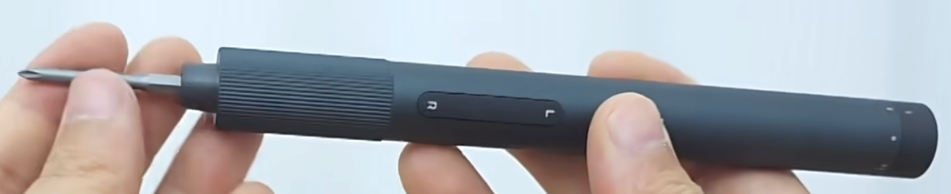
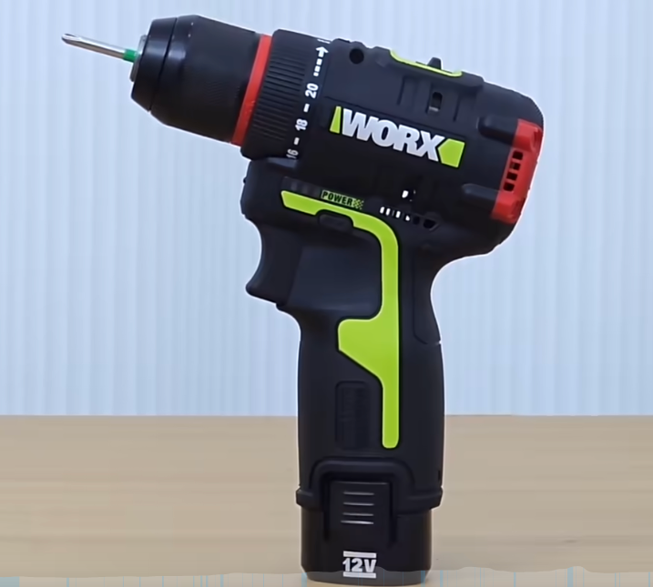
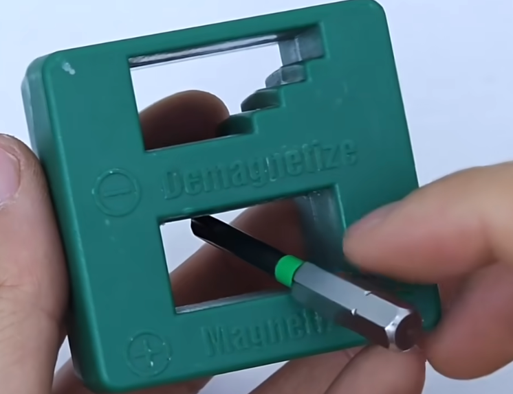

# 加工

【猿理 | 创客老司机教你选购五金工具 日常生活 创客制作 必备工具】 https://www.bilibili.com/video/BV1UZ4y137Cv/?share_source=copy_web&vd_source=0152764925b99fadd2e9e3592e9421a8

###### 目录

>- 螺丝刀
>- 扳手
>- 钳子
>- 剪刀类
>- 美工刀
>- 胶带
>- 卷尺
>- PCB 尺子
>- 游标卡尺

## 螺丝刀

- 手动
- 电动

螺丝刀是我们日常生活和专业工作中不可或缺的工具。本文将为您详细介绍不同类型的螺丝刀及其特点。

### 手动螺丝刀

手动螺丝刀是最基础且使用最广泛的类型，主要由两部分组成：

- 主体
    - 手柄：提供抓握和扭转力量
    - 杆身：连接手柄和螺丝头
- 披头（批头）
    - 一字型：适用于一字槽螺丝
    - 十字型：适用于十字槽螺丝
    - 六角型：适用于内六角螺丝

### 电动

电动螺丝刀能够提供更大的扭力和效率，主要分为以下几类：

- 外观分类
    - 笔式
    - 枪式
- 电机分类
    - 有刷电动螺丝刀
        - 价格相对较低
        - 适合家用和轻度使用
        - 需要定期更换碳刷
    - 无刷电动螺丝刀
        - 效率更高，寿命更长
        - 发热量小，噪音低
        - 适合专业和重度使用
- 重要参数
    - 扭矩
        - 迷你的笔式一般 0.2 牛米
        - 普通笔式或枪式 4-5 牛米
        - 专业品牌电动螺丝刀（手电钻）

### 加磁器

给披头加磁性，磁吸螺丝螺母。

## 胶带

- 贴来做红外循迹
- 贴铜线，防止触电

## PCB 尺子

- 对比常用封装

## 游标卡尺

- 测量
