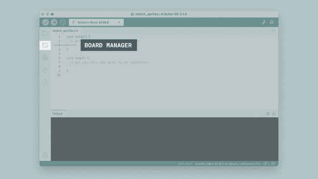
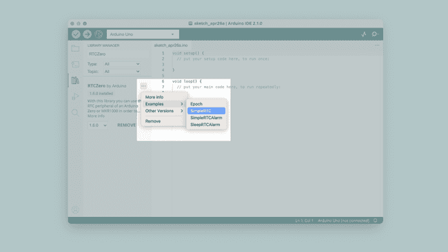
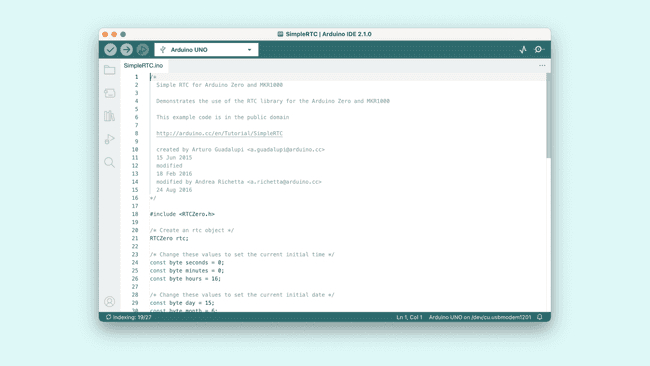
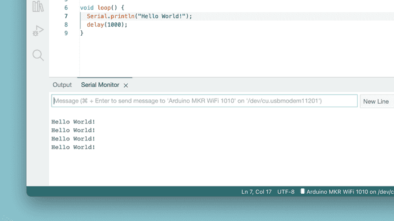
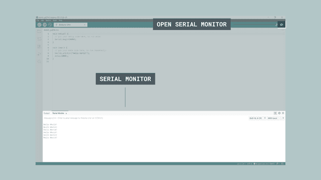
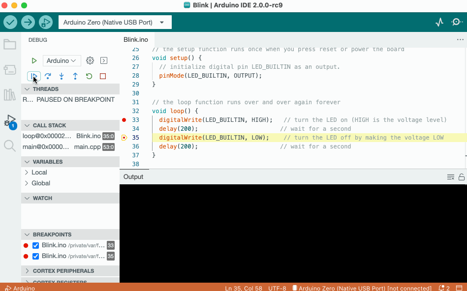

# Arduino IDE

##### 相关

> - 框架: Arduino
> - 平台: Arduino
> - 官网：https://docs.arduino.cc/software/ide/
> - [**Arduino IDE 2**](https://www.arduino.cc/en/software) installed.

###### 目录

> - 概览
> - 安装 Arduino IDE
>     - 安装软件
>     - 安装开发板（芯片开发环境）
> - 安装库
> - 串口监视器
> - 串口监视仪
> - Debugging

# Overview


- **验证 / 上传**：编译并将代码上传到 Arduino 开发板。
- **选择开发板和端口**：自动检测到的 Arduino 开发板以及端口号会在此处显示。
- **草图本**：在这里可以找到本地存储在计算机上的所有草图。此外，还可以与[**Arduino 云**](https://cloud.arduino.cc/)同步，并从在线环境中获取草图。
- **开发板管理器**：浏览可以安装的 Arduino 及第三方软件包。例如，使用 MKR WiFi 1010 开发板需要安装`Arduino SAMD Boards`软件包。
- **库管理器**：浏览由 Arduino 及其社区创建的数千个 Arduino 库。
- **调试器**：实时测试和调试程序。
- **搜索**：在代码中搜索关键字。
- **打开串口监视器**：打开串口监视器工具，作为控制台中的一个新标签页。

# **Installing a Board Package in the IDE 2**

开发板管理器是一个用于在本地计算机上安装不同开发板软件包的工具。那么什么是**开发板软件包**，为什么我需要安装一个呢？

开发板软件包的作用是在所有这些特定于微控制器的行话和你（创造者）之间充当一个中间层。开发板软件包将其转换为你已经熟悉的 Arduino API，这样你就可以以相同的方式对 Arduino 生态系统中的任何微控制器进行编程。

例如，Arduino UNO 有一个**ATmega328P**，它使用**AVR 软件包**，而 Arduino Nano 33 IoT 有一个**SAMD21**微控制器，在这里我们需要使用**SAMD 软件包**。然而，无论我们使用的开发板上是什么微控制器，`digitalWrite(LED_BUILTIN, HIGH)`将打开内置的 LED，`analogRead(A0)`将读取模拟引脚 0 并检查电压。

总之，要使用特定的开发板，我们需要安装特定的开发板软件包。

## Installing a Board Package

安装开发板软件包快速而容易，但是让我们看看需要做什么。

**1.** 打开 Arduino IDE 2。

**2.** 在编辑器打开的情况下，让我们看一下左侧栏。在这里，我们可以看到几个图标。让我们点击**Arduino 开发板**图标。



**3.** 现在将出现所有可用软件包的列表。现在假设我们正在使用**Nano 33 BLE**开发板，并且我们想要安装开发板软件包。只需在搜索字段中输入名称，正确的软件包（Mbed OS Nano）将出现，其中 Nano 33 BLE 的功能在描述中。点击 **“安装”** 按钮。


**4.** 这将开始一个安装过程，通常只需要几分钟。


**5.** 安装完成后，我们可以在开发板管理器栏中查看核心，那里应该显示 **“已安装”**，并注意你在机器上安装的版本。


恭喜！你现在已经成功地在你的机器上下载并安装了一个开发板软件包，你可以开始使用你的 Arduino 开发板了！

## What Board Package Should I Install?

你手里有一个 Arduino 开发板，但不确定需要安装哪个开发板软件包吗？当你将开发板插入计算机，并且没有安装适当的开发板软件包时，IDE 应该会自动提示你安装它。但是，如果你仍然需要它，你可以在下面找到开发板及其所属软件包的列表：

### **AVR**

- **AVR 开发板软件包**基于**Arduino AVR 核心**，包括以下开发板：

    - [**UNO R3**](https://docs.arduino.cc/hardware/uno-rev3)
    - [**UNO R3 SMD**](https://docs.arduino.cc/hardware/uno-rev3-smd)
    - [**UNO Mini Limited Edition**](https://docs.arduino.cc/hardware/uno-mini-limited-edition)
    - [**Leonardo**](https://docs.arduino.cc/hardware/leonardo)
    - [**Micro**](https://docs.arduino.cc/hardware/micro)
    - [**Nano**](https://docs.arduino.cc/hardware/nano)
    - [**Mega 2560**](https://docs.arduino.cc/hardware/mega-2560)

    当你下载 Arduino IDE 时，**AVR 开发板软件包**会预先安装，所以如果你有这些开发板中的一个 —— 太好了！你已经完成了，不需要自己安装。但是，如果你想更改安装的开发板软件包的版本，仍然可以在开发板管理器中找到它。有关如何执行此操作的详细说明，请[**按照上述步骤**](https://docs.arduino.cc/software/ide-v2/tutorials/ide-v2-board-manager/#installing-a-board-package)。

    对于源代码和报告问题，请访问官方 GitHub 存储库：

    - [**ArduinoCore-avr**](https://github.com/arduino/ArduinoCore-avr)

## ESP32

## STM32

# **Installing libraries**

Arduino 编程体验的很大一部分是**使用库**。在线上可以找到数千个库，并且最好的文档化库可以直接通过编辑器找到并安装。

在本教程中，我们将介绍如何在 Arduino IDE 2 中使用库管理器安装库。我们还将展示如何访问已安装库中的示例。

## Why Use Libraries?

在创建任何类型的项目时，库都非常有用。它们使我们的开发体验更加顺畅，并且几乎有无穷无尽的数量。它们用于与许多不同的传感器、实时时钟（RTC）、Wi-Fi 模块、RGB 矩阵以及当然还有开发板上的其他组件进行接口。

Arduino 有许多官方库，但真正的英雄是 Arduino 社区，他们定期开发、维护和改进他们的库。

## Installing a Library

安装库快速而容易，但是让我们看看需要做什么。

**1.** 打开 Arduino IDE 2。

**2.** 在编辑器打开的情况下，让我们看一下左侧栏。在这里，我们可以看到几个图标。让我们点击 **“库”** 图标。


**3.** 现在将出现所有可用库的列表，我们也可以在这里搜索我们想要使用的库。在这个例子中，我们将安装**RTCZero**库。点击 **“安装”** 按钮安装库。


**4.** 这个过程不应该花费太长时间，但最多允许一分钟来安装它。


**5.** 安装完成后，我们可以在库管理器栏中查看库，那里应该显示 **“已安装”**。


恭喜！你现在已经成功地在你的机器上下载并安装了一个库。

## Including a Library

要使用一个库，你首先需要在草图的顶部包含该库。


几乎所有的库都带有已经制作好的示例，你可以使用。这些可以通过**文件 > 示例 >{库}>{示例}**访问。在这个例子中，我们选择**RTCZero>SimpleRTC**。


你也可以直接在库管理器中通过点击已安装库旁边的三个点来访问库示例，如下所示：



所选示例现在将在一个新窗口中打开，你可以根据需要使用它。



# **Serial Monitor**



现在，我们需要创建一个草图，其中包括一些所需的配置，以便我们的开发板可以与我们的计算机通信。主要是，我们需要设置一个**波特率**，这是通过编写`Serial.begin(9600);`来完成的。在这里，`9600`表示波特率，即每秒可以传输的最大比特数。我们需要使用的草图可以在下面的代码片段中找到：

```arduino
void setup() {
Serial.begin(9600);
}

void loop() {
Serial.println("Hello world!");
delay(1000); 
}
```

这将每一秒向串口监视器打印`"Hello world!"`。让我们选择我们想要使用的开发板，并将草图上传到开发板。


当上传完成后，点击 IDE 右上角的串口监视器按钮。这将在 IDE 的底部启动串口监视器，替换控制台部分。



现在每一秒都会打印`"Hello world!"`文本。恭喜，你现在已经成功地从你的 Arduino 向你的计算机发送了一条消息。

# **Serial Plotter**


串口绘图仪工具非常适合利用图形来可视化数据，例如用于监测电压峰值。 你可以同时监测多个变量，并且能够选择仅启用某些特定类型的变量。 要使用串口绘图仪，我们需要创建一个草图并将其上传到开发板上。这个草图需要包含至少一个**数值变量**，比如`int`（整型）或`float`（浮点型）这样的变量。 

### **Sketch (Without Potentiometer)**

- `int random_variable`：存储 0 到 1000 之间随机值的变量。
- `int static_variable = 500`：值固定为 500 的变量。

```arduino
int random_variable;
int static_variable = 500;

void setup() {
  Serial.begin(9600);
}

void loop() {
  random_variable = random(0, 1000);

  Serial.print("Variable_1:");
  Serial.print(random_variable);
  Serial.print(",");
  Serial.print("Variable_2:");
  Serial.println(static_variable);
}
```

一旦草图上传完成，我们就可以测试串口绘图仪了。

***在打开串口绘图仪之前，请确保草图已完成上传。你将会在终端输出中看到 “上传完成” 的文本。***

点击集成开发环境（IDE）窗口右上角的按钮来打开**串口绘图仪**。


你也可以通过勾选变量名称旁边的复选框来启用或禁用变量。


# **Debugging**



调试器工具用于测试和**调试**程序，顾名思义，它可用于以可控的方式浏览程序的执行过程。
