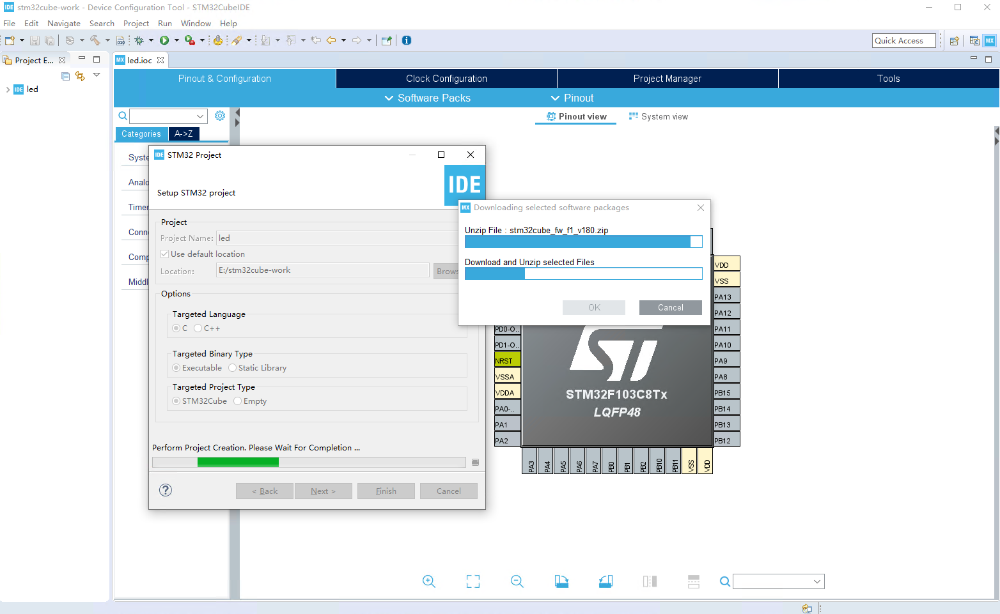

#Windows 硬件开发环境搭建

###### 目录

> - Keil5
> - Arduino IDE
>     - Arduino
>     - ESP32
>     - STM32
> - STM32CubeIDE
> - VSC（VS code）
>     - PlatformIO
>     - ESP-IDF
> - Clion
> - Thonny
> - ADS

# Keil 5

- 安装软件

- 注册软件（破解）

- 安装芯片包

    ## 安装软件

    正常默认一步步安装即可。（推荐安装在非 C 盘）

    安装包可以通过互联网获取，也可以去官网获取。

    > 注意：建议安装路径不能有中文。


### 注册软件

- 管理员身份打开


- 复制


打开注册器

  

- 输入刚刚复制的 CID，并选择 ARM
- 点击生成（Generate）


- 复制粘贴生成的序列号，到 keil5 里；点击添加，即可


## 安装芯片包

- 离线：互联网获取或者官网下载的包，直接双击安装


- 在线：安装完软件后，在软件内搜索安装


# Arduino IDE

- [官网下载](https://www.arduino.cc/en/software)：https://www.arduino.cc/en/software

正常默认一步步安装即可。（推荐安装在非 C 盘）


## Arduino

默认情况下，Arduino IDE 安装完成后，初次打开，会自动安装 Arduino board 的开发环境。无需手动操作。


途中，弹出要安装其它东西，全都安装即可。


> 博主，推荐 Arduino IDE 里，只开发 Arduino 的开发板，在没有良好网络环境情况下，其它芯片的开发板环境安装，极其繁琐，且 Arduino IDE 对于代码补全、提示，支持太弱，且风格趋向于将代码写在一个文件里，不利于项目工程化，更加推荐使用后文中的，VSC + PIO 的方式开发。

## ESP32

- 添加开发板链接

    ```
    https://gitee.com/dfrobot/FireBeetle-ESP32/raw/master/package_esp32_index.json
    ```

     

- 安装

耐心等待即可，如果网络实在不好，可以进行离线安装（自行搜索解决）。


## STM32

- 添加开发板

```
https://github.com/stm32duino/BoardManagerFiles/raw/master/STM32/package_stm_index.json
```

- 安装

耐心等待即可，如果网络实在不好，可以进行离线安装（自行搜索解决）。


# STM32CubeIDE

- 安装软件


- 新建工程会，自动下载开发环境，耐心等待，即可。



# VSC（VS code）

正常一步步安装，即可。


## PlatformIO

即是 VSC + PIO。


每第一次新建从未使用过的芯片框架时，都会自动下载依赖环境（非常久）。


## ESP-IDF

待补充。

# Clion

待补充。

# Thonny

待补充。

# ADS

博主，使用逐飞科技开源的 TC264 库，推荐的 ADS 版本。

正常一步步，安装即可。


