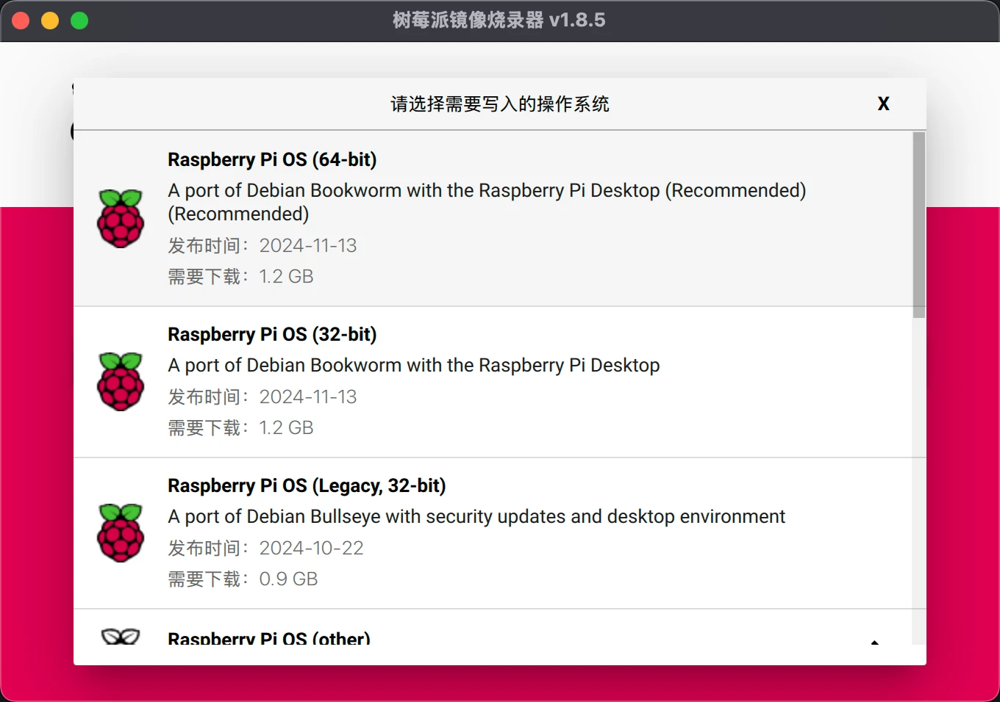

# 常见开发板、芯片烧录方法

- STM32
    - stlink
    - daplink
    - 串口

- ESP8266

- ESP32

- 树莓派
- TC264

## STM32

一般最小核心板是不带下载芯片的，所以需要额外的烧录硬件。

### st-link

> -  st-link
>
> - 杜邦线
>
> - STM32 核心板

### dap-link

> - dap-link
> - 杜邦线
> - STM32 核心板

### 串口

略，一般不会使用这种方式烧录。

## ESP32

> - 数据线 + ESP32 开发板
> - 独立设计的电路板，一般都会加上下载芯片与自动下载电路

## ESP8266

> - ESP8266 烧录器 + ESP8266 模块
> - 数据线 + ESP8266 开发板

## 树莓派

> - 读卡器
> - TF 卡
> - 树莓派硬件
> - 树莓派官方烧录器（或者其它第三方烧录器）

- 安装官方 Raspberry Pi OS（Raspbian）

通过，官方镜像烧写工具，直接在线安装

- 选择树莓派版本
- 选择系统镜像
- 选择存储卡

如果是官方系统镜像，还支持写入配置信息：

- 配置用户名与密码
- 配置 Wi-Fi
- 开启 SSH

## TC264

> - TC264 核心板，及逐飞科技或者龙邱科技对应的烧录器
> - ADS 软件
>     - 网络上有不少说，软件烧录经常出问题
>     - 还有不是说，烧录需要使用英飞凌的另一款软件
>     - 众说纷纭，博主以为，先使用逐飞推荐的 ADS 版本，软件内烧录，要是不成功再换方法
