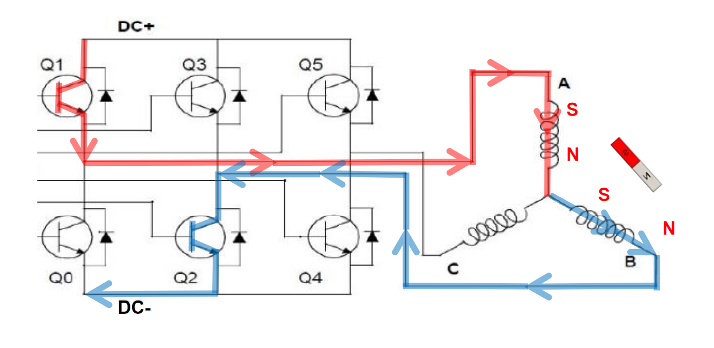
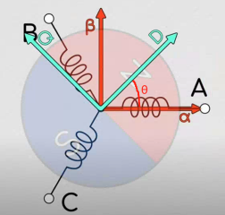
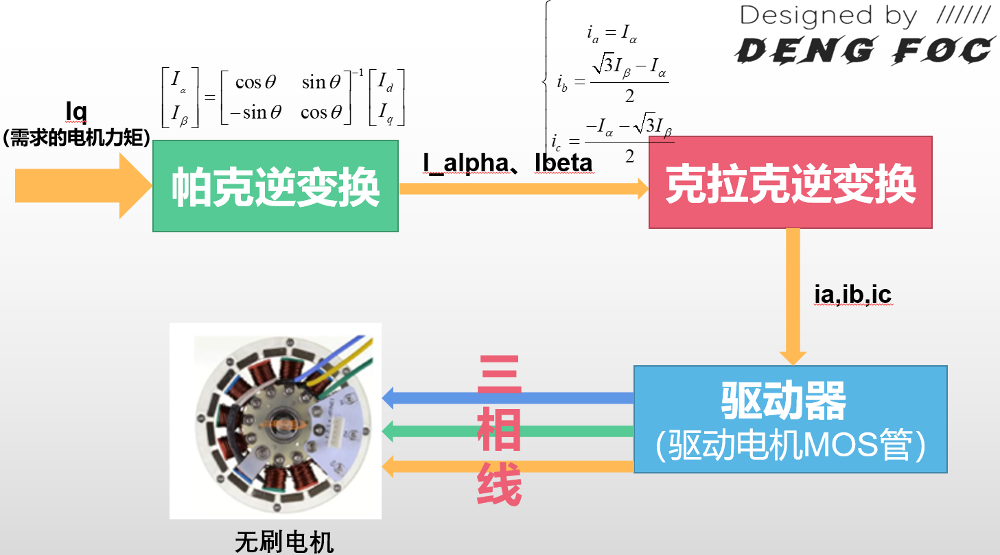

# FOC 算法——无刷电机原理与控制

###### 目录

> - 为什么需要学习理论
> - 无刷电机
> - FOC 算法原理
>     - CLARKE 变换
>     - PARK 变换
> - 开环 FOC
> - 闭环 FOC
> - 封装 FOC 库

# 为什么需要学习理论

**SimpleFOC** 的很多不足和短板，这些短板主要分为以下几个方面：

- **SimpleFOC** 库架构复杂，内存占用大
- **SimpleFOC** 库只注重 FOC 功能，没有做很多的软硬件扩展支持，比如Can，双编码器，ROS，无线，OpenMV，Python库，树莓派等，这限制了其在应用领域的进一步发展
- **SimpleFOC** 库没有很好的电机快速应用功能，想要在这个库上运行电机，必须经过复杂的调参，所以，我认为引入自动PID调参在我的库里实际上很有必要
- **SImpleFOC** 库没有无感电机驱动的相关算法，限制了其在无感工况条件下的应用

理想中 FOC 库会具有以下优势功能：

- **资源占用低**：内存占用比 *SimpleFOC* 少2/3
- **开放度更广**：库把基本的FOC算法接口（如电角度、IαIα 、IβIβ）等以一种及其简单的方式向用户开放，使得用户可以直接接触到 FOC 算法实现的全过程，易于学习和在此基础上更进一步的开发 FOC 算法
- **外接能力强**：支持与 *OpenMV、树莓派、Python* 等多种硬件方案和软件语言直接的对接和互相调用，可以以比 *SimpleFOC* 更快的方式完成无刷电机应用的开发
- **即插即用，无需校准**：先进的参数自识别功能可以使得用户无需配置任何参数，直接插入电机和编码器即可跑FOC
- **无线控制支持**：高速 *UDP，ESPNow* 通讯，无需信号线即可控制电机 脚本支持：库内建强大的脚本语言 *Lua*，可以在不编译的情况下快速建立FOC应用
- **强大的工具链支持**：支持与 *Matlab Simulink 、ROS*  等系统直接通讯，秒速建立机器人应用
- **高精度减速器应用支持**：支持双编码器减速机应用

## 参考 FOC

本 FOC 库将与 **DengFOC** 硬件联合组成一整套完整可用的 FOC 电机驱动方案。资料链接：

1 [灯哥开源 淘宝店–一站配齐DengFOC板](https://shop564514875.taobao.com/) 您的支持就是我们持续做开源内容和课程的动力，项目收益将用于后续开发DengFOC和做课程~

2 [DengFOC库 Github](https://github.com/ToanTech/DengFOC_Lib)

3 [DengFOC硬件 Github](https://github.com/ToanTech/Deng-s-foc-controller)

4 [DengFOC官网](http://dengfoc.com/#/) 包含课程文字版讲义，DengFOC使用文档，库使用方法等。

# 无刷电机

## 无刷电机结构分类

首先，在学会怎么控制无刷电机前，我们需要对无刷电机的结构有基本的认识，基本的航模无刷电机结构图如下图所示，分为前盖，中盖，后盖，磁铁，硅钢片，漆包线、轴承和转轴组成。

更加宏观上分，我们也可以直接把电机分为定子部分和转子部分。

- **定子**就是有线圈绕组，固定不动的部分；
- **转子**就是电机旋转的部分，用于输出电机的转动和扭矩。

而进一步的，无刷电机可以分为内转子和外转子两种。

- **内转子无刷电机**就是转子在内部；
- **外转子无刷电机**就是转子在外面，我们常见的无刷电机。比如航模无刷电机，就是外转子无刷电机。

## 直流无刷电机驱动原理

直流无刷电机依靠改变电机定子线圈的电流交变频率和波形，在定子周围形成磁场，驱动转子永磁体转动，从而带动电机旋转。所以，研究改变定子线圈电流交变频率和波形是驱动电机的关键。

## 硬件控制原理

无刷电机与有刷电机的区别在于无刷电机没有电刷，不能像有刷电机那样通过机械结构进行电流换向，而是要通过 MOS 等器件实现电子换向。MOS 可看作是控制电流通断的开关，类似水龙头控制水流。

通过控制不同 MOS 管的通断组合，可改变电机线圈电流大小和方向。

例如，打开 Q1 管和 Q2 管，电流从 A 相流到 B 相再到负极，根据右手螺旋定则产生磁场，定子线圈吸引转子磁铁转动，但转子旋转一定角度后会停止。此时打开 Q1 管和 Q4 管，磁场方向改变，转子磁极进一步旋转。交替开关不同 MOS 管，可实现电机磁极交替运动，这就是无刷电机旋转运动原理。因此，电机控制实际上是对 MOS 管开关规律的控制，而这需要单片机程序控制，由此引出 FOC 控制算法，它是对电机运动模型抽象简化，进而有规律控制 MOS 管开关通断的过程。

因此，我们就可以总结出一条规律：**对电机的控制实际上就是对MOS管开关规律的控制**。而MOS管的开关规律是需要用到单片机程序进行控制的，因此这就引出了我们的 **FOC** 控制算法，**FOC** 控制就是一种对电机运动模型进行抽象化和简化，进而有规律控制各个MOS管开关和通断的过程。

# FOC 算法原理、数学模型

根据期望的电机运行情况，通过一个电机运行模型，实现交替开关各个 MOS 管的算法，这就是 **FOC 算法**，它的另一个名称就是**磁场定向控制算法**，而 **CLARKE 变换**和 **PARK 变换**，就是磁场定向控制算法的**两个核心**。

## CLARKE 变换

交替开关 MOS 管使电机转动，这些 MOS 管快速周期性开关，观察各相可得到 A、B、C 三相电流随时间变化的曲线，它们相位差为 120°。从另一个角度看，控制这个相位差为 120° 的正弦状波形就能实现电机控制。

CLARKE 变换里的克拉克是一个真实存在的人 ，她的全名叫：**伊迪丝·克拉克（Edith Clarke，1883 年 2 月 10 日 - 1959 年 10 月 29 日）**。她是美国第一位专业从事电气工程师工作的女性， 也是美国第一位电气工程女教授。 她是第一位在美国电气工程师学会发表论文的女性，第一位专业地位得到 Tau Beta Pi 认可的女性工程师，也是第一位被任命为美国电气工程师学会院士的女性。 她专门从事电力系统分析，并撰写了交流电力系统的电路分析。

所谓**CLARKE 变换，实际上就是降维解耦的过程，把难以辨明和控制的三相相位差120°电机波形降维为两维矢量**。

控制 120° 的正弦状波形实现电机控制有难度，因为相之间相互耦合，改变一相无法实现控制，必须三相同时改变，问题复杂。CLARKE 变换就是降维解耦过程，把三相相位差 120° 的电机波形降维为两维矢量。其思路是先将三相电流波形抽象化为三个间隔 120° 的矢量，再利用三角函数将矢量降维到两个坐标轴，将复杂三相问题转化为 $α - β$ 坐标轴上的数值变化问题。

### CLARKE 变换推导

#### 投影

显然，针对 $α-β$ 坐标系中 $α$ 轴，有：

$$\begin{aligned}&\mathrm{I_\alpha=i_a-sin30^\circ i_b-cos60^\circ i_c}\\&\mathrm{I_\alpha=i_a-\frac{1}{2}i_b-\frac{1}{2}i_c}\end{aligned}$$​

针对 $α-β$ 坐标系中 $β$ 轴，有

$$\begin{aligned}&\mathrm{I_{\beta}}=\cos30^{\circ}\mathrm{i_{b}}-\cos30^{\circ}\mathrm{i_{c}}\\&\mathrm{I_{\beta}}=\frac{\sqrt{3}}{2}\mathrm{i_{b}}-\frac{\sqrt{3}}{2}\mathrm{i_{c}}\end{aligned}$$​

把上面的投影结果列成矩阵形式，有：

$$\begin{bmatrix}\mathrm{I}_\alpha\\\mathrm{I}_\beta\end{bmatrix}=\begin{bmatrix}1&&-\frac{1}{2}&&-\frac{1}{2}\\0&&\frac{\sqrt{3}}{2}&&-\frac{\sqrt{3}}{2}\end{bmatrix}\begin{bmatrix}\mathrm{i}_a\\\mathrm{i}_b\\\mathrm{i}_c\end{bmatrix}$$

#### 等幅值

由于 $b,c$ 相电流投影的存在，导致在 $a$ 相输入 1A 电流，反应在 $α$ 轴上的电流并不是等赋值的 1A。

为使得，重合的矢量 $a$ 与 $α$ 电流相等，让式子等辐值，乘以 $\cfrac 2 3$:

$$[\begin{array}{l}\mathrm{I}_\alpha\\\mathrm{I}_\beta\end{array}]=\frac{2}{3}[\begin{array}{lllll}1&&-\frac{1}{2}&&-\frac{1}{2}\\0&&\frac{\sqrt{3}}{2}&&-\frac{\sqrt{3}}{2}\end{array}]\begin{bmatrix}\mathrm{i}_\mathrm{a}\\\mathrm{i}_\mathrm{b}\\\mathrm{i}_\mathrm{c}\end{bmatrix}$$​

移项：

$$\mathrm{I_{\alpha}}=\frac{2}{3}[\mathrm{i_{a}}-\frac{1}{2}(\mathrm{i_{b}}+\mathrm{i_{c}})]$$

根据基尔霍夫电流定律：

$$\begin{aligned}&\mathrm{i}\mathrm{a}+\mathrm{i}_{\mathrm{b}}+\mathrm{i}_{\mathrm{c}}=0\\\frac{1}{2}\mathrm{i_{a}}&=-\frac{1}{2}(\mathrm{i_b}+\mathrm{i_c})\\&\mathrm{I}_{\alpha}=\frac{2}{3}[\mathrm{i_{a}}+\frac{1}{2}\mathrm{i_{a}}]\\&\mathrm{I_{\alpha}}=\frac{2}{3}\times\frac{3}{2}\mathrm{i}_{\mathrm{a}}\\&\mathrm{I}_{\alpha}=\mathrm{i_a}\end{aligned}$$

接下来求 $$\mathrm{I}_{\beta}$$​：

$$\begin{aligned}\mathrm{Ip}&=\frac{2}{3}\times(\frac{\sqrt{3}}{2}\mathrm{i_{b}}-\frac{\sqrt{3}}{2}\mathrm{i_{c}})\\&=\frac{\sqrt{3}}{3}\times(\mathrm{i_b-i_c})\\&=\frac{1}{\sqrt{3}}\times(\mathrm{i_b-i_c})\end{aligned}$$

根据基尔霍夫电流定律：

$$\begin{aligned}&\mathrm{i_{a}+i_{b}+i_{c}=0}\\&\mathrm{-}\mathrm{i_{c}=-(i_{a}+i_{b})}\\&\mathrm{Ip}=\frac{1}{\sqrt{3}}\times(\mathrm{i_b-i_c})\\&=\frac{1}{\sqrt{3}}\times(\mathrm{i_b+i_a+i_c})\\&=\frac{1}{\sqrt{3}}\times(2\mathrm{i_b+i_a})\end{aligned}$$​

So,

$$\{\begin{array}{c}\mathrm{I_\alpha=i_a}\\\mathrm{I_\beta=\frac{1}{\sqrt{3}}\times(2i_b+i_a)}\end{array}$$

可以看出，在式子中，我们消去了变量 $i_c$，这是因为由于基尔霍夫电流定律的存在，我们并不需要知道所有三相电流，我们只需要知道两相电流就能够求解得到另外一相的电流，反映在硬件上，**我们就可以省去一路的电流传感器！节省了成本！**

### CLARKE 逆变换推导

那么，有没有什么办法能够反过来把降维后的形式重新升维变回原来的 $i_a,i_b,i_c$​​ 三相电流波形呢？有，这就被称为**克拉克逆变换**。这个在后续的 FOC 算法中也会很常用到。

已知：

$$\{\begin{array}{c}\mathrm{I_\alpha=i_a}\\\mathrm{I_\beta=\frac{1}{\sqrt{3}}\times(2i_b+i_a)}\end{array}$$

研究逆变换 $i_b$：

$$\begin{aligned}\mathrm{Ip}&=\frac{1}{\sqrt{3}}\times(2\mathrm{i_{b}+ia})\\\mathrm{Ip}&=\frac{1}{\sqrt{3}}\times(2\mathrm{i_{b}}+\mathrm{I_{\alpha}})\\\sqrt{3}\mathrm{I}_{\beta}&=2\mathrm{i}_{\mathrm{b}}+\mathrm{I}_{\alpha}\\2i_{\mathrm{b}}&=\sqrt{3}\mathrm{I}_{\beta}-\mathrm{I}_{\alpha}\\\mathrm{ib}&=\frac{\sqrt{3}\mathrm{I}_{\beta}-\mathrm{I}_{\alpha}}{2}\end{aligned}$$

根据**基尔霍夫电流定律**，$i_a+i_b+i_c=0$，我们得到逆变换 $i_c$：

$$\begin{aligned}\mathrm{i}_{\mathrm{c}}&=-(\mathrm{i_a+i_b})\\&=-\mathrm{I}_{\alpha}-\mathrm{i}_{\mathrm{b}}\\&=-\mathrm{I}_\alpha-\frac{\sqrt{3}\mathrm{I}_\beta-\mathrm{I}_\alpha}{2}\\&=\frac{-2\mathrm{I}_\alpha-\sqrt{3}\mathrm{I}_\beta+\mathrm{I}_\alpha}{2}\\&=\frac{-\mathrm{I}_\alpha-\sqrt{3}\mathrm{I}_\beta}{2}\end{aligned}$$

So,

$$\begin{array}{l}\mathrm{i_a}=\mathrm{I}_\alpha\\\mathrm{i_b}=\frac{\sqrt{3}\mathrm{I_\beta}-\mathrm{I_\alpha}}{2}\\\mathrm{i_c}=\frac{-\mathrm{I_\alpha}-\sqrt{3}\mathrm{I_\beta}}{2}\end{array}$$

## PARK 变换

**PARK 变换** 就是能够帮助我们求得各种旋转情况下的 $I_α$ 和 $I_β$​。

我们发现降维后尽管少了一个变量，但是只要电机转动，$I_α$ 和 $I_β$ 就依然在一直变化，能不能对这个电机系统进行进一步的降维，使得我们甚至不用考虑变化的 $I_α,I_β$，只需要有一个定值就能够描述整个电机系统的转动状态？

帕克在我们刚刚固定在电机定子上的 $I_α−I_β$ 坐标系上，另外新建了一个坐标系，我们称之为 $I_q−I_d$ 坐标系，这个坐标系是可以随电机转子转动的！它与电机转子固联！

那么我们就有了两个坐标系了，一个是固定在定子上的坐标系 $I_α−I_β$，一个是固定在转子上的坐标系 $I_q−I_d$。进一步的，我们把两个坐标系画在一起，我们就有如下图所示的坐标：

其中，$I_q−I_d$ 坐标系随转子转动，D 轴在此处设定为指向电机的 N 级，$I_q−I_d$ 坐标系因转动而造成的与 $I_α−I_β$  坐标系的差角 $θ$，就被称为电角度！

那么，很轻松的，还是利用简单的三角函数构建的旋转矩阵，在知道电角度的前提下，我们很容易就能够把 $i_q−i_d$ 坐标系上的值映射（旋转）到 $i_α−i_β$ 坐标系上！式子如下：

$$[\begin{array}{c}\mathrm{i_d}\\\mathrm{i_q}\end{array}]=[\begin{array}{ccc}\cos\theta&&\sin\theta\\-\sin\theta&&\cos\theta\end{array}][\begin{array}{c}\mathrm{i_\alpha}\\\mathrm{i_\beta}\end{array}]$$

因此，在知道电角度的前提下，我们就可以用 $i_q,i_d$​  坐标系上的定值来描述电机的旋转！**这正是我们一直渴望的电机旋转数学模型！**

### PARK 逆变换

根据矩阵乘法，取逆，我们可进行帕克逆变换，也就是知道 $i_q,i_d$ 值和电角度的前提下，反求 $i_α,i_β$ ，式子如下：

$$\begin{bmatrix}\mathrm{i}_\alpha\\\mathrm{i}_\beta\end{bmatrix}=\begin{bmatrix}\cos\theta&\sin\theta\\-\sin\theta&\cos\theta\end{bmatrix}^{-1}\begin{bmatrix}\mathrm{i}_\mathrm{d}\\\mathrm{i}_\mathrm{q}\end{bmatrix}$$

写成等式结果：

$$\mathrm{i_{\alpha}=i_d\cos\theta-i_q\sin\theta}\\\mathrm{i_{\beta}=i_q\cos\theta+i_d\sin\theta}$$

在实际的 FOC 应用中，电角度是实时有编码器求出的，因此是已知的。$I_q$ 和 $I_d$ 可以合成一个矢量，加上电角度（旋转）的存在，因此可以看成一个旋转的矢量。在通过 $I_q,I_d$ 和电角度求得 $I_α$ 和 $I_β$ 后，我们就可以通过前面提到的克拉克逆变换求得 $i_a,i_b,i_c$ 的波形，这正是 FOC 的基本过程！

通常在简单的 FOC 应用中，我们只需要控制 $I_q$ 的电流大小，而把 $I_d$ 设置为 0。此时，$I_q$ 的大小间接就决定了定子三相电流的大小，进而决定了定子产生磁场的强度。进一步我们可以说，它决定了电机产生的力矩大小！

而 $I_q$ 是旋转的矢量；在前面说了，同时 $I_q$ 又会间接影响磁场的强度，这正是 FOC 的名称**磁场定向控制**的由来。

## FOC 算法

所谓 FOC 的过程，其实就是输入需求的电机力矩，最后得到对应的真实世界电机输出力矩的过程，如上图所示。而其中最核心的数学过程，就是帕克逆变换和克拉克逆变换，而这两个变换的数学公式上图中框图上面的公式所示，其中 PARK 变换可以对用户输入的 $I_q$ 进行变换，根据电角度算出 $I_α$ 和 $I_β$，接着，通过克拉克逆变换，三相电流 $i_a,i_b,i_c$ 能够被求出，最后这三个 $i_a,i_b,i_c$ 能够用作控制指令输入到电机控制器硬件中进行电机的控制。

# FOC 代码实现

包括 FOC 开环速度、FOC 闭环位置、FOC 闭环速度和 FOC 电流闭环等方面，但文中未详细展开介绍这些内容的实现细节。

[4 FOC 开环速度代码撰写](https://dengfoc.com/#/dengfoc/灯哥手把手教你写FOC算法/4序FOC开环速度代码的撰写?id=_4-foc-开环速度代码撰写)

[ESP32 单片机](https://docs.geeksman.com/esp32/)

## 开环速度

## 闭环位置

## 闭环速度

## 闭环电流

## 闭环电流，改进闭环位置、速度

## 单路 FOC，改进双路 FOC

## SVPWM

## 无感 FOC

