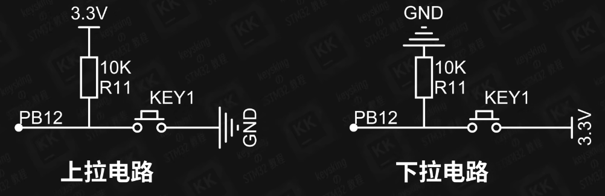
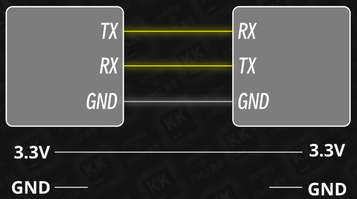

# 概念扫盲

待补充

###### 目录

> - 上拉电阻与下拉电阻
> - PWM
> - 中断
> - 定时器
> - 时钟
> - DMA
> - ADC
> - DAC
> - SPI
> - IIC
> - CAN
> - 独立看门狗
> - 窗口看门狗
> - 串口通信
> - 蓝牙通信
> - 网络通信

## 基础名词

| 高电平 | 1                |
| ------ | ---------------- |
| 低电平 | 0                |
| 上升沿 | 低电平变成高电平 |
| 下降沿 | 高电平变成低电平 |
|        |                  |

## 上拉电阻与下拉电阻

芯片数字引脚，输入模式，当浮空输入模式时（按键未按下时），芯片内部，相对于无穷大电阻，对于上拉电路，根据分压定律，芯片内部几乎分得 `3.3V`，即是引脚读取高电平，故而叫连一个电阻和高电平的为上拉电阻；同理，对于下拉电路，引脚读取低电平。

- 接电阻是为了限流，防止短路
- 开关按下时，没有电阻的一路，相对于导线，故而不会走有电阻的回路

> 可以简单理解为，接什么，读取的就是什么。

## PWM

## 中断

顺序执行代码，中断作用就是，希望在接收到某些信号后（如按下开关），为触发某个功能，暂停顺序执行代码。

- 外部中断：EXIT
- 中断向量
- 中断优先级

## 串口

TTL 串口

Asynchronous

- TX
- RX

### 轮询模式

执行完发送或者接收后，才顺序执行下一步。

### 中断模式

一边顺序执行代码，一边执行数据发送或者接收。

代码写法，类似于中断，调用函数方式。

### DMA

STM32Cube 默认有接收到一半时，触发中断函数。

## I2C

