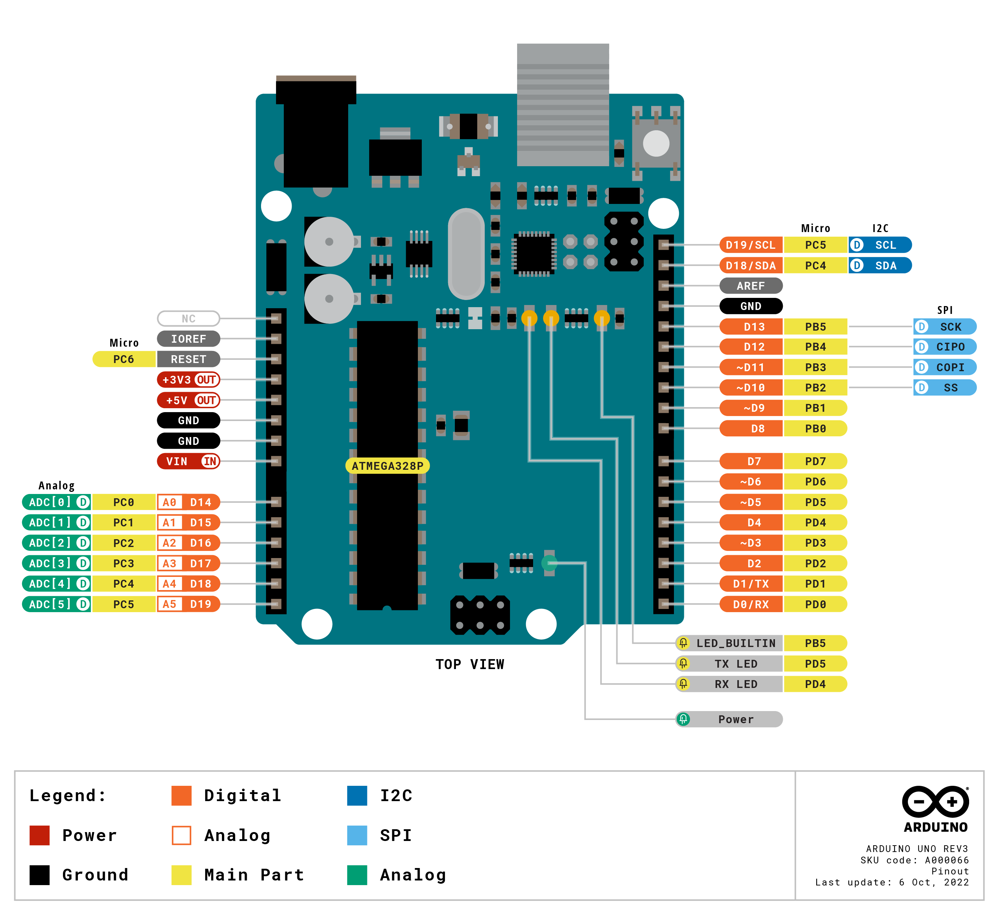

# Arduino UNO R3

##### 相关

> - 开发板官网：https://docs.arduino.cc/hardware/uno-rev3/#features
> - Pinout (PDF)：https://docs.arduino.cc/resources/pinouts/A000066-full-pinout.pdf
> - Datasheet：https://docs.arduino.cc/resources/datasheets/A000066-datasheet.pdf
> - Schematics：https://docs.arduino.cc/resources/schematics/A000066-schematics.pdf
> - CAD Files：https://docs.arduino.cc/static/f70b5045f5f73c41d96e4b12775c31c6/A000066-cad-files.zip
> - EEPROM 使用：https://docs.arduino.cc/learn/programming/eeprom-guide/
> - 官方使用示例：https://docs.arduino.cc/tutorials/uno-rev3/AnalogInput/

# Tech Specs

Here you will find the technical specifications for the Arduino UNO R3.

| **Board**               |                                  |
| ----------------------- | -------------------------------- |
| Name                    | Arduino UNO R3                   |
| SKU                     | A000066                          |
| **Microcontroller**     |                                  |
| ATmega328P              |                                  |
| **USB connector**       |                                  |
| USB-B                   |                                  |
| **Pins**                |                                  |
| Built-in LED Pin        | 13                               |
| Digital I/O Pins        | 14                               |
| Analog input pins       | 6                                |
| PWM pins                | 6                                |
| **Communication**       |                                  |
| UART                    | Yes                              |
| I2C                     | Yes                              |
| SPI                     | Yes                              |
| **Power**               |                                  |
| I/O Voltage             | 5V                               |
| Input voltage (nominal) | 7-12V                            |
| DC Current per I/O Pin  | 20 mA                            |
| Power Supply Connector  | Barrel Plug                      |
| **Clock speed**         |                                  |
| Main Processor          | ATmega328P 16 MHz                |
| USB-Serial Processor    | ATmega16U2 16 MHz                |
| **Memory**              |                                  |
| ATmega328P              | 2KB SRAM, 32KB FLASH, 1KB EEPROM |
| **Dimensions**          |                                  |
| Weight                  | 25 g                             |
| Width                   | 53.4 mm                          |
| Length                  | 68.6 mm                          |

# Intro

The Arduino UNO is the best board to get started with electronics and coding. If this is your first experience tinkering with the platform, the UNO is the most robust board you can start playing with. The UNO is the most used and documented board of the whole Arduino family.

Arduino UNO is a microcontroller board based on the **ATmega328P**. It has 14 digital input/output pins (of which 6 can be used as PWM outputs), 6 analog inputs, a 16 MHz ceramic resonator, a USB connection, a power jack, an ICSP header and a reset button. It contains everything needed to support the microcontroller; simply connect it to a computer with a USB cable or power it with a AC-to-DC adapter or battery to get started. You can tinker with your UNO without worrying too much about doing something wrong, worst case scenario you can replace the chip for a few dollars and start over again.

### **Replaceable chip**

The `ATmega328P` can easily be replaced, as it is not soldered to the board.

### **Battery Connector**

The Arduino UNO features a barrel plug connector, that works great with a standard 9V battery.

### **EEPROM**

The `ATmega328P` also features 1kb of EEPROM, a memory which is not erased when powered off.

[**Documentation**](https://docs.arduino.cc/learn/programming/eeprom-guide)
