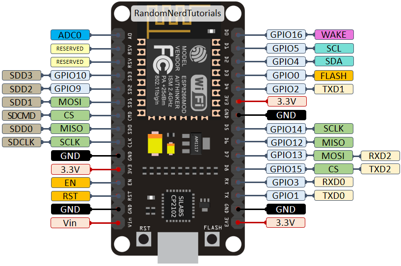

# ESP-12E NodeMCU

##### 相关

> - NodeMCU：https://www.nodemcu.com/index_cn.html
> - [ESP8266 Arduino 核心文档/ESP8266 Arduino Core Documentation（英文）百度网盘下载](https://pan.baidu.com/s/1bqxLxeR)
> - [esp8266ex技术规格表（中文）百度网盘下载](https://pan.baidu.com/s/1dGECrfj)
> - [esp8266ex技术规格表（英文）百度网盘下载](https://pan.baidu.com/s/1smIr9KT)
> - 【【ESP8266教程】零基础入门学用物联网-基础知识篇（太极创客团队）】 https://www.bilibili.com/video/BV1L7411c7jw/?p=2&share_source=copy_web&vd_source=0152764925b99fadd2e9e3592e9421a8

## 主要技术参数

| 核心模块         | ESP8266                     |
| ---------------- | --------------------------- |
| 工作电压         | 5伏特                       |
| 输入电压(推荐)   | 5伏特                       |
| 输入电压(极限)   | 4.5 ～ 10 伏特              |
| 数字输入输出引脚 | 10个（全部可以作为PWM引脚） |
| PWM引脚          | 10个                        |
| 模拟输入引脚     | 1个                         |
| WIFI标准         | 802.11 b / g / n            |
| 工作模式         | STA / AP / STA + AP         |
| 重量             | 7g                          |
