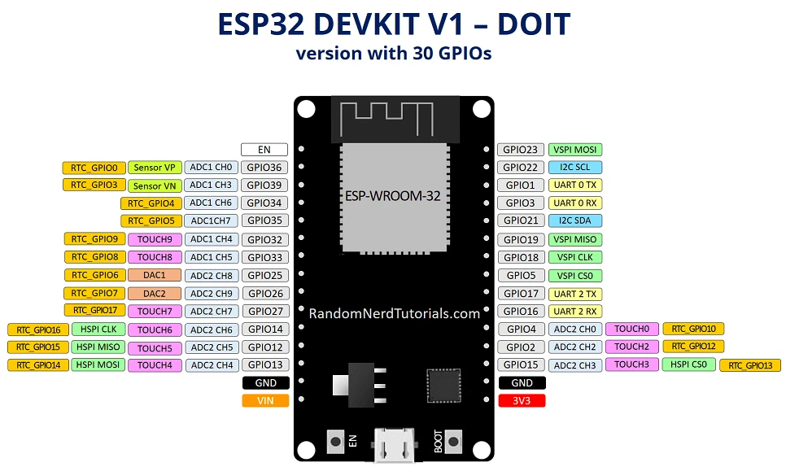

# ESP32-DevKitC

##### 相关

> - 官方文档 v4：https://docs.espressif.com/projects/esp-dev-kits/zh_CN/latest/esp32/esp32-devkitc/user_guide.html
>     - 核心模组没换，都是 ESP-WROOM-32，故而无论 v 几版本文档可看，只是开发板引脚不同
> - Arduino 框架版本文档：https://docs.geeksman.com/esp32/Arduino/01.esp32-arduino-intro.html

##vv1-30pin

## v4-38pin

# 补充 ESP32 概念

1. **ESP32 开发板**：它是在 ESP32 模组基础上，预先焊接了许多电路，并预留了便于编程使用的接口，为开发者提供了便捷的开发条件。
2. **ESP32 模组**：为了方便使用 ESP32 芯片，模组中预先焊接了一些电阻、电容等元件。
3. **ESP32 芯片**：这是最底层的核心芯片。通常我们所说的 ESP32 一般指的是 ESP32 开发板。