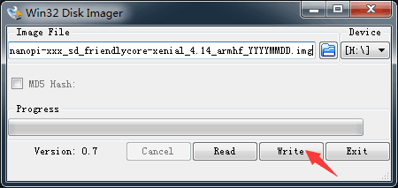

# NanoPi Duo2

##### 相关资料

> - 教程（固件介绍，使用说明，操作步骤等）：http://wiki.friendlyelec.com/wiki/index.php/NanoPi_Duo2
> - 系统固件下载：https://dl.friendlyelec.com/nanopiduo2
> - 原理图(pdf格式)：http://wiki.friendlyelec.com/wiki/images/a/ab/Schematic_NanoPi_Duo2-V1.0-1807.pdf
> - 尺寸图(dxf格式)：http://wiki.friendlyelec.com/wiki/index.php/File:Dimensions_NanoPi_Duo2_V1.0_1807_PCB.rar

- NanoPi Duo2（以下简称Duo2）是友善之臂团队开发的一款双列直插超小型创客神器，尺寸只有55x25.4mm。它采用全志四核A7处理器H3, 配备256M/512M DDR3内存，板载WiFi 蓝牙模块，并提供OV5640摄像头接口，可运行完整的Ubuntu Core等嵌入式Linux系统。

- NanoPi Duo2小巧精致，接口丰富，可采用USB-C直接供电，支持Micro SD卡直接启动运行系统，并可直接插入面包板使用。它引出了USB, SPI, UART, I2C, PWM, IR，音频输入与输出，百兆以太网等接口管脚，非常方便调试开发。

- NanoPi Duo2可支持使用WiringNP, Python等编程库, 完全开源, 非常适合轻量级IoT应用开发。


## 引脚图


## 相关参数

本文档作者使用的开发板信息：

| 品牌 | FriendlyElec   |
| ---- | -------------- |
| 型号 | DUO2 V1.0 512M |

| CPU                    | Allwinner H3, Quad-core Cortex-A7 Up to 1.2GHz               |
| ---------------------- | ------------------------------------------------------------ |
| DDR3 RAM               | 512M                                                         |
| Connectivity           | 10/100M Ethernet                                             |
| WiFi                   | 802.11b/g/n                                                  |
| Bluetooth              | Bluetooth V4.0 of 1, 2 and 3 Mbps.                           |
| Camera                 | OV5640                                                       |
| Key                    | GPIO Key                                                     |
| USB Host               | 2.54mm pin x2, exposed in 2.54mm pitch pin header            |
| MicroSD Slot           | 1                                                            |
| USB-C                  | USB-C 2.0 DRP and power input                                |
| Debug Serial Interface | exposed in 2.54mm pitch pin header                           |
| Audio Interface        | exposed in 2.54mm pitch pin header                           |
| GPIO1                  | 2.54mm spacing 16pin. It includes UART, SPI, I2C, Audio etc  |
| GPIO2                  | 2.54mm spacing 16pin. It includes USB,10/100M Ethernet, IO etc |
| PCB Dimension          | 25.4 x 55mm                                                  |
| Power Supply           | DC 5V/2A                                                     |
| Temperature Range      | -20℃ to 70℃                                                  |
| OS/Software            | U-boot，Linux-4.14 / Linux-3.4, Ubuntu 16.04.2 LTS (Xenial)  |
| Weight                 | xxg(With Pin-headers)                                        |

# 学习札记

要开启你的NanoPi Duo2新玩具，请先准备好以下硬件

- NanoPi Duo2 主板
- microSD卡/TF卡: Class10或以上的 8GB SDHC卡
- 一个microUSB接口的外接电源，要求输出为5V/2A（可使用同规格的手机充电器）
- 一台电脑，需要联网，建议使用Ubuntu 18.04 64位系统
- 一个串口模块

制作启动TF卡时，建议Class10或以上的 8GB SDHC卡。

## 烧录系统镜像

首先访问[下载地址](http://download.friendlyelec.com/nanopiduo2)下载需要的固件文件(officail-ROMs目录)和烧写工具(tools目录)：

| nanopi-duo2_sd_friendlycore-xenial_4.14_armhf_YYYYMMDD.img.zip | 基于UbuntuCore构建的FriendlyCore系统固件，使用Linux-4.14内核 |
| ------------------------------------------------------------ | ------------------------------------------------------------ |
| nanopi-duo2_sd_friendlywrt_4.14_armhf_YYYYMMDD.img.zip       | 基于OpenWrt构建的系统固件，使用Linux-4.14内核                |

### 烧录工具

- win32diskimager：Windows平台下的系统烧写工具
- Linux 平台下可以用dd命令烧写系统

### win32diskimager-烧写到TF卡

- FriendlyCore / FriendlyWrt 等系统都属于 Linux 系统，所以它们的烧写方法是一样。
- 将 Linux 系统固件和烧写工具 win32diskimager.rar 分别解压，在 Windows 下插入TF卡（限4G及以上的卡)，以管理员身份运行烧写工具 win32diskimager，在烧写工具 win32diskimager 的界面上，选择你的TF卡盘符，选择Linux 系统固件，点击 Write 按钮烧写。

这里以nanopi-duo2_sd_friendlycore-xenial_4.14_armhf_YYYYMMDD.img为例，其他系统的烧写操作是类似的，烧写时的界面如下：



成功烧写后，会看到如下界面：


- 当制作完成TF卡后，拔出TF卡插入 BOOT 卡槽，上电启动（注意，这里需要5V/2A的供电），你可以看到STAT灯闪烁，这时你已经成功启动系统。

##首次开机使用

FriendlyCore，是一个没有X-windows环境，基于Ubuntu core构建的系统，使用Qt-Embedded作为图形界面的轻量级系统，兼容Ubuntu系统软件源，非常适合于企业用户用作产品的基础OS。

本系统除了保留Ubuntu Core的特性以外，还包括以下特性：

- 集成Qt4.8；
- 集成NetworkManager网络管理器；
- 集成bluez等蓝牙相关软件包；
- 集成alsa相关软件包；
- 集成命令行系统配置工具npi-config；
- 集成Python GPIO模块RPiGPIO；
- 集成Python/C语言编写的demo程序，位于/root目录；
- 使能512M的swap分区；

### 运行FriendlyCore

使用USB转串口模块调试，请注意需要使用5V/2A电源给开发板MicroUSB供电：


- https://blog.csdn.net/Meissen_Zhong/article/details/113481333
- https://bbs.elecfans.com/jishu_806854_1_1.html

FriendlyCore默认帐户：

普通用户：

```
   用户名: pi
   密码: pi
```

Root用户：

```
   用户名: root
   密码: fa
```

默认会以 pi 用户自动登录，你可以使用 sudo npi-config 命令取消自动登录。

## 基本配置

###常用命令

- 更新软件包

```bash
sudo apt-get update
```

### 连接WiFi

无论是SD WiFi还是USB WiFi, 它们的连接方式都是一样的。正基科技的APXX系列芯片属于SD WiFi，另外系统默认也已经支持市面上众多常见的USB WiFi，已测试过的USB WiFi型号如下：

| 序号 | 型号                                   |
| ---- | -------------------------------------- |
| 1    | RTL8188CUS/8188EU 802.11n WLAN Adapter |
| 2    | RT2070 Wireless Adapter                |
| 3    | RT2870/RT3070 Wireless Adapter         |
| 4    | RTL8192CU Wireless Adapter             |
| 5    | 小米WiFi mt7601                        |
| 6    | 5G USB WiFi RTL8821CU                  |
| 7    | 5G USB WiFi RTL8812AU                  |

目前使用 NetworkManager 工具来管理网络，其在命令行下对应的命令是 nmcli，要连接WiFi，相关的命令如下：

- 切换到root账户

```bash
su root
```

- 查看网络设备列表

```bash
nmcli dev
```

注意，如果列出的设备状态是 unmanaged 的，说明网络设备不受NetworkManager管理，你需要清空 /etc/network/interfaces下的网络设置,然后重启.

- 开启WiFi

```bash
nmcli r wifi on
```

- 扫描附近的 WiFi 热点

```bash
nmcli dev wifi
```

- 连接到指定的 WiFi 热点

```bash
nmcli dev wifi connect "SSID" password "PASSWORD" ifname wlan0
```

请将 SSID和 PASSWORD 替换成实际的 WiFi名称和密码。
连接成功后，下次开机，WiFi 也会自动连接。

更详细的NetworkManager使用指南可参考这篇文章： [Use NetworkManager to configure network settings](https://wiki.friendlyelec.com/wiki/index.php/Use_NetworkManager_to_configure_network_settings)

如果你的USB WiFi无法正常工作, 大概率是因为文件系统里缺少了对应的USB WiFi固件。对于Debian系统, 可以在[Debian-WiFi](https://wiki.debian.org/WiFi)里找到并安装USB WiFi芯片的固件。而对于Ubuntu系统, 则可以通过下列命令安装所有的USB WiFi固件:

```bash
apt-get install linux-firmware
```

一般情况下, 各种WiFi芯片的固件都存放在/lib/firmware目录下。

### 配置WiFi无线热点

执行以下命令进入AP模式：

```bash
su root
turn-wifi-into-apmode yes
```

这时会提示你输入WiFi热点的名称和密码，按提示操作即可。
操作成功后，你可以在电脑/手机上搜索并连接热点，然后通过192.168.8.1这个地址来登录开发板:

```bash
ssh root@192.168.8.1
```

在提示输入密码时，输入预设的密码fa，即可登入。

为了保证ssh的流畅，用以下命令关闭wifi的省电模式:

```bash
iwconfig wlan0 power off
```

要切换回普通的Station模式，输入如下命令：

```bash
turn-wifi-into-apmode no
```

### 扩展TF卡文件系统

第一次启动FriendlyCore系统时，系统会自动扩展文件系统分区，请耐心等待，TF卡/eMMC的容量越大，需要等待的时间越长，进入系统后执行下列命令查看文件系统分区大小：

```bash
df -h
```

### 使用蓝牙传输文件

以传输文件到手机为例进行说明，首先，将你的手机蓝牙设置为可侦测状态，然后执行以下命令开始蓝牙搜索：

```bash
hcitool scan
```

搜索到设备时，结果举例如下：

```
Scanning ...
    2C:8A:72:1D:46:02   HTC6525LVW
```

这表示搜索到一台名为HTC6525LVW的手机，我们记下手机名称前面的MAC地址，然后用sdptool命令查看该手机支持的蓝牙服务：

```bash
sdptool browser 2C:8A:72:1D:46:02
```

注：上述命令中的MAC地址请替换成手机实际的蓝牙MAC地址
这个命令会详细列出手机蓝牙所支持的协议，我们需要关心的是一个名为 OBEX Object Push 的文件传输服务，以HTC6525LVW手机为例，其显示结果如下所示：

```
Service Name: OBEX Object Push
Service RecHandle: 0x1000b
Service Class ID List:
  "OBEX Object Push" (0x1105)
Protocol Descriptor List:
  "L2CAP" (0x0100)
  "RFCOMM" (0x0003)
    Channel: 12
  "OBEX" (0x0008)
Profile Descriptor List:
  "OBEX Object Push" (0x1105)
    Version: 0x0100
```

从上面的信息可以看到，这个手机的OBEX Object Push服务的所用的频道是12, 我们需要将它传递给obexftp命令，最后发起文件传输请求的命令如下：

```bash
obexftp --nopath --noconn --uuid none --bluetooth -b 2C:8A:72:1D:46:02 -B 12 -put example.jpg
```

注：上述命令中的MAC地址、频道和文件名请替换成实际的

执行上述命令后，请留意手机屏幕，正常情况下手机会弹出配对和接收文件的提示，确定后就开始文件传輪了。

蓝牙常见问题：

1) 开发板上找不到蓝牙设备, 可尝试用以下命令开启蓝牙：

```bash
rfkill unblock 0
```

2) 提示找不到相关命令，可尝试用以下命令安装相关软件：

```bash
apt-get install bluetooth bluez obexftp openobex-apps python-gobject ussp-push
```

### 开机自动运行 Qt 示例程序

使用npi-config工具进行开启：

```bash
sudo npi-config
```

进入Boot Options -> Autologin -> Qt/Embedded，选择Enable然后重启即可。

开发Qt应用，参考 [How to Build and Install Qt Application for FriendlyELEC Boards/zh](https://wiki.friendlyelec.com/wiki/index.php/How_to_Build_and_Install_Qt_Application_for_FriendlyELEC_Boards/zh)

### 定制命令行的欢迎信息（文字LOGO）


### 修改时区


## 外设

- 摄像头

- GPIO

- IIC

- 串口

- ### 选择系统默认音频设备