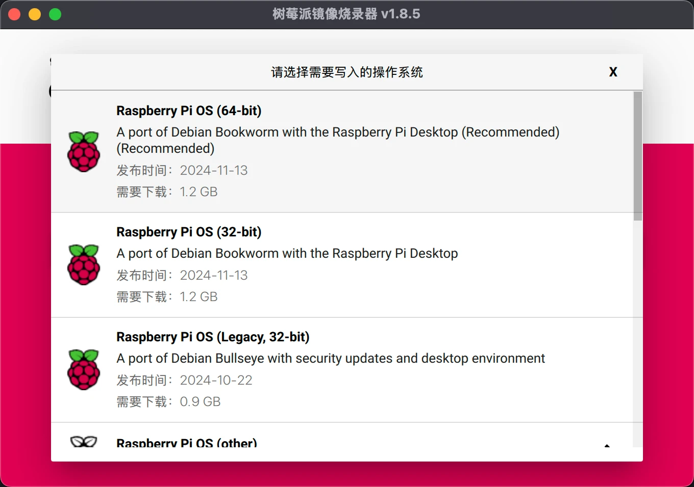
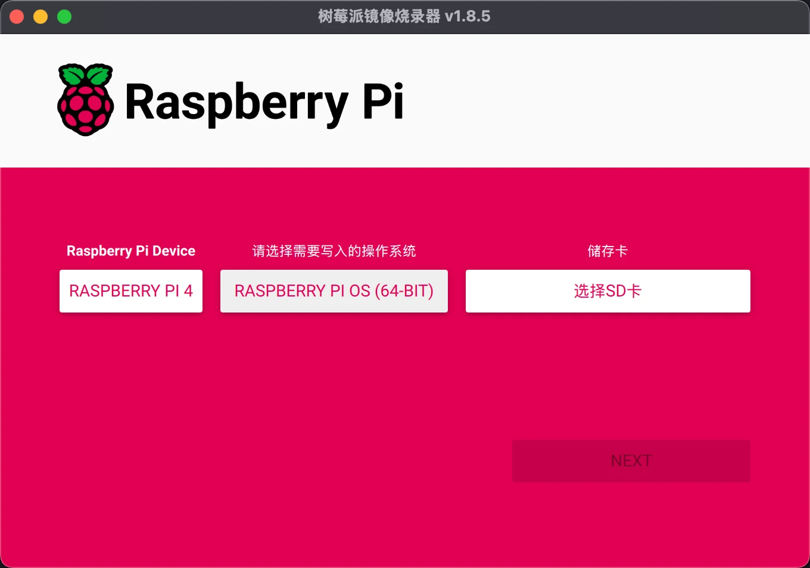

# Raspberry Pi


# 树莓派历史

待补充。

# 开始使用-安装操作系统

## Raspberry Pi 硬件

- TF 卡
- TF 卡读卡器
- 供电稳定（插头）
- 外设（可选）
    - 显示器
    - 鼠标
    - 键盘

## 安装官方 Raspberry Pi OS（Raspbian）

通过，官方镜像烧写工具，直接在线安装

- 选择树莓派版本
- 选择系统镜像
- 选择存储卡





如果是官方系统镜像，还支持写入配置信息：

- 配置用户名与密码
- 配置 Wi-Fi
- 开启 SSH

# 树莓派基本配置

## SSH

## SSH-终端命令连接

> 使用官方镜像烧写官方系统，已经配置了 Wi-Fi 信息和开启 SSH。

- 获取树莓派 IP
    - 路由器后台（一般为，192.168.1.1）
- 终端 SSH 连接树莓派（macOS）
    - `ssh pi@192.168.1.108`
    - `ssh 用户名@IP`
    - 根据提示，输入密码，即可

## VNC 远程桌面

> 使用官方镜像烧写官方系统，已经配置了 Wi-Fi 信息和开启 SSH，并且获取到树莓派 IP，能够通过 SSH 连接到树莓派。

- 树莓派开启 VNC

```bash
sudo raspi-config
```

此时，现象是自动退出 SSH，因为设置完成后会自动重启，需要重启完成后，才能连接

```bash
sudo systemctl start vncserver-x11-serviced
sudo systemctl enable vncserver-x11-serviced
```

- macOS 安装 VNC 客户端
- VNC 客户端，通过树莓派 IP 连接树莓派

## 换源-方便下载

> 使用官方镜像烧写官方系统，已经配置了 Wi-Fi 信息和开启 SSH，并且获取到树莓派 IP，能够通过 SSH 连接到树莓派。

### 查看树莓派系统信息

- 查树莓派系统版本

```bash
lsb_release -a
```

- 查树莓派系统架构

```bash
uname -a
```

### 更换 Debian 源

> 默认有 vim 基础。

- 清华镜像，根据树莓派系统信息，选择源
    - https://mirrors.tuna.tsinghua.edu.cn/help/debian/
- 树莓派 SSH 连接的终端，输入下面命令；将已经复制选择好的源，粘贴到对应文件

```bash
sudo vi /etc/apt/sources.list
```

### 更换 Raspberry 源

- 清华镜像，根据树莓派系统信息，选择源
    - https://mirrors.tuna.tsinghua.edu.cn/help/raspberrypi/
- 树莓派 SSH 连接的终端，输入下面命令；将已经复制选择好的源，粘贴到对应文件

```bash
sudo vi /etc/apt/sources.list.d/raspi.list
```

### 最后一步，更新源和系统

- 树莓派 SSH 连接的终端，输入下面命令

```bash
sudo apt-get update -y
sudo apt-get upgrade -y
```

## 常用命令

### 系统更新与软件安装类

- 更新软件包索引
    - `sudo apt-get update`：这是在安装或升级软件之前必须执行的步骤，用于从软件源获取最新的软件包列表和版本信息。
- 更新软件包
    - `sudo apt-get upgrade`：根据更新后的软件包索引，升级已安装的软件包到最新版本，但不会自动安装新的软件包或删除旧的软件包。

### 系统管理类

- 查看系统信息
    - `uname -a`：显示系统内核等信息，例如系统名称、内核版本、硬件架构等内容，有助于了解树莓派系统的基本情况。
- 查看磁盘使用情况
    - `df -h`：以人类可读的格式（如KB、MB、GB）显示磁盘空间使用情况，包括各个挂载点的总大小、已使用大小、可用大小和使用百分比等。
- 查看内存使用情况
    - `free -h`：显示系统内存（包括物理内存和交换空间）的使用情况，以方便用户了解系统内存资源是否紧张。
- 查看CPU信息
    - `lscpu`：提供CPU的详细信息，如CPU核心数、线程数、型号等，对于性能优化和软件兼容性检查很有用。
- 重启系统
    - `sudo reboot`：用于重新启动树莓派系统，通常在安装系统更新或修改系统配置后需要重启使更改生效。
- 关闭系统
    - `sudo shutdown -h now`：立即关闭树莓派系统，“-h”表示“halt”，即停机。

### 文件和目录操作类

- 列出文件和目录（详细模式）
    - `ls -l`：以长格式列出当前目录下的文件和目录，显示文件的权限、所有者、大小、修改时间等详细信息。
- 列出所有文件和目录（包括隐藏文件）
    - `ls -la`：在长格式的基础上，还会列出隐藏文件和目录，隐藏文件和目录在Linux系统中通常以“.”开头。
- 切换目录
    - `cd <directory - path>`：用于改变当前工作目录，例如`cd /home/pi/Documents`将当前目录切换到指定的“Documents”目录；`cd..`则是返回上一级目录。
- 复制文件
    - `cp <source - file> <destination - file>`：将一个文件从源位置复制到目标位置，例如`cp file1.txt /home/pi/backup/file1.txt`。
- 复制目录（递归复制）
    - `cp - r <source - directory> <destination - directory>`：用于复制一个目录及其所有内容到目标位置，如`cp - r dir1 /home/pi/backup/dir1`。
- 移动文件或重命名文件
    - `mv <source - file> <destination - file>`：可以将文件从一个位置移动到另一个位置，也可用于重命名文件。例如，`mv file1.txt /home/pi/backup/file1.txt`是移动文件，`mv file1.txt new_file1.txt`是重命名文件。
- 删除文件
    - `rm <file - name>`：删除指定的文件，如`rm file1.txt`。使用时要小心，因为文件删除后很难恢复。
- 删除目录（递归删除）
    - `rm - r <directory - name>`：用于删除一个目录及其所有内容，例如`rm - r dir1`。同样要谨慎使用，避免误删重要目录。

### 网络操作类

- 查看网络接口信息
    - `ifconfig`或`ip addr`：用于查看树莓派的网络接口状态，包括IP地址、MAC地址等信息。例如，`ip addr show`可以显示所有网络接口的详细信息。
- 测试网络连接
    - `ping <target - ip - address>`：向指定的IP地址发送ICMP数据包，以测试与目标主机之间的网络连接是否正常。例如，`ping - c 4 192.168.1.1`会发送4个数据包到指定的IP地址。
- 下载文件（从网络）
    - `wget <file - url>`：从指定的URL下载文件到当前目录。例如，`wget http://example.com/file.tar.gz`会从给定的网址下载文件。

## GPIO 控制 LED、模块、传感器、Camera

- RPi.GPIO 库
- GPIO Zero 库

- OpenCV
- ROS

