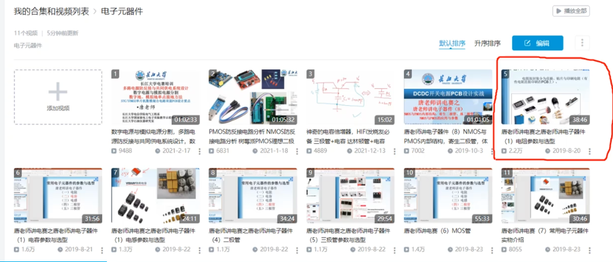

# 电阻

【唐老师讲电赛之唐老师讲电子器件（1）电阻参数与选型】 https://www.bilibili.com/video/BV1Q4411R7ow/?share_source=copy_web&vd_source=0152764925b99fadd2e9e3592e9421a8

【唐老师讲电赛之唐老师讲电子器件（1）电容参数与选型】 https://www.bilibili.com/video/BV1x4411d7cZ/?share_source=copy_web&vd_source=0152764925b99fadd2e9e3592e9421a8

【唐老师讲电赛之唐老师讲电子器件（1）电感参数与选型】 https://www.bilibili.com/video/BV1q441197SX/?share_source=copy_web&vd_source=0152764925b99fadd2e9e3592e9421a8

【唐老师讲电赛之唐老师讲电子器件（4）二极管】 https://www.bilibili.com/video/BV11441197Lq/?share_source=copy_web&vd_source=0152764925b99fadd2e9e3592e9421a8

【唐老师讲电赛之唐老师讲电子器件（5）三极管参数与选型】 https://www.bilibili.com/video/BV16441197Es/?share_source=copy_web&vd_source=0152764925b99fadd2e9e3592e9421a8

【唐老师讲电赛（6）MOS管】 https://www.bilibili.com/video/BV1L4411R75p/?share_source=copy_web&vd_source=0152764925b99fadd2e9e3592e9421a8

【唐老师讲电赛（7）常用电子元器件实物介绍】 https://www.bilibili.com/video/BV1g4411r7Su/?share_source=copy_web&vd_source=0152764925b99fadd2e9e3592e9421a8

###### 目录

> - 电阻封装
> - 电阻参数
> - 选型：选什么参数？什么封转？
> - 电阻阻值读取
> - 传感器：热敏电阻、光敏电阻
