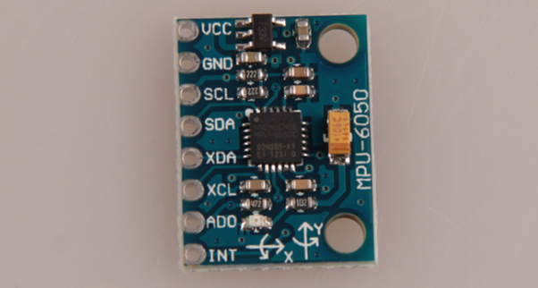
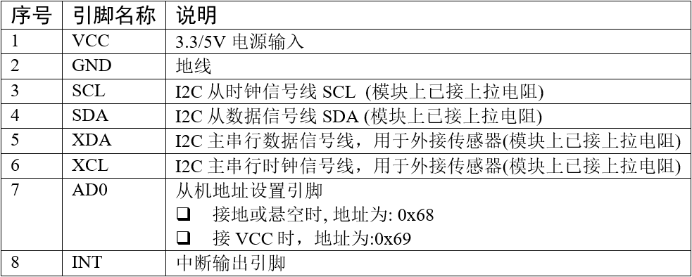
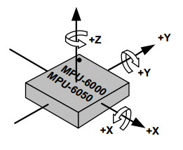
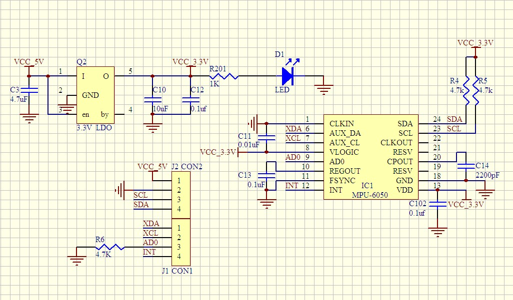
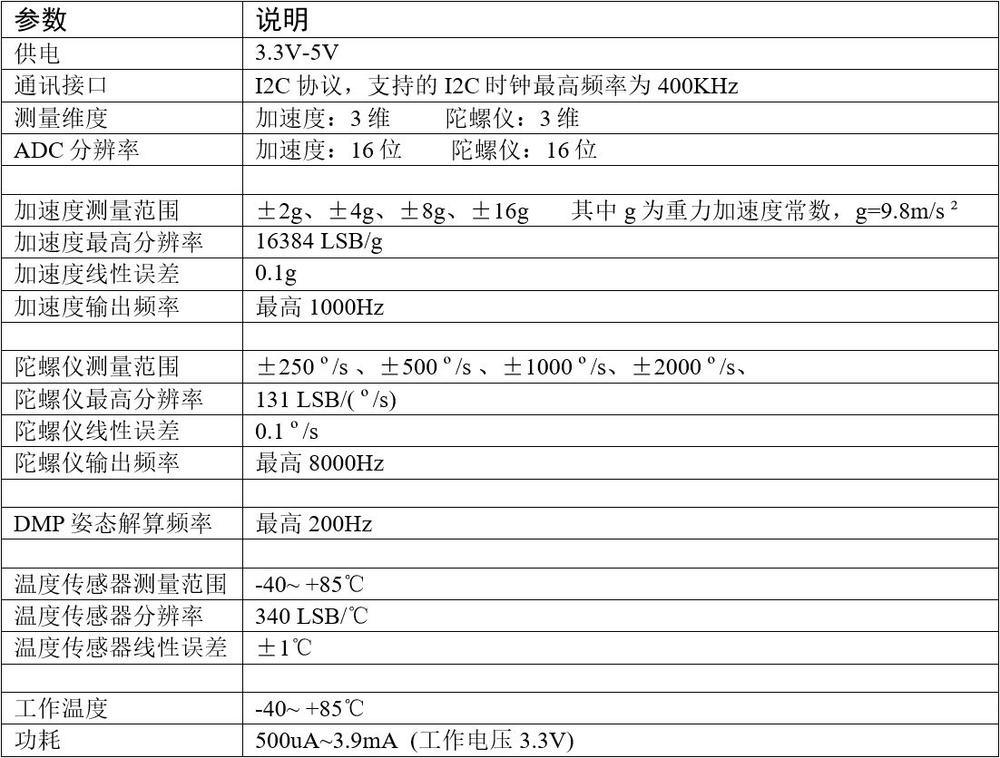
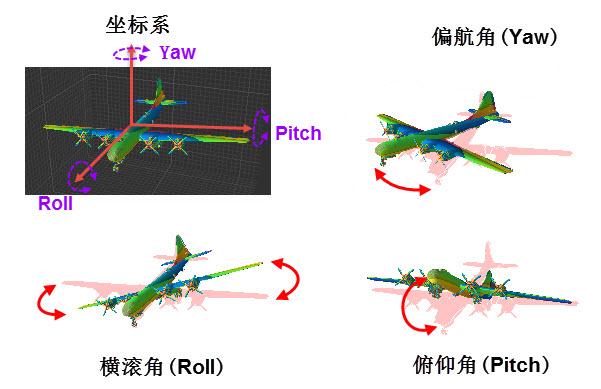

# MPU6050 模块

https://doc.embedfire.com/mcu/stm32/f103badao/std/zh/latest/book/MPU6050.html#id22

接下来我们使用传感器实例来讲解如何检测物体的姿态。在我们的开发板上有引出I2C总线接口，方便用于扩展使用I2C协议通讯的传感器模块。它是一种六轴传感器模块， 采用InvenSense公司的MPU6050作为主芯片，能同时检测三轴加速度、三轴陀螺仪(三轴角速度)的运动数据以及温度数据。 利用MPU6050芯片内部的DMP模块（Digital Motion Processor数字运动处理器），可对传感器数据进行滤波、融合处理， 它直接通过I2C接口向主控器输出姿态解算后的姿态数据，降低主控器的运算量。其姿态解算频率最高可达200Hz， 非常适合用于对姿态控制实时要求较高的领域。常见应用于手机、智能手环、四轴飞行器及计步器等的姿态检测。

## 原理图

它的硬件非常简单，SDA与SCL被引出方便与外部I2C主机连接，看图中的右上角，可知该模块的I2C通讯引脚SDA及SCL已经连接了上拉电阻， 因此它与外部I2C通讯主机通讯时直接使用导线连接起来即可；而MPU6050模块与其它传感器通讯使用的XDA、XCL引脚没有接上拉电阻，要使用时需要注意。 模块自身的I2C设备地址可通过AD0引脚的电平控制，当AD0接地时，设备地址为0x68(七位地址)，当AD0接电源时，设备地址为0x69(七位地址)。 另外，当传感器有新数据的时候会通过INT引脚通知STM32。

## 参数

# 原理

## 姿态检测

在飞行器中，飞行姿态是非常重要的参数，表示飞机姿态的偏航角横滚角及俯仰角 ， 以飞机自身的中心建立坐标系，当飞机绕坐标轴旋转的时候，会分别影响偏航角、横滚角及俯仰角。

