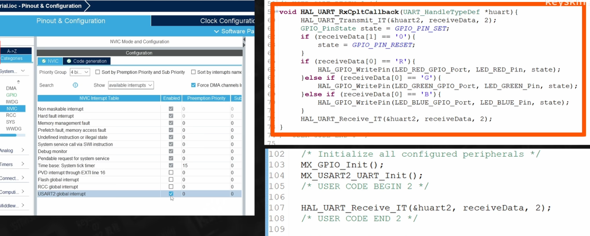

# STM32Cube API

#### 前置

> - 标准库教程：[STM32F1 Tutorial](https://www.youtube.com/playlist?list=PLtVUYRe-Z-mcjXXFBte61L8SjyI377VNq)

##### 相关

> - 框架: STM32Cube
> - 平台: STM32

待补充

- 官方快速入门教程
    - [MOOC - STM32CubeIDE basics（3h）](https://www.youtube.com/playlist?list=PLnMKNibPkDnFCosVVv98U5dCulE6T3Iy8)
    - [MOOC - STM32CubeMX and STM32Cube HAL basics（6h）](https://www.youtube.com/playlist?list=PLnMKNibPkDnGtuIl5v0CvC81Am7SKpj02)
- 中文教程
    - 
    
- 其它
    - https://www.youtube.com/watch?v=Re60MW2xNmM&list=PLfIJKC1ud8gga7xeUUJ-bRUbeChfTOOBd
        - 案例多，使用 macOS 系统，但是播放列表混乱，适合查找，不适合初学直接看

    - [STM32CubeIDE Course for beginners, stm32f103c8t6, STM32 CubeIDE](https://www.youtube.com/watch?v=2OwUnupABec&t=1001s)
    - [Starting with STM32 - Programming Tutorial for Beginners | Step by Step | Greidi Ajalik](https://www.youtube.com/watch?v=dnfuNT1dPiM&list=PLXvLToQzgzdeG8r9IEuAq6ft6r4f_1Ub_&index=2)

## HAL 常用函数

- `HAL_GPIO_ReadPin(GPIOB,B_KEY_Pin);`
- `HAL_GPIO_WritePin(C_LED_GPIO_Port, C_LED_Pin, GPIO_PIN_SET);`
- `HAL_GPIO_TogglePin(GPIOC, C_LED_Pin);`

## HAL 常量变量

- `GPIO_PIN_RESET` = 0
- `GPIO_PIN_SET` = 1

## 设置

### 设置 GPIO

### 设置中断

### 串口

- 轮询模式

- 中断模式
- DMA 模式

接收不定长度数据。
